# 当前任务： PCG Graph 用户体验优化迭代方案

## 迭代一：基础操作完善

> 目标：补齐编辑器最基本的操作闭环，让用户不丢失工作成果。

### 1.1 Save / Save As 分离 + 脏状态追踪

**现状**：`SaveGraph()` 每次都弹 `SaveFilePanelInProject`，没有"保存到当前文件"的能力；窗口标题固定为 `"PCG Node Editor"`，无法看出当前编辑的是哪个图、是否有未保存修改。 [3-cite-0](#3-cite-0) [3-cite-1](#3-cite-1)

**改动文件**：`PCGGraphEditorWindow.cs`

**具体方案**：

```
字段新增：
  - private string _currentAssetPath;   // 当前文件路径，null 表示新建未保存
  - private bool _isDirty;              // 脏状态标记

方法改动：
  - SaveGraph() → 如果 _currentAssetPath != null，直接覆盖保存；否则走 SaveAs 流程
  - 新增 SaveAsGraph() → 始终弹文件对话框
  - 新增 MarkDirty() → 设置 _isDirty = true，更新标题
  - 新增 UpdateWindowTitle() → 显示 "PCG Node Editor - {GraphName}{*}"
  - OnGraphViewChanged 回调中调用 MarkDirty()
  - SaveGraph / LoadGraph / NewGraph 成功后清除 _isDirty

工具栏改动：
  - Save 按钮保留，新增 Save As 按钮
```

### 1.2 Undo/Redo 支持

**现状**：代码中没有任何 `Undo.RecordObject` 调用，所有操作不可撤销。

**改动文件**：`PCGGraphView.cs`, `PCGGraphEditorWindow.cs`, `PCGNodeVisual.cs`

**具体方案**：

```
核心思路：
  将 PCGGraphData 作为 Undo 的序列化载体。每次操作前，
  调用 Undo.RecordObject(currentGraph, "操作描述") 记录快照。

具体改动点：
  1. PCGGraphView.OnGraphViewChanged() 中：
     - edgesToCreate 前 → Undo.RecordObject(graphData, "Create Edge")
     - elementsToRemove 前 → Undo.RecordObject(graphData, "Delete Element")
  
  2. PCGGraphView.CreateNodeVisual() 中：
     - 创建节点前 → Undo.RecordObject(graphData, "Create Node")
  
  3. PCGNodeVisual 参数修改回调中：
     - FloatField/IntegerField/Toggle 等 RegisterValueChangedCallback 中
       → Undo.RecordObject(graphData, "Change Parameter")
  
  4. PCGGraphEditorWindow 中：
     - Undo.undoRedoPerformed += OnUndoRedo
     - OnUndoRedo() → 从 currentGraph 重新 LoadGraph 刷新视图
```

### 1.3 键盘快捷键

**现状**：`PCGGraphView` 构造函数中没有注册任何键盘事件.

**改动文件**：`PCGGraphView.cs`, `PCGGraphEditorWindow.cs`

**具体方案**：

| 快捷键 | 功能 | 实现位置 |
|--------|------|----------|
| `Ctrl+S` | Save | `PCGGraphEditorWindow.OnGUI` 或 `CreateGUI` 中注册 |
| `Ctrl+Shift+S` | Save As | 同上 |
| `Ctrl+Z` | Undo | Unity 内置，Undo 系统接入后自动生效 |
| `Ctrl+Y` | Redo | 同上 |
| `F` | Frame All | `PCGGraphView` 中调用 `FrameAll()` |
| `Delete` | 删除选中 | `PCGGraphView` 中调用 `DeleteSelection()` |
| `Ctrl+D` | 复制选中节点 | 迭代二实现 |

```csharp
// PCGGraphView 构造函数中添加
RegisterCallback<KeyDownEvent>(OnKeyDown);

private void OnKeyDown(KeyDownEvent evt)
{
    if (evt.keyCode == KeyCode.F)
    {
        FrameAll();
        evt.StopPropagation();
    }
    if (evt.keyCode == KeyCode.Delete)
    {
        DeleteSelection();
        evt.StopPropagation();
    }
}
```

### 1.4 MiniMap

**现状**：未添加 MiniMap 组件。

**改动文件**：`PCGGraphView.cs`

**具体方案**：

```csharp
// PCGGraphView 构造函数末尾添加
var miniMap = new MiniMap { anchored = true };
miniMap.SetPosition(new Rect(10, 30, 200, 140));
Add(miniMap);
```

---

## 迭代二：操作效率提升

> 目标：减少重复操作，提升节点图编辑的流畅度。

### 2.1 右键上下文菜单

**现状**：没有重写 `BuildContextualMenu`，右键无任何菜单。

**改动文件**：`PCGGraphView.cs`

**具体方案**：

```csharp
public override void BuildContextualMenu(ContextualMenuPopulateEvent evt)
{
    base.BuildContextualMenu(evt);
    
    // 画布右键
    evt.menu.AppendAction("Create Node", _ => { /* 打开搜索窗口 */ });
    evt.menu.AppendSeparator();
    evt.menu.AppendAction("Frame All", _ => FrameAll());
    
    // 节点右键（当选中节点时）
    if (selection.OfType<PCGNodeVisual>().Any())
    {
        evt.menu.AppendAction("Duplicate", _ => DuplicateSelection());
        evt.menu.AppendAction("Disconnect All", _ => DisconnectSelection());
        evt.menu.AppendAction("Delete", _ => DeleteSelection());
    }
}
```

### 2.2 节点复制/粘贴

**现状**：没有实现 `serializeGraphElements` 和 `unserializeAndPaste` 回调。

**改动文件**：`PCGGraphView.cs`

**具体方案**：

```
GraphView 内置支持 Copy/Paste，需要实现两个回调：

1. serializeGraphElements = elements => {
     // 将选中的节点和边序列化为 JSON 字符串
     // 返回 string
   };

2. unserializeAndPaste = (operationName, data) => {
     // 反序列化 JSON，创建新节点（偏移位置 +30,+30）
     // 重建内部连线
   };

3. canPasteSerializedData = data => {
     // 验证剪贴板数据是否有效
   };
```

### 2.3 端口拖拽时过滤搜索窗口

**现状**：`nodeCreationRequest` 回调中直接打开搜索窗口，不传递端口类型信息。搜索窗口 `CreateSearchTree` 显示所有节点。 

**改动文件**：`PCGGraphView.cs`, `PCGNodeSearchWindow.cs`

**具体方案**：

```
1. PCGNodeSearchWindow 新增字段：
   - public PCGPortType? FilterPortType;
   - public Direction? FilterDirection;

2. PCGGraphView 中重写 GetCompatiblePorts 时记录拖拽起始端口信息，
   或在 nodeCreationRequest 回调中检测是否从端口拖出。

3. PCGNodeSearchWindow.CreateSearchTree 中：
   - 如果 FilterPortType != null，只显示拥有兼容端口的节点
   - 例如从 Float Output 拖出 → 只显示有 Float/Any Input 的节点

4. OnSelectEntry 中创建节点后自动连线到拖拽起始端口。
```

### 2.4 端口 Tooltip

**现状**：`PCGParamSchema` 有 `Description` 字段，但端口上没有设置 tooltip。 

**改动文件**：`PCGNodeVisual.cs`

**具体方案**：

```csharp
// CreateInputPorts() 中，port.portName = schema.DisplayName 之后添加：
port.tooltip = schema.Description;

// CreateOutputPorts() 中同理
port.tooltip = schema.Description;
```

### 2.5 Min/Max 参数使用 Slider

**现状**：`PCGParamSchema` 定义了 `Min`/`Max`，但内联控件只用了 `FloatField`/`IntegerField`，没有利用范围约束。 

**改动文件**：`PCGNodeVisual.cs`

**具体方案**：

```csharp
// CreateInlineWidget() 中 PCGPortType.Float 分支改为：
case PCGPortType.Float:
{
    bool hasRange = schema.Min != float.MinValue && schema.Max != float.MaxValue;
    if (hasRange)
    {
        var slider = new Slider(schema.Min, schema.Max) { value = defaultVal };
        slider.style.width = 100;
        slider.RegisterValueChangedCallback(evt => {
            _portDefaultValues[schema.Name] = evt.newValue;
        });
        widget = slider;
    }
    else
    {
        // 保留原有 FloatField 逻辑
    }
    break;
}

// PCGPortType.Int 分支同理，使用 SliderInt
```

---

## 迭代三：预览与调试增强

> 目标：提升执行调试体验，让用户能更方便地检查中间结果。

### 3.1 执行完成后点击节点预览

**现状**：只有 "Run To Selected" 暂停时才打开预览窗口。全图执行完成后无法查看任意节点的输出。 

**改动文件**：`PCGGraphEditorWindow.cs`, `PCGGraphView.cs`

**具体方案**：

```
1. PCGGraphView 中监听节点选中事件：
   - RegisterCallback<MouseUpEvent> 或重写 selection changed
   - 当选中节点变化时，通知 EditorWindow

2. PCGGraphEditorWindow 中：
   - 新增 OnNodeSelectionChanged(PCGNodeVisual visual) 方法
   - 如果 _asyncExecutor.State == Idle 且有执行结果缓存：
     var outputs = _asyncExecutor.GetNodeOutput(visual.NodeId);
     if (outputs != null) ShowPreviewForNode(...)
   - 这样执行完成后，点击任意节点即可查看其输出
```

### 3.2 编辑器内错误面板

**现状**：执行错误只输出到 Unity Console，编辑器内只有节点红色高亮，没有错误详情。 

**改动文件**：`PCGGraphEditorWindow.cs`, `PCGNodeVisual.cs`

**具体方案**：

```
1. PCGNodeVisual 新增：
   - private Label _errorLabel; // 显示在节点底部
   - public void ShowError(string message) → 显示红色错误文本
   - public void ClearError()

2. PCGGraphEditorWindow 中：
   - OnNodeCompleted 回调中，如果 !result.Success：
     visual.ShowError(result.ErrorMessage);
   
3. 可选：在工具栏下方添加一个可折叠的错误列表面板
   - 使用 ListView 显示所有执行错误
   - 点击错误项定位到对应节点
```

### 3.3 节点执行进度条

**现状**：工具栏有 `Total: {ms} ({completed}/{total})` 标签，但没有可视化进度。

**改动文件**：`PCGGraphEditorWindow.cs`

**具体方案**：

```
在工具栏中 _totalTimeLabel 旁边添加一个 ProgressBar：

private ProgressBar _progressBar;

// GenerateToolbar() 中：
_progressBar = new ProgressBar { title = "" };
_progressBar.style.width = 120;
_progressBar.style.height = 16;
toolbar.Add(_progressBar);

// OnNodeCompleted 回调中：
_progressBar.value = (float)_asyncExecutor.CompletedNodeCount / _asyncExecutor.TotalNodeCount * 100f;
```

---

## 迭代四：高级功能

> 目标：支持大型图的组织管理，提升专业用户的效率。

### 4.1 节点分组与注释

**改动文件**：`PCGGraphView.cs`, `PCGGraphData.cs`

**具体方案**：

```
1. PCGGraphView.BuildContextualMenu 中添加：
   - "Group Selection" → 创建 Group 元素包裹选中节点
   - "Add Sticky Note" → 创建 StickyNote 元素

2. PCGGraphData 中新增序列化字段：
   - List<PCGGroupData> Groups  // { Title, NodeIds[], Position, Size }
   - List<PCGStickyNoteData> StickyNotes  // { Title, Content, Position, Size }

3. SaveToGraphData / LoadGraph 中处理 Group 和 StickyNote 的序列化/反序列化
```

### 4.2 SubGraph 完整实现

**现状**：`SubGraphNode` 是空壳，`Execute` 只是透传输入，输入输出端口硬编码。 

**改动文件**：`SubGraphNode.cs`, 新增 `SubGraphInputNode.cs`, `SubGraphOutputNode.cs`

**具体方案**：

```
1. 新增 SubGraphInputNode / SubGraphOutputNode：
   - 作为子图的入口/出口标记节点
   - 端口定义由用户在子图中配置

2. SubGraphNode.Execute() 改为：
   - 加载 subGraphData
   - 创建 PCGGraphExecutor 实例
   - 将外部输入映射到 SubGraphInputNode 的输出
   - 执行子图
   - 从 SubGraphOutputNode 的输入收集结果返回

3. SubGraphNode.GetSubGraphInputs/Outputs 改为：
   - 从 subGraphData 中查找 SubGraphInputNode/OutputNode
   - 动态生成端口定义

4. PCGGraphEditorWindow 支持双击 SubGraph 节点进入子图编辑
```

### 4.3 Enum/Dropdown 参数类型

**现状**：`PCGPortType` 没有 Enum 类型，需要枚举选择的参数只能用 Int 或 String。

**改动文件**：`PCGParamSchema.cs`, `PCGNodeVisual.cs`, `PCGGraphView.cs`

**具体方案**：

```
1. PCGParamSchema 新增字段：
   public string[] EnumOptions;  // 可选，非 null 时渲染为下拉框

2. PCGNodeVisual.CreateInlineWidget() 中：
   - 在 switch 之前检查 schema.EnumOptions != null
   - 如果有，创建 PopupField<string> 替代默认控件

3. 序列化/反序列化中按 string 类型处理 enum 值

4. 节点定义示例：
   new PCGParamSchema("axis", PCGPortDirection.Input, PCGPortType.Int,
       "Axis", "旋转轴", 0) { EnumOptions = new[] { "X", "Y", "Z" } }
```

### 4.4 Vector3 控件优化

**现状**：Vector3 三个 FloatField 每个只有 45px 宽，操作困难。

**改动文件**：`PCGNodeVisual.cs`

**具体方案**：

```csharp
// 方案 A：增大宽度
var fieldX = new FloatField("X") { value = defaultVal.x, style = { width = 58, fontSize = 9 } };

// 方案 B：改为垂直排列（推荐，更清晰）
var container = new VisualElement()
{
    style = { flexDirection = FlexDirection.Column, marginLeft = 4 }
};
```

### 4.5 代码清理

**现状**：`PCGNodeVisual.cs` 第 3 行和第 7 行重复引入 `UnityEditor.UIElements`。

---

## 迭代总览

```mermaid
gantt
    title "PCG Graph UX 优化迭代计划"
    dateFormat X
    axisFormat %s

    section "迭代一：基础操作"
    "1.1 Save/SaveAs + 脏状态" :a1, 0, 1
    "1.2 Undo/Redo" :a2, 0, 1
    "1.3 键盘快捷键" :a3, 0, 1
    "1.4 MiniMap" :a4, 0, 1

    section "迭代二：操作效率"
    "2.1 右键上下文菜单" :b1, 1, 2
    "2.2 节点复制/粘贴" :b2, 1, 2
    "2.3 端口拖拽过滤搜索" :b3, 1, 2
    "2.4 端口 Tooltip" :b4, 1, 2
    "2.5 Min/Max Slider" :b5, 1, 2

    section "迭代三：预览调试"
    "3.1 点击节点预览" :c1, 2, 3
    "3.2 编辑器内错误面板" :c2, 2, 3
    "3.3 执行进度条" :c3, 2, 3

    section "迭代四：高级功能"
    "4.1 节点分组与注释" :d1, 3, 4
    "4.2 SubGraph 完整实现" :d2, 3, 4
    "4.3 Enum Dropdown" :d3, 3, 4
    "4.4 Vector3 控件优化" :d4, 3, 4
    "4.5 代码清理" :d5, 3, 4
```



## 文件改动汇总

| 文件 | 迭代一 | 迭代二 | 迭代三 | 迭代四 |
|------|--------|--------|--------|--------|
| `PCGGraphEditorWindow.cs` | 1.1, 1.2, 1.3 | — | 3.1, 3.2, 3.3 | — |
| `PCGGraphView.cs` | 1.2, 1.3, 1.4 | 2.1, 2.2, 2.3 | 3.1 | 4.1 |
| `PCGNodeVisual.cs` | 1.2 | 2.4, 2.5 | 3.2 | 4.3, 4.4, 4.5 |
| `PCGNodeSearchWindow.cs` | — | 2.3 | — | — |
| `PCGParamSchema.cs` | — | — | — | 4.3 |
| `PCGGraphData.cs` | — | — | — | 4.1 |
| `SubGraphNode.cs` | — | — | — | 4.2 |
| 新增文件 | — | — | — | `SubGraphInputNode.cs`, `SubGraphOutputNode.cs` |