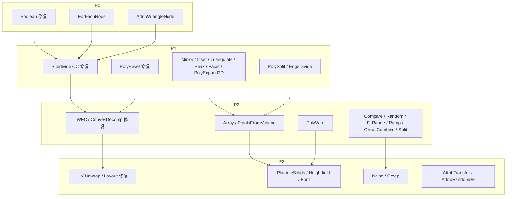

## PCG 节点库迭代大纲

基于对仓库的全面审查，以下是整理后的迭代大纲。

---

### 一、现状盘点

**已有节点 71 个**，分布在 11 个目录下：


| 分类 | 数量 | 节点 |
|------|------|------|
| Create | 12 | Box, Sphere, Grid, Tube, Circle, Line, Torus, Transform, Merge, Delete, GroupCreate, ImportMesh |
| Attribute | 5 | Create, Set, Delete, Promote, Copy |
| Geometry | 12 | Extrude, Subdivide, **Boolean\***, Normal, Fuse, Reverse, Clip, Blast, Measure, Sort, Pack, Unpack |
| UV | 4 | Project, **Unwrap\***, **Layout\***, Transform |
| Distribute | 4 | Scatter, CopyToPoints, Instance, Ray |
| Curve | 5 | CurveCreate, Resample, Sweep, Carve, Fillet |
| Deform | 6 | Mountain, Bend, Twist, Taper, Lattice, Smooth |
| Topology | 6 | **PolyBevel\***, PolyBridge, PolyFill, Remesh, Decimate, **ConvexDecomp\*** |
| Procedural | 3 | **WFC\***, LSystem, VoronoiFracture |
| Output | 6 | ExportMesh, ExportFBX, SavePrefab, SaveMaterial, SaveScene, LODGenerate |
| Utility | 13 | 6×Const, MathFloat, MathVector, Null, Switch, SubGraph, SubGraphInput, SubGraphOutput |

**\* = 简化/占位实现，需修复**

---

### 二、需修复的现有节点（7 个）

| # | 节点 | 问题 | 修复方向 |
|---|------|------|---------|
| 1 | `BooleanNode` | Subtract/Intersect 返回占位结果 | 桥接 `PCGGeometry ↔ DMesh3`，调用 geometry3Sharp CSG |
| 2 | `SubdivideNode` | Catmull-Clark 退化为 Linear | 实现面点/边点/顶点规则的真正 CC 细分 |
| 3 | `PolyBevelNode` | 只处理边界边，忽略 group 参数 | 支持按 Group 选择内部边倒角 |
| 4 | `ConvexDecompositionNode` | 轴向切割近似，非真正凸分解 | 集成 MIConvexHull 或 V-HACD |
| 5 | `WFCNode` | 邻接规则硬编码 `Abs(t-nt)<=1` | 支持自定义邻接规则 JSON 输入 |
| 6 | `UVUnwrapNode` | 需要 xatlas 集成 | 集成 xatlas 或实现 ABF/LSCM |
| 7 | `UVLayoutNode` | 简化实现 | 实现真正的 UV 岛排布算法 | [3-cite-0](#3-cite-0) [3-cite-1](#3-cite-1) [3-cite-2](#3-cite-2) [3-cite-3](#3-cite-3) [3-cite-4](#3-cite-4) 

---

### 三、需新增的节点（25 个）

#### P0 — 核心基础设施（2 个）

| # | 节点 | 目录 | 说明 |
|---|------|------|------|
| 1 | **ForEachNode** | `Utility/` | 对每个 PrimGroup/PointGroup/Piece 执行子图，逐层/逐面处理的基石 |
| 2 | **AttribWrangleNode** | `Attribute/` | 简易表达式求值（`@P.y = sin(@ptnum * 0.1);`），对标 Houdini AttribWrangle |

#### P1 — Geometry 系列（6 个）

| # | 节点 | 说明 |
|---|------|------|
| 3 | **MirrorNode** | 沿平面镜像几何体，翻转面绕序 |
| 4 | **InsetNode** | 面内缩，生成环形侧面带（与 Extrude 互补） |
| 5 | **TriangulateNode** | 四边形/N 边形统一转三角形 |
| 6 | **PeakNode** | 沿法线均匀偏移点（不改拓扑） |
| 7 | **FacetNode** | Unique Points / Consolidate / Compute Normals 三模式 |
| 8 | **PolyExpand2DNode** | 2D 多边形偏移/内缩（Clipper2） |

#### P1 — Topology 系列（2 个）

| # | 节点 | 说明 |
|---|------|------|
| 9 | **PolySplitNode** | 用平面切割面，拆分为子面 |
| 10 | **EdgeDivideNode** | 在边上等距插入新点 |

#### P2 — Distribute 系列（2 个）

| # | 节点 | 说明 |
|---|------|------|
| 11 | **ArrayNode** | 线性阵列 + 径向阵列复制 |
| 12 | **PointsFromVolumeNode** | 在包围盒内按体素网格生成点 |

#### P2 — Curve 系列（1 个）

| # | 节点 | 说明 |
|---|------|------|
| 13 | **PolyWireNode** | 曲线/线段转管状网格（固定圆形截面，比 Sweep 轻量） |

#### P2 — Utility 系列（6 个）

| # | 节点 | 说明 |
|---|------|------|
| 14 | **CompareNode** | 比较两值，输出 Bool（驱动 Switch） |
| 15 | **RandomNode** | 输出随机 Float/Int/Vector3，支持 seed |
| 16 | **FitRangeNode** | 值域重映射 `fit(v, oMin, oMax, nMin, nMax)` |
| 17 | **RampNode** | 曲线 Ramp 映射（线性/平滑/阶梯） |
| 18 | **GroupCombineNode** | 对两个 Group 做集合运算（Union/Intersect/Subtract） |
| 19 | **SplitNode** | 按 Group 拆分几何体为 matched/unmatched 两路输出 |

#### P3 — Create 系列（3 个）

| # | 节点 | 说明 |
|---|------|------|
| 20 | **PlatonicSolidsNode** | 正四/八/十二/二十面体 |
| 21 | **HeightfieldNode** | 带 height 属性的网格 + Perlin/Simplex 初始化 |
| 22 | **FontNode** | 文本转 2D 轮廓几何体，可配合 Extrude 做 3D 文字 |

#### P3 — Deform 系列（2 个）

| # | 节点 | 说明 |
|---|------|------|
| 23 | **NoiseNode** | 通用噪声变形（Perlin/Simplex/Worley/Curl），比 Mountain 更灵活 |
| 24 | **CreepNode** | 将点沿目标表面"爬行"变形 |

#### P3 — Attribute 系列（2 个）

| # | 节点 | 说明 |
|---|------|------|
| 25 | **AttributeTransferNode** | 基于空间距离从源几何体传递属性到目标 |
| 26 | **AttributeRandomizeNode** | 为属性赋随机值（Uniform/Gaussian） |

---

### 四、优先级总览

```
P0（基石）     修复 Boolean + 新增 ForEach + AttribWrangle         = 3 项
P1（几何拓扑） 修复 Subdivide/PolyBevel + 新增 8 个几何/拓扑节点   = 10 项
P2（工具链）   修复 WFC/ConvexDecomp + 新增 9 个分布/曲线/工具节点 = 11 项
P3（锦上添花） 修复 UV×2 + 新增 7 个创建/变形/属性节点             = 9 项
─────────────────────────────────────────────────────────
                                                  合计 = 33 项
```



---

### 五、关键依赖

- **`GeometryBridge.cs`**（新增）：`PCGGeometry ↔ DMesh3` 双向转换，Boolean 修复和 ConvexDecomp 修复都依赖它 [3-cite-5](#3-cite-5)
- **`ExpressionParser.cs`**（新增）：AttribWrangle 的表达式解析器（tokenizer + recursive descent）
- **ForEach 需要扩展 `SubGraphNode` 的执行模式**：加载子图 → 注入迭代元数据 → 循环执行 → Merge 结果 [3-cite-6](#3-cite-6)
- **geometry3Sharp** 已在 `ThirdParty/` 中，Boolean/Remesh/Decimate 可直接使用
- **Clipper2**（待引入）：PolyExpand2D 需要