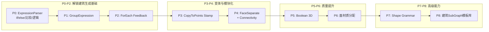

# PCG for Unity 第2轮迭代评估与下一轮指导

## 最新提交概览

[`a71de58`](https://github.com/No78Vino/pcg_for_unity/commit/a71de58ab170d48e3ce4d2d4dd721e213a30517d) ("PCG第2轮功能迭代") 是一次非常大的提交（5488 additions, 11666 deletions），新增/重写了约 30 个节点和核心模块。 [0-cite-0](#0-cite-0)

---

## 当前节点库全景（~100个节点）

| 分类 | 数量 | 节点 |
|------|------|------|
| **Create** | 15 | Box, Sphere, Tube, Grid, Circle, Line, Torus, Delete, GroupCreate, ImportMesh, Merge, Transform, **Font★**, **Heightfield★**, **PlatonicSolids★** |
| **Attribute** | 8 | AttribCreate, AttribSet, AttribCopy, AttribDelete, AttribPromote, **AttribWrangle★**, **AttribRandomize★**, **AttribTransfer★** |
| **Geometry** | 18 | Blast, Boolean, Clip, Extrude, Fuse, Normal, Reverse, Sort, Measure, Pack, Unpack, **Facet★**, **Inset★**, **Mirror★**, **Peak★**, **PolyExpand2D★**, **Triangulate★**, Subdivide(重写CC★) |
| **Deform** | 8 | Bend, Twist, Taper, Lattice, Mountain, Smooth, **Creep★**, **Noise★** |
| **Topology** | 8 | PolyBevel(重写★), PolyBridge, PolyFill, Remesh, Decimate, ConvexDecomp(重写★), **EdgeDivide★**, **PolySplit★** |
| **Distribute** | 6 | Scatter, CopyToPoints, Instance, Ray, **Array★**, **PointsFromVolume★** |
| **Curve** | 6 | CurveCreate, Resample, Sweep, Carve, Fillet, **PolyWire★** |
| **UV** | 4 | UVProject, UVUnwrap(增强★), UVLayout(增强★), UVTransform |
| **Procedural** | 3 | LSystem, VoronoiFracture, WFC(增强★) |
| **Utility** | 19 | ForEach★, Switch, Split, Compare★, FitRange★, GroupCombine★, Ramp★, SubGraph系列, Math系列, Const系列, Null, Random |
| **Output** | 6 | ExportFBX, ExportMesh, SavePrefab, SaveMaterial, SaveScene, LODGenerate |

（★ = 本次新增或重大重写）


---

## 能否制作程序化建筑生成器？

**短回答：基本具备了，但有明显短板。**

### 已具备的建筑生成关键能力

| 建筑生成需求 | 对应节点 | 状态 |
|---|---|---|
| 墙体/楼层挤出 | `Extrude` + `Inset` | ✅ |
| 窗洞/门洞开孔 | `Boolean` (Subtract) | ✅ 但拓扑质量存疑 |
| 楼层重复 | `Array` + `CopyToPoints` | ✅ |
| 对称建筑 | `Mirror` | ✅ |
| 装饰线脚/栏杆 | `Sweep` + `PolyWire` | ✅ |
| 模块化组装 | `SubGraph` + `ForEach` | ✅ |
| 边缘倒角 | `PolyBevel` | ✅ |
| 表面细节 | `Peak` + `Noise` | ✅ |
| 自定义逻辑 | `AttribWrangle` (VEX子集) | ✅ 但功能有限 |
| UV/材质 | UV系列 + `SaveMaterial` | ✅ |
| 输出 | FBX/Prefab/Scene | ✅ |

### 关键缺口（离"复杂3D建筑"还差的部分）

#### 1. 流程控制能力不足（最大短板）

`ExpressionParser` 不支持 `if/else`、`for` 循环、比较运算符（`<`, `>`, `==`）。这意味着无法在 Wrangle 中写条件逻辑，比如"如果是顶层就生成屋顶，否则生成普通楼层"。 [0-cite-1](#0-cite-1)

`ForEachNode` 虽然已实现，但只支持 byGroup/byPiece/count 三种模式，缺少 **feedback 模式**（上一次迭代的输出作为下一次的输入进行累积变换）。 [0-cite-2](#0-cite-2)

实际上 `IterateByCount` 已经有 feedback 的雏形（`current = result`），但它把所有中间结果都 add 到 results 里再 merge，而不是只输出最终结果。这对建筑的"逐层叠加"场景不太对。

#### 2. 缺少 Group Expression / 条件选择

建筑生成的核心模式是：**按属性值选择不同的面组，对不同组执行不同操作**。目前 `GroupCreateNode` 和 `Switch` 节点存在，但缺少一个 **基于表达式的 Group 过滤器**（如 `@floor == 3` 或 `@type == "window"`）。

#### 3. Boolean 拓扑质量

`BooleanNode` 使用 Clipper2 做 2D 布尔，对 3D 网格的 CSG 操作（如在墙面上开窗洞）可能产生非流形拓扑。建筑生成对 Boolean 的拓扑清洁度要求很高。 [0-cite-3](#0-cite-3)

#### 4. 缺少 Copy Stamp / 变体实例化

Houdini 建筑生成的核心模式之一是 `CopyToPoints` + stamp 变量（每个拷贝可以有不同参数）。当前 `CopyToPoints` 和 `Instance` 节点是否支持 per-copy 参数变体？如果不支持，就无法做"每层窗户样式不同"这类需求。

#### 5. 缺少 Primitive Split / 面独立化

建筑生成经常需要把一个面"独立化"（每个面变成独立的点集），然后对每个面单独做 Extrude/Inset。`Pack`/`Unpack` 节点存在，但需要确认是否实现了 Houdini 的 "Connectivity + ForEach Piece" 工作流。

#### 6. 缺少 Shape Grammar / Rule-based 系统

WFC 适合做平面布局，但建筑的立面生成更适合 **Shape Grammar**（类似 CGA Shape / Houdini Labs Building Generator 的规则系统）。这是一个 Tier 7+ 的高级功能。

---

## 量化差距评估

```
程序化建筑生成器（简单方盒子建筑）：  ████████░░ 80%  — 基本可做
程序化建筑生成器（中等复杂度）：      ██████░░░░ 60%  — 缺条件逻辑和变体
程序化建筑生成器（高复杂度/装饰物）：  ████░░░░░░ 40%  — 缺 Shape Grammar、干净 Boolean、材质分配
```

---

## 第3轮迭代指导方针

按优先级排序，以下是让系统真正能做复杂建筑的关键任务：

### P0 — 表达式系统补全（最高优先级）

在 `ExpressionParser` 中增加：
- **比较运算符**: `<`, `>`, `<=`, `>=`, `==`, `!=`
- **逻辑运算符**: `&&`, `||`, `!`
- **三元表达式**: `condition ? a : b`
- **if/else 语句**: `if (@floor > 3) { @type = 1; } else { @type = 0; }`

这是解锁建筑生成能力的最关键一步。没有条件逻辑，AttribWrangle 只能做数学变换，无法做决策。 [0-cite-4](#0-cite-4)

### P1 — Group Expression Node

新增一个 `GroupExpression` 节点，允许用表达式创建分组：
```
@P.y > 5 && @P.y < 8   →  创建 "middle_floors" 组
@primnum % 2 == 0       →  创建 "even_faces" 组
```
这让 `ForEach byGroup` + `Switch` 的组合变得真正可用。

### P2 — ForEach Feedback 模式修正

修改 `ForEachNode` 的 `IterateByCount` 模式：
- 增加 `feedback` 参数（bool），为 true 时只输出最终迭代结果而非 merge 所有中间结果
- 这对"逐层叠加建筑"至关重要：第1次生成地基，第2次在地基上加一层，第3次再加一层... [0-cite-2](#0-cite-2)

### P3 — CopyToPoints Stamp 变量

增强 `CopyToPointsNode`：
- 读取目标点上的自定义属性（如 `@variant`, `@scale`, `@rotation`）
- 将这些属性注入到被拷贝几何体的 SubGraph 执行上下文中
- 实现 per-instance 变体

### P4 — 面独立化节点 (Primitive Separate / Connectivity)

新增 `ConnectivityNode`：
- 为每个连通分量写入 `@class` 属性
- 配合 `ForEach byPiece` 实现"对每个面独立操作"

新增 `FaceSeparateNode`（或叫 `Fuse` 的反操作）：
- 将共享顶点的面拆成独立点集
- 这是 Extrude Individual 的前置操作

### P5 — Boolean 3D 质量提升

当前 Boolean 可能是 2D 投影实现。需要：
- 通过 `GeometryBridge` 转换到 `DMesh3`，使用 geometry3Sharp 的 `MeshBoolean` 做真正的 3D CSG
- 或者集成 `libigl` / `CGAL` 的 C# binding
- 输出后自动 Fuse + Normal 清理拓扑 [0-cite-5](#0-cite-5)

### P6 — 材质 ID / 面材质分配

建筑的不同部分需要不同材质（墙面、玻璃、金属框架等）：
- 在 `PrimAttribs` 中支持 `@material` 或 `@shop_materialpath` 属性
- `ExportFBX` / `SavePrefab` 时按材质属性自动分配多材质
- 新增 `MaterialAssignNode`：按 PrimGroup 分配材质路径

### P7 — Shape Grammar 节点（中期目标）

这是真正的"建筑生成器"核心：
- 新增 `ShapeGrammarNode`：输入一个面 + 规则集，递归细分
- 规则示例：`Facade -> Floor* Roof`，`Floor -> Window Wall Window`
- 可以参考 CGA Shape (CityEngine) 或 Houdini Labs Building Generator 的设计
- 这个节点的复杂度很高，建议作为 Phase 4 的目标

### P8 — 实用建筑 SubGraph 模板库

在节点能力补全后，创建一组预制 SubGraph：
- `BuildingFloor.asset` — 单层楼板生成
- `WindowFrame.asset` — 窗框生成（Inset + Extrude + Bevel）
- `Balcony.asset` — 阳台生成
- `Roof.asset` — 屋顶生成（坡顶/平顶）
- `Facade.asset` — 立面生成（Grid + ForEach + 随机变体）

---

## 总结优先级矩阵



完成 P0-P4 后，你的工具就能做出"中等复杂度的程序化建筑"了。完成 P5-P8 后，才能真正对标 Houdini Labs Building Generator 的能力水平。