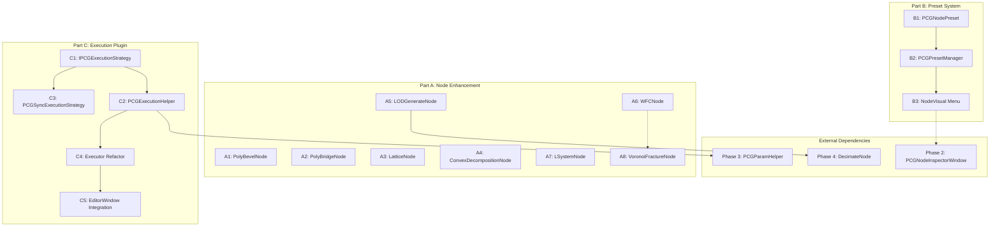

# 阶段 6 详细实施文档

**范围**: P1-4 剩余 8 个 Tier 4-8 节点增强 + P4-3 (节点模板/预设系统) + P4-4 (图执行引擎插件化)

---

## 总览

阶段 6 分为三个部分：

| 部分 | 内容 | 优先级 |
|------|------|--------|
| **A. P1-4 剩余节点增强** | 8 个已有基础实现的节点：PolyBevel / PolyBridge / Lattice / ConvexDecomposition / LODGenerate / WFC / LSystem / VoronoiFracture | 高 |
| **B. P4-3 节点模板/预设系统** | 保存/加载节点参数配置为可复用预设 | 中 |
| **C. P4-4 图执行引擎插件化** | 抽象执行策略接口，统一同步/异步执行器 | 中 |

---

## Part A: P1-4 剩余节点增强

### A1: PolyBevelNode 增强

**文件**: `Assets/PCGToolkit/Editor/Nodes/Topology/PolyBevelNode.cs`

#### 现状分析

当前实现存在四个问题：

1. **只倒角边界边** (line 79): `kvp.Value.Count == 1` 只选择了边界边（只被一个面引用的边），但实际倒角应作用于所有边或由 `group` 参数指定的边 [6-cite-0](#6-cite-0)
2. **`group` 参数未使用**: line 53 接受了 `group` 字符串参数但从未用于过滤边 [6-cite-1](#6-cite-1)
3. **`divisions > 1` 未实现**: line 115 只处理了 `divisions == 1` 的情况，多段倒角被忽略 [6-cite-2](#6-cite-2)
4. **顶点倒角模式未实现**: line 52 的 `mode` 参数接受 `"vertices"` 但没有对应逻辑分支 [6-cite-3](#6-cite-3)

#### 修改 1: 替换边选择逻辑 (line 75-83)

当前代码：

```csharp
// ❌ 当前：只选择边界边
var edgesToBevel = new List<(int, int)>();
foreach (var kvp in edgeFaces)
{
    if (kvp.Value.Count == 1) // 边界边
    {
        edgesToBevel.Add(kvp.Key);
    }
}
```

替换为：

```csharp
// ✅ 修复：按 group 过滤，或倒角所有边
var edgesToBevel = new List<(int, int)>();

if (!string.IsNullOrEmpty(group))
{
    // 按 group 过滤：收集 group 中面的所有边
    var groupEdges = new HashSet<(int, int)>();
    if (geo.PrimGroups.TryGetValue(group, out var groupPrimIndices))
    {
        foreach (int primIdx in groupPrimIndices)
        {
            if (primIdx >= geo.Primitives.Count) continue;
            var prim = geo.Primitives[primIdx];
            for (int i = 0; i < prim.Length; i++)
            {
                int v0 = prim[i];
                int v1 = prim[(i + 1) % prim.Length];
                var edge = v0 < v1 ? (v0, v1) : (v1, v0);
                groupEdges.Add(edge);
            }
        }
    }
    edgesToBevel.AddRange(groupEdges);
}
else
{
    // 无 group 时，倒角所有边
    edgesToBevel.AddRange(edgeFaces.Keys);
}
```

#### 修改 2: 支持多段倒角 (替换 line 95-143)

当前代码只处理 `divisions == 1`，需要替换整个倒角生成循环以支持任意分段数：

```csharp
// ✅ 替换 line 95-143
foreach (var edge in edgesToBevel)
{
    int v0 = edge.Item1;
    int v1 = edge.Item2;
    Vector3 p0 = geo.Points[v0];
    Vector3 p1 = geo.Points[v1];
    Vector3 edgeDir = (p1 - p0).normalized;

    int primIdx = edgeFaces[edge][0];
    var prim = geo.Primitives[primIdx];
    Vector3 normal = CalculateFaceNormal(geo.Points, prim);
    Vector3 offsetDir = Vector3.Cross(normal, edgeDir).normalized;

    // 为 v0 端和 v1 端各生成 (divisions+1) 个倒角点
    var bevelPoints0 = new List<int>();
    var bevelPoints1 = new List<int>();

    for (int d = 0; d <= divisions; d++)
    {
        float t = (float)d / divisions;
        // 沿四分之一圆弧插值，产生更平滑的倒角轮廓
        float arcT = Mathf.Sin(t * Mathf.PI * 0.5f);

        Vector3 newPt0 = p0 + offsetDir * offset * arcT;
        bevelPoints0.Add(newPoints.Count);
        newPoints.Add(newPt0);

        Vector3 newPt1 = p1 + offsetDir * offset * arcT;
        bevelPoints1.Add(newPoints.Count);
        newPoints.Add(newPt1);
    }

    // 在相邻段之间生成四边形倒角面
    for (int d = 0; d < divisions; d++)
    {
        newPrimitives.Add(new int[] {
            bevelPoints0[d], bevelPoints1[d],
            bevelPoints1[d + 1], bevelPoints0[d + 1]
        });
    }
}
```

> **设计说明**: 使用 `Mathf.Sin(t * PI/2)` 而非线性插值，使倒角轮廓沿四分之一圆弧分布，视觉效果更接近真实倒角。当 `divisions == 1` 时退化为原来的单段行为。

#### 修改 3: 添加顶点倒角模式 (在 line 94 之后新增分支)

在 `if (mode == "edges")` 分支之后（即 line 144 之前），添加 `else if (mode == "vertices")` 分支：

```csharp
else if (mode == "vertices")
{
    // 收集需要倒角的顶点
    var verticesToBevel = new HashSet<int>();
    if (!string.IsNullOrEmpty(group) && geo.PointGroups.TryGetValue(group, out var ptGroup))
    {
        verticesToBevel = new HashSet<int>(ptGroup);
    }
    else
    {
        for (int i = 0; i < geo.Points.Count; i++) verticesToBevel.Add(i);
    }

    // 构建顶点→相邻边映射
    var vertexEdges = new Dictionary<int, List<(int, int)>>();
    foreach (var kvp in edgeFaces)
    {
        var e = kvp.Key;
        if (!vertexEdges.ContainsKey(e.Item1)) vertexEdges[e.Item1] = new List<(int, int)>();
        if (!vertexEdges.ContainsKey(e.Item2)) vertexEdges[e.Item2] = new List<(int, int)>();
        vertexEdges[e.Item1].Add(e);
        vertexEdges[e.Item2].Add(e);
    }

    // 记录每个倒角顶点的替换映射: 原顶点 → (边 → 新点索引)
    var vertexReplacements = new Dictionary<int, Dictionary<(int, int), int>>();

    foreach (int vi in verticesToBevel)
    {
        if (!vertexEdges.ContainsKey(vi)) continue;
        var replacements = new Dictionary<(int, int), int>();

        foreach (var edge in vertexEdges[vi])
        {
            int other = edge.Item1 == vi ? edge.Item2 : edge.Item1;
            Vector3 dir = (geo.Points[other] - geo.Points[vi]).normalized;
            // 限制偏移不超过边长的一半
            float clampedOffset = Mathf.Min(offset,
                Vector3.Distance(geo.Points[vi], geo.Points[other]) * 0.5f);

            int newIdx = newPoints.Count;
            newPoints.Add(geo.Points[vi] + dir * clampedOffset);
            replacements[edge] = newIdx;
        }

        vertexReplacements[vi] = replacements;

        // 在新点之间生成倒角面（N-gon）
        var bevelFaceVerts = new List<int>(replacements.Values);
        if (bevelFaceVerts.Count >= 3)
        {
            // 按角度排序，确保面的顶点顺序正确
            Vector3 center = Vector3.zero;
            foreach (int idx in bevelFaceVerts) center += newPoints[idx];
            center /= bevelFaceVerts.Count;

            Vector3 refDir = (newPoints[bevelFaceVerts[0]] - center).normalized;
            Vector3 up = CalculateVertexNormal(geo, vi);

            bevelFaceVerts.Sort((a, b) =>
            {
                Vector3 da = (newPoints[a] - center).normalized;
                Vector3 db = (newPoints[b] - center).normalized;
                float angleA = Mathf.Atan2(Vector3.Dot(Vector3.Cross(refDir, da), up), Vector3.Dot(refDir, da));
                float angleB = Mathf.Atan2(Vector3.Dot(Vector3.Cross(refDir, db), up), Vector3.Dot(refDir, db));
                return angleA.CompareTo(angleB);
            });

            newPrimitives.Add(bevelFaceVerts.ToArray());
        }
    }

    // 更新原有面中对倒角顶点的引用
    for (int pi = 0; pi < geo.Primitives.Count; pi++)
    {
        var prim = geo.Primitives[pi];
        var newPrim = new int[prim.Length];
        bool modified = false;

        for (int i = 0; i < prim.Length; i++)
        {
            if (vertexReplacements.TryGetValue(prim[i], out var replacements))
            {
                // 找到该面中包含此顶点的"下一条边"，用对应的新点替换
                int next = prim[(i + 1) % prim.Length];
                var edgeKey = prim[i] < next ? (prim[i], next) : (next, prim[i]);
                if (replacements.TryGetValue(edgeKey, out int newIdx))
                {
                    newPrim[i] = newIdx;
                    modified = true;
                    continue;
                }
            }
            newPrim[i] = prim[i];
        }

        if (modified)
            newPrimitives[pi] = newPrim;
        else
            newPrimitives[pi] = prim;
    }
}
```

需要新增辅助方法 `CalculateVertexNormal`：

```csharp
private Vector3 CalculateVertexNormal(PCGGeometry geo, int vertexIdx)
{
    Vector3 normal = Vector3.zero;
    foreach (var prim in geo.Primitives)
    {
        for (int i = 0; i < prim.Length; i++)
        {
            if (prim[i] == vertexIdx)
            {
                normal += CalculateFaceNormal(geo.Points, prim);
                break;
            }
        }
    }
    return normal.normalized == Vector3.zero ? Vector3.up : normal.normalized;
}
```

> **设计说明**: 顶点倒角的核心思路是：对每个倒角顶点，在其每条相邻边上距顶点 `offset` 处创建一个新点，然后用这些新点组成一个 N-gon 倒角面。同时更新原有面中对该顶点的引用为对应边上的新点。新点按角度排序以确保倒角面的顶点顺序正确（避免自交）。

---

### A2: PolyBridgeNode 增强

**文件**: `Assets/PCGToolkit/Editor/Nodes/Topology/PolyBridgeNode.cs`

#### 现状分析

1. **`FindBoundaryLoops` 是 O(E²)** (line 246): 内层循环 `foreach (var e in boundaryEdges)` 对每一步都遍历所有边界边来找下一个邻居，E 条边界边最坏情况下需要 E² 次比较 [6-cite-4](#6-cite-4)
2. **`ResampleLoop` 过于简化** (line 269-284): 只做索引采样 `loop[idx % loop.Count]`，不创建新的插值点。当两个环点数差异较大时（如 8 vs 32），多个桥接面会共享同一个顶点，导致退化三角形和扭曲 [6-cite-5](#6-cite-5)

#### 修改 1: 替换 `FindBoundaryLoops` (line 208-267)

使用邻接表替代暴力搜索（与阶段 4 PolyFillNode 修复模式一致），从 O(E²) 降为 O(E)：

```csharp
private List<List<int>> FindBoundaryLoops(PCGGeometry geo)
{
    // 统计每条边被引用的次数
    var edgeCount = new Dictionary<(int, int), int>();
    foreach (var prim in geo.Primitives)
    {
        for (int i = 0; i < prim.Length; i++)
        {
            int v0 = prim[i];
            int v1 = prim[(i + 1) % prim.Length];
            var edge = v0 < v1 ? (v0, v1) : (v1, v0);
            if (!edgeCount.ContainsKey(edge)) edgeCount[edge] = 0;
            edgeCount[edge]++;
        }
    }

    // 构建边界顶点的邻接表（只保留边界边）
    var adjacency = new Dictionary<int, List<int>>();
    foreach (var kvp in edgeCount)
    {
        if (kvp.Value != 1) continue;
        int a = kvp.Key.Item1, b = kvp.Key.Item2;
        if (!adjacency.ContainsKey(a)) adjacency[a] = new List<int>();
        if (!adjacency.ContainsKey(b)) adjacency[b] = new List<int>();
        adjacency[a].Add(b);
        adjacency[b].Add(a);
    }

    // 遍历邻接表提取环
    var visited = new HashSet<int>();
    var loops = new List<List<int>>();

    foreach (var startVertex in adjacency.Keys)
    {
        if (visited.Contains(startVertex)) continue;

        var loop = new List<int>();
        int current = startVertex;
        int prev = -1;

        while (!visited.Contains(current))
        {
            visited.Add(current);
            loop.Add(current);

            int next = -1;
            foreach (int neighbor in adjacency[current])
            {
                if (neighbor != prev && !visited.Contains(neighbor))
                {
                    next = neighbor;
                    break;
                }
            }

            if (next == -1) break;
            prev = current;
            current = next;
        }

        if (loop.Count >= 3)
            loops.Add(loop);
    }

    return loops;
}
```

#### 修改 2: 替换 `ResampleLoop` (line 269-284)

使用弧长参数化插值，在需要时创建新的插值点：

```csharp
/// <summary>
/// 弧长参数化重采样。当 targetCount > loop.Count 时会创建新的插值点。
/// 注意：points 参数为 List（非 readonly），因为可能向其中添加新点。
/// </summary>
private List<int> ResampleLoop(List<Vector3> points, List<int> loop, int targetCount)
{
    if (loop.Count == targetCount) return new List<int>(loop);

    // 计算每段弧长
    var arcLengths = new List<float> { 0f };
    for (int i = 1; i <= loop.Count; i++)
    {
        int curr = loop[i % loop.Count];
        int prev = loop[(i - 1) % loop.Count];
        float segLen = Vector3.Distance(points[prev], points[curr]);
        arcLengths.Add(arcLengths[i - 1] + segLen);
    }
    float totalLength = arcLengths[arcLengths.Count - 1];
    if (totalLength < 1e-6f) return new List<int>(loop);

    var result = new List<int>();
    for (int i = 0; i < targetCount; i++)
    {
        float targetArc = (float)i / targetCount * totalLength;

        // 查找所在线段
        int seg = 0;
        for (int j = 1; j < arcLengths.Count; j++)
        {
            if (arcLengths[j] >= targetArc) { seg = j - 1; break; }
        }

        float segStart = arcLengths[seg];
        float segEnd = arcLengths[seg + 1];
        float segLen = segEnd - segStart;
        float t = segLen > 1e-6f ? (targetArc - segStart) / segLen : 0f;

        if (t < 0.01f)
        {
            // 足够接近已有点，直接复用
            result.Add(loop[seg % loop.Count]);
        }
        else
        {
            // 创建新的插值点
            int idxA = loop[seg % loop.Count];
            int idxB = loop[(seg + 1) % loop.Count];
            Vector3 newPt = Vector3.Lerp(points[idxA], points[idxB], t);
            int newIdx = points.Count;
            points.Add(newPt);
            result.Add(newIdx);
        }
    }

    return result;
}
```

> **设计说明**: 
> - `FindBoundaryLoops` 从 O(E²) 降为 O(E)。原实现每步都遍历所有边界边找邻居，新实现通过邻接表直接查找，每条边只被访问一次。
> - `ResampleLoop` 改为弧长参数化后，插值点均匀分布在环上。原实现 `loop[idx % loop.Count]` 只是重复引用已有点，不创建新点，导致多个桥接面共享同一顶点。
> - 注意 `ResampleLoop` 的 `points` 参数类型为 `List<Vector3>`（可变），因为需要向其中添加新的插值点。调用处 line 73-74 传入的是 `geo.Points`，已经是 `List<Vector3>` 类型，无需修改。

---

### A3: LatticeNode 增强

**文件**: `Assets/PCGToolkit/Editor/Nodes/Deform/LatticeNode.cs`

#### 现状分析

1. **使用三线性插值而非 Bernstein 多项式** (line 142): 标准 FFD（Free-Form Deformation）应使用 Bernstein 基函数。三线性插值只在 2×2×2 晶格时与 Bernstein 等价，更高分辨率时变形不够平滑，且不满足 FFD 的数学性质（如仿射不变性） [6-cite-6](#6-cite-6)
2. **自动生成的正弦波变形不实用** (line 120-125): 当没有提供 lattice 输入时，自动应用正弦波变形。这对实际工作流没有意义——用户期望的行为是"不变形"或"输出 rest lattice 供下游编辑" [6-cite-7](#6-cite-7)

#### 修改 1: 新增 Bernstein FFD 评估方法

在类中添加以下三个方法（在 `TrilinearInterpolate` 方法之后）：

```csharp
/// <summary>
/// Bernstein 多项式 FFD 评估。
/// 公式: P(s,t,u) = Σ_i Σ_j Σ_k B(i,l,s) * B(j,m,t) * B(k,n,u) * P_ijk
/// 其中 B(i,n,t) = C(n,i) * t^i * (1-t)^(n-i) 是 Bernstein 基函数。
/// </summary>
private Vector3 BernsteinFFDEvaluate(Vector3[,,] lattice,
    int divX, int divY, int divZ,
    float s, float t, float u)
{
    Vector3 result = Vector3.zero;

    for (int i = 0; i <= divX; i++)
    {
        float bi = BernsteinBasis(divX, i, s);
        for (int j = 0; j <= divY; j++)
        {
            float bj = BernsteinBasis(divY, j, t);
            for (int k = 0; k <= divZ; k++)
            {
                float bk = BernsteinBasis(divZ, k, u);
                result += bi * bj * bk * lattice[i, j, k];
            }
        }
    }

    return result;
}

private float BernsteinBasis(int n, int i, float t)
{
    return BinomialCoeff(n, i) * Mathf.Pow(t, i) * Mathf.Pow(1f - t, n - i);
}

private float BinomialCoeff(int n, int k)
{
    if (k < 0 || k > n) return 0;
    if (k == 0 || k == n) return 1;
    float result = 1;
    for (int j = 0; j < k; j++)
    {
        result *= (n - j);
        result /= (j + 1);
    }
    return result;
}
```

#### 修改 2: 替换 line 142 的插值调用

```csharp
// ❌ 当前 (line 142):
Vector3 deformedPoint = TrilinearInterpolate(latticePoints, divX, divY, divZ, s, t, u);

// ✅ 替换为：
// 当晶格分辨率 <= 4 时使用 Bernstein（精确 FFD），否则回退到三线性（性能）
Vector3 deformedPoint;
if (divX <= 4 && divY <= 4 && divZ <= 4)
    deformedPoint = BernsteinFFDEvaluate(latticePoints, divX, divY, divZ, s, t, u);
else
    deformedPoint = TrilinearInterpolate(latticePoints, divX, divY, divZ, s, t, u);
```

#### 修改 3: 无 lattice 输入时不变形 (替换 line 100-129)

```csharp
// ❌ 当前 (line 100-129): 自动生成正弦波变形
else
{
    restLatticePoints = GenerateRestLattice(divX, divY, divZ, min, max);
    latticePoints = new Vector3[divX + 1, divY + 1, divZ + 1];
    // ... 正弦波变形 ...
}

// ✅ 替换为：
else
{
    // 无 lattice 输入时：生成 rest lattice 并直接输出（不变形）
    // 用户应通过上游节点（如 TransformNode）修改 lattice 点后再连入
    restLatticePoints = GenerateRestLattice(divX, divY, divZ, min, max);

    // 将 rest lattice 作为输出几何体的 Detail 属性，方便下游使用
    var latticeOutput = new PCGGeometry();
    int idx = 0;
    for (int x = 0; x <= divX; x++)
        for (int y = 0; y <= divY; y++)
            for (int z = 0; z <= divZ; z++)
                latticeOutput.Points.Add(restLatticePoints[x, y, z]);

    // 存储晶格维度信息到 Detail 属性
    geo.DetailAttribs["lattice_divX"] = divX;
    geo.DetailAttribs["lattice_divY"] = divY;
    geo.DetailAttribs["lattice_divZ"] = divZ;

    ctx.Log($"Lattice: 未提供 lattice 输入，几何体不变形。已输出 rest lattice ({latticeOutput.Points.Count} 个控制点)。");
    return SingleOutput("geometry", geo);
}
```

> **设计说明**: 
> - Bernstein FFD 的时间复杂度为 O(P × (L+1)³)，其中 P 是几何体点数，L 是晶格分辨率。对于常见的 2~4 分段晶格，(L+1)³ ≤ 125，性能可接受。当晶格分辨率 > 4 时回退到三线性插值以保证性能。
> - 保留 `TrilinearInterpolate` 方法不删除，作为高分辨率晶格的回退路径。
> - 无 lattice 输入时不再自动应用正弦波变形，而是直接输出原始几何体。同时将 rest lattice 的维度信息存入 `DetailAttribs`，方便下游节点读取。
> - `deformX/Y/Z` 参数在无 lattice 输入时不再使用（原来用于控制正弦波幅度）。如果需要保留简单变形功能，可以在 Inspector 面板中添加"自动变形"开关，但建议默认关闭。

---

Now I have all the context needed. Here is **Part 2/4** of the Phase 6 document:

---

### A4: ConvexDecompositionNode 增强

**文件**: `Assets/PCGToolkit/Editor/Nodes/Topology/ConvexDecompositionNode.cs`

#### 现状分析

当前实现存在四个问题：

1. **轴对齐分割不是真正的凸分解** (line 54-76): 只是沿最长轴等距切片，不考虑几何体的凹凸形状。对于 L 形、U 形等凹几何体，切片结果仍然是凹的 [6-cite-8](#6-cite-8)
2. **`ComputeConvexHull` 不正确** (line 156-216): 只找 6 个极值点 + 最多 8 个最远点，不是真正的凸包算法。输出的点集不构成封闭凸包面 [6-cite-9](#6-cite-9)
3. **输出面只有扇形三角化** (line 125-129): `baseIdx, baseIdx+i, baseIdx+i+1` 从第一个点扇形展开，对非凸点集会产生自交面 [6-cite-10](#6-cite-10)
4. **`concavity` 和 `voxelResolution` 参数未使用**: line 24-27 定义了这两个参数但 Execute 中从未读取 `concavity`（line 52 只读了 `maxHulls` 和 `outputMode`） [6-cite-11](#6-cite-11)

#### 实现思路

由于完整的 V-HACD 算法实现量巨大（>1000 行），采用折中方案：**递归凹度分割 + 增量式 3D 凸包**。

#### 修改 1: 替换 `ComputeConvexHull` (line 156-217)

实现增量式 3D 凸包算法，返回顶点列表和三角面列表（而非仅返回点集）：

```csharp
/// <summary>
/// 辅助数据结构：凸包中间状态
/// </summary>
private class ConvexHullState
{
    public List<int[]> faces = new List<int[]>();
    public HashSet<int> vertexSet = new HashSet<int>();
}

/// <summary>
/// 增量式 3D 凸包算法。
/// 返回 (顶点列表, 三角面列表)，面为三角形，索引指向返回的顶点列表。
/// </summary>
private (List<Vector3> vertices, List<int[]> faces) ComputeConvexHull3D(List<Vector3> points)
{
    if (points.Count < 4)
        return (new List<Vector3>(points), new List<int[]>());

    // ---- 第 1 步：构建初始四面体 ----

    // 找到距离最远的两个点
    int i0 = 0, i1 = 1;
    float maxDist = 0;
    for (int a = 0; a < Mathf.Min(points.Count, 200); a++)
    for (int b = a + 1; b < Mathf.Min(points.Count, 200); b++)
    {
        float d = (points[a] - points[b]).sqrMagnitude;
        if (d > maxDist) { maxDist = d; i0 = a; i1 = b; }
    }

    // 找到距 i0-i1 线段最远的点作为 i2
    int i2 = -1;
    maxDist = 0;
    Vector3 lineDir = (points[i1] - points[i0]).normalized;
    for (int i = 0; i < points.Count; i++)
    {
        if (i == i0 || i == i1) continue;
        Vector3 toP = points[i] - points[i0];
        float dist = Vector3.Cross(lineDir, toP).magnitude;
        if (dist > maxDist) { maxDist = dist; i2 = i; }
    }
    if (i2 < 0) return (new List<Vector3>(points), new List<int[]>());

    // 找到距 i0-i1-i2 平面最远的点作为 i3
    int i3 = -1;
    maxDist = 0;
    Vector3 planeNormal = Vector3.Cross(
        points[i1] - points[i0],
        points[i2] - points[i0]).normalized;
    for (int i = 0; i < points.Count; i++)
    {
        if (i == i0 || i == i1 || i == i2) continue;
        float dist = Mathf.Abs(Vector3.Dot(points[i] - points[i0], planeNormal));
        if (dist > maxDist) { maxDist = dist; i3 = i; }
    }
    if (i3 < 0) return (new List<Vector3>(points), new List<int[]>());

    // 确保四面体面朝向一致（法线朝外）
    var hull = new ConvexHullState();
    hull.vertexSet = new HashSet<int> { i0, i1, i2, i3 };

    if (Vector3.Dot(points[i3] - points[i0], planeNormal) > 0)
    {
        hull.faces.Add(new[] { i0, i1, i2 });
        hull.faces.Add(new[] { i0, i2, i3 });
        hull.faces.Add(new[] { i0, i3, i1 });
        hull.faces.Add(new[] { i1, i3, i2 });
    }
    else
    {
        hull.faces.Add(new[] { i0, i2, i1 });
        hull.faces.Add(new[] { i0, i3, i2 });
        hull.faces.Add(new[] { i0, i1, i3 });
        hull.faces.Add(new[] { i1, i2, i3 });
    }

    // ---- 第 2 步：逐点插入 ----
    for (int i = 0; i < points.Count; i++)
    {
        if (hull.vertexSet.Contains(i)) continue;

        // 找到从该点可见的面（点在面的正面）
        var visibleFaces = new List<int>();
        for (int f = 0; f < hull.faces.Count; f++)
        {
            var face = hull.faces[f];
            Vector3 a = points[face[0]], b = points[face[1]], c = points[face[2]];
            Vector3 normal = Vector3.Cross(b - a, c - a);
            if (Vector3.Dot(points[i] - a, normal) > 1e-6f)
                visibleFaces.Add(f);
        }

        if (visibleFaces.Count == 0) continue; // 点在凸包内部，跳过

        // 找到可见面的边界边（horizon edges）
        var horizon = FindHorizonEdges(hull.faces, visibleFaces);

        // 移除可见面
        var visibleSet = new HashSet<int>(visibleFaces);
        var newFaces = new List<int[]>();
        for (int f = 0; f < hull.faces.Count; f++)
        {
            if (!visibleSet.Contains(f))
                newFaces.Add(hull.faces[f]);
        }

        // 从新点到每条 horizon edge 创建新三角面
        foreach (var edge in horizon)
            newFaces.Add(new int[] { edge.Item1, edge.Item2, i });

        hull.faces = newFaces;
        hull.vertexSet.Add(i);
    }

    // ---- 第 3 步：收集使用的顶点并重新索引 ----
    var usedVerts = new HashSet<int>();
    foreach (var face in hull.faces)
        foreach (int v in face) usedVerts.Add(v);

    var vertexList = new List<Vector3>();
    var remap = new Dictionary<int, int>();
    foreach (int v in usedVerts)
    {
        remap[v] = vertexList.Count;
        vertexList.Add(points[v]);
    }

    var remappedFaces = new List<int[]>();
    foreach (var face in hull.faces)
        remappedFaces.Add(new int[] { remap[face[0]], remap[face[1]], remap[face[2]] });

    return (vertexList, remappedFaces);
}

/// <summary>
/// 找到可见面集合的边界边（horizon edges）。
/// Horizon edge = 只被一个可见面引用的边。
/// </summary>
private List<(int, int)> FindHorizonEdges(List<int[]> faces, List<int> visibleFaces)
{
    var edgeCount = new Dictionary<(int, int), int>();

    foreach (int fi in visibleFaces)
    {
        var face = faces[fi];
        for (int i = 0; i < 3; i++)
        {
            int a = face[i], b = face[(i + 1) % 3];
            var edge = a < b ? (a, b) : (b, a);
            if (!edgeCount.ContainsKey(edge)) edgeCount[edge] = 0;
            edgeCount[edge]++;
        }
    }

    var horizon = new List<(int, int)>();
    foreach (var kvp in edgeCount)
    {
        if (kvp.Value == 1)
            horizon.Add(kvp.Key);
    }
    return horizon;
}
```

#### 修改 2: 替换 Execute 中的分割逻辑 (line 54-153)

使用递归凹度分割替代轴对齐切片。同时使用 `concavity` 参数：

```csharp
public override Dictionary<string, PCGGeometry> Execute(
    PCGContext ctx,
    Dictionary<string, PCGGeometry> inputGeometries,
    Dictionary<string, object> parameters)
{
    var geo = GetInputGeometry(inputGeometries, "input").Clone();

    if (geo.Points.Count < 4 || geo.Primitives.Count == 0)
    {
        ctx.LogWarning("ConvexDecomposition: 输入几何体点数不足");
        return SingleOutput("geometry", geo);
    }

    int maxHulls = GetParamInt(parameters, "maxHulls", 16);
    float concavity = GetParamFloat(parameters, "concavity", 0.0025f);
    string outputMode = GetParamString(parameters, "outputMode", "merge").ToLower();

    // 递归凹度分割
    var results = new List<(List<Vector3> verts, List<int[]> faces)>();
    RecursiveDecompose(geo.Points, maxHulls, concavity, results);

    // 如果没有成功分割，使用整体凸包
    if (results.Count == 0)
    {
        var hull = ComputeConvexHull3D(geo.Points);
        if (hull.vertices.Count >= 4)
            results.Add(hull);
    }

    // 构建输出几何体
    var newPoints = new List<Vector3>();
    var newPrimitives = new List<int[]>();

    for (int h = 0; h < results.Count; h++)
    {
        var hull = results[h];
        int baseIdx = newPoints.Count;

        newPoints.AddRange(hull.verts);

        // 直接使用凸包算法输出的三角面（已正确构建）
        foreach (var face in hull.faces)
        {
            newPrimitives.Add(new int[] {
                face[0] + baseIdx,
                face[1] + baseIdx,
                face[2] + baseIdx
            });
        }
    }

    // 创建分组
    int primOffset = 0;
    for (int h = 0; h < results.Count; h++)
    {
        string groupName = $"hull_{h}";
        if (!geo.PrimGroups.ContainsKey(groupName))
            geo.PrimGroups[groupName] = new HashSet<int>();

        int faceCount = results[h].faces.Count;
        for (int i = 0; i < faceCount; i++)
            geo.PrimGroups[groupName].Add(primOffset + i);
        primOffset += faceCount;
    }

    geo.Points = newPoints;
    geo.Primitives = newPrimitives;

    ctx.Log($"ConvexDecomposition: 分解为 {results.Count} 个凸包，共 {newPrimitives.Count} 个面");
    return SingleOutput("geometry", geo);
}
```

新增 `RecursiveDecompose` 方法：

```csharp
/// <summary>
/// 递归凹度分割。
/// 思路：计算当前点集的凸包，估算凹度（凸包表面到最远内部点的距离），
/// 如果凹度超过阈值且未达到最大凸包数，则沿凹度最大方向的中位面分割，递归处理。
/// </summary>
private void RecursiveDecompose(
    List<Vector3> points,
    int maxHulls,
    float concavityThreshold,
    List<(List<Vector3> verts, List<int[]> faces)> results)
{
    if (points.Count < 4 || results.Count >= maxHulls)
    {
        var hull = ComputeConvexHull3D(points);
        if (hull.vertices.Count >= 4)
            results.Add(hull);
        return;
    }

    var fullHull = ComputeConvexHull3D(points);
    if (fullHull.vertices.Count < 4)
        return;

    // 估算凹度：找到距离凸包表面最远的输入点
    float maxConcavity = 0f;
    Vector3 bestSplitNormal = Vector3.up;

    foreach (var p in points)
    {
        // 计算点到凸包最近面的距离
        float minDistToSurface = float.MaxValue;
        Vector3 closestFaceNormal = Vector3.up;

        foreach (var face in fullHull.faces)
        {
            Vector3 a = fullHull.vertices[face[0]];
            Vector3 b = fullHull.vertices[face[1]];
            Vector3 c = fullHull.vertices[face[2]];
            Vector3 n = Vector3.Cross(b - a, c - a).normalized;
            float dist = Vector3.Dot(p - a, n);

            // 只考虑在凸包内部的点（dist < 0 表示在面的背面 = 内部）
            if (Mathf.Abs(dist) < minDistToSurface)
            {
                minDistToSurface = Mathf.Abs(dist);
                closestFaceNormal = n;
            }
        }

        if (minDistToSurface > maxConcavity)
        {
            maxConcavity = minDistToSurface;
            bestSplitNormal = closestFaceNormal;
        }
    }

    // 如果凹度低于阈值，或已接近最大凸包数，直接输出当前凸包
    if (maxConcavity <= concavityThreshold || results.Count + 1 >= maxHulls)
    {
        results.Add(fullHull);
        return;
    }

    // 沿 bestSplitNormal 方向的中位面分割
    Vector3 center = Vector3.zero;
    foreach (var p in points) center += p;
    center /= points.Count;

    var setA = new List<Vector3>();
    var setB = new List<Vector3>();
    foreach (var p in points)
    {
        if (Vector3.Dot(p - center, bestSplitNormal) <= 0)
            setA.Add(p);
        else
            setB.Add(p);
    }

    // 避免退化分割（一侧点数过少）
    if (setA.Count < 4 || setB.Count < 4)
    {
        results.Add(fullHull);
        return;
    }

    RecursiveDecompose(setA, maxHulls, concavityThreshold, results);
    RecursiveDecompose(setB, maxHulls, concavityThreshold, results);
}
```

> **设计说明**:
> - 增量式凸包算法的时间复杂度为 O(n × f)，其中 n 是点数，f 是当前凸包面数。对于大多数 PCG 场景（<10000 点），性能可接受。
> - `RecursiveDecompose` 的分割方向选择基于凹度最大点对应的凸包面法线，比轴对齐分割更能适应几何体的实际形状。
> - `voxelResolution` 参数暂不使用（真正的体素化分割需要 V-HACD 级别的实现）。如果未来接入 MIConvexHull 库（README 中已列为中优先级依赖），可以替换整个实现。
> - 初始四面体构建中，寻找最远两点时限制搜索范围为前 200 个点（`Mathf.Min(points.Count, 200)`），避免 O(n²) 在大点集上的性能问题。对于大多数场景，前 200 个点足以找到合理的初始四面体。

---

### A5: LODGenerateNode 增强

**文件**: `Assets/PCGToolkit/Editor/Nodes/Output/LODGenerateNode.cs`

#### 现状分析

1. **内联 `DecimateGeometry` 方法** (line 129-256): 包含 128 行的独立减面实现，与 `DecimateNode` 功能重复且质量更差——没有使用优先队列，只是排序所有边后顺序坍缩，也没有 `preserveBoundary` 等选项 [6-cite-12](#6-cite-12)
2. **不创建 Unity LODGroup**: NODE_TODO.md (line 72) 明确要求"组装为 LODGroup 组件，可选保存为 Prefab"，但当前实现只输出合并的几何体，没有实际创建可用的 LOD Prefab [6-cite-13](#6-cite-13)

#### 修改 1: 删除 `DecimateGeometry`，复用 `DecimateNode`

删除 line 129-257 的整个 `DecimateGeometry` 方法，替换为调用 `DecimateNode`：

```csharp
/// <summary>
/// 复用 DecimateNode 进行减面，避免代码重复。
/// DecimateNode 支持 preserveBoundary、优先队列等 LODGenerateNode 缺少的功能。
/// </summary>
private PCGGeometry DecimateGeometry(PCGGeometry geo, float ratio, PCGContext ctx)
{
    var decimateNode = new PCGToolkit.Nodes.Topology.DecimateNode();

    var inputs = new Dictionary<string, PCGGeometry>
    {
        { "input", geo }
    };

    var parameters = new Dictionary<string, object>
    {
        { "targetRatio", ratio },
        { "targetCount", 0 },
        { "preserveBoundary", true },
        { "preserveTopology", false },
    };

    var result = decimateNode.Execute(ctx, inputs, parameters);

    if (result != null && result.ContainsKey("geometry"))
        return result["geometry"];

    ctx.LogWarning("LODGenerate: DecimateNode 执行失败，返回原始几何体");
    return geo.Clone();
}
```

同时更新 line 84 的调用签名（增加 `ctx` 参数）：

```csharp
// ❌ 当前 (line 84):
currentGeo = DecimateGeometry(currentGeo, lodRatio);

// ✅ 替换为:
currentGeo = DecimateGeometry(currentGeo, lodRatio, ctx);
```

需要在文件头部添加 `using` 引用：

```csharp
// 在 line 5 之后添加
using PCGToolkit.Nodes.Topology;
```

#### 修改 2: 添加 LOD Prefab 输出参数

在 `Inputs` 数组 (line 20-32) 末尾添加两个新参数：

```csharp
new PCGParamSchema("savePrefab", PCGPortDirection.Input, PCGPortType.Bool,
    "Save Prefab", "是否保存为带 LODGroup 的 Prefab", false),
new PCGParamSchema("prefabPath", PCGPortDirection.Input, PCGPortType.String,
    "Prefab Path", "Prefab 保存路径（savePrefab=true 时生效）",
    "Assets/PCGOutput/LOD_Prefab.prefab"),
```

#### 修改 3: 在 Execute 末尾添加 Prefab 生成逻辑

在 line 125 (`ctx.Log(...)`) 之前插入：

```csharp
// LOD Prefab 输出
bool savePrefab = GetParamBool(parameters, "savePrefab", false);
if (savePrefab)
{
    string prefabPath = GetParamString(parameters, "prefabPath",
        "Assets/PCGOutput/LOD_Prefab.prefab");
    CreateLODPrefab(lodGeometries, screenPercentages, lodCount, prefabPath, ctx);
}
```

为了支持 Prefab 生成，需要在 LOD 生成循环中保存每级 LOD 的独立几何体。修改 line 75-111 的循环，添加 `lodGeometries` 列表：

```csharp
// 在 line 74 之后添加
var lodGeometries = new List<PCGGeometry>();

// 在 line 85 之后（减面之后）添加
lodGeometries.Add(currentGeo.Clone());
```

> 注意：`lodGeometries[0]` 是原始精度（LOD0），`lodGeometries[1]` 是第一次减面后的结果，以此类推。

新增 `CreateLODPrefab` 方法：

```csharp
/// <summary>
/// 创建带 LODGroup 的 Prefab。
/// 参考 SavePrefabNode 的 Prefab 保存模式。
/// </summary>
private void CreateLODPrefab(
    List<PCGGeometry> lodGeometries,
    float[] screenPercentages,
    int lodCount,
    string path,
    PCGContext ctx)
{
    // 确保路径以 .prefab 结尾
    if (!path.EndsWith(".prefab"))
        path += ".prefab";

    // 确保目录存在
    string dir = Path.GetDirectoryName(path);
    if (!string.IsNullOrEmpty(dir) && !Directory.Exists(dir))
        Directory.CreateDirectory(dir);

    var rootGo = new GameObject(Path.GetFileNameWithoutExtension(path));
    var lodGroup = rootGo.AddComponent<LODGroup>();
    var lods = new LOD[lodCount];

    for (int i = 0; i < lodCount && i < lodGeometries.Count; i++)
    {
        // 转换为 Mesh
        var mesh = PCGGeometryToMesh.Convert(lodGeometries[i]);
        mesh.name = $"LOD{i}_Mesh";

        // 保存 Mesh 资产（与 Prefab 同目录）
        string meshPath = path.Replace(".prefab", $"_LOD{i}.asset");
        AssetDatabase.CreateAsset(mesh, meshPath);

        // 创建子 GameObject
        var lodGo = new GameObject($"LOD{i}");
        lodGo.transform.SetParent(rootGo.transform);

        lodGo.AddComponent<MeshFilter>().sharedMesh = mesh;
        var renderer = lodGo.AddComponent<MeshRenderer>();
        renderer.sharedMaterial =
            AssetDatabase.GetBuiltinExtraResource<Material>("Default-Diffuse.mat");

        float screenPct = i < screenPercentages.Length
            ? screenPercentages[i]
            : Mathf.Pow(0.5f, i);

        lods[i] = new LOD(screenPct, new Renderer[] { renderer });
    }

    lodGroup.SetLODs(lods);
    lodGroup.RecalculateBounds();

    // 保存 Prefab
    PrefabUtility.SaveAsPrefabAsset(rootGo, path);
    Object.DestroyImmediate(rootGo);

    AssetDatabase.SaveAssets();
    ctx.Log($"LODGenerate: Prefab 已保存到 {path}（{lodCount} 级 LOD）");
}
```

#### 完整修改后的 Execute 方法概览

为清晰起见，列出修改后 Execute 方法的关键变化点：

```csharp
public override Dictionary<string, PCGGeometry> Execute(
    PCGContext ctx,
    Dictionary<string, PCGGeometry> inputGeometries,
    Dictionary<string, object> parameters)
{
    var inputGeo = GetInputGeometry(inputGeometries, "input");
    // ... 参数解析不变 (line 53-67) ...

    var geo = new PCGGeometry();
    var allPoints = new List<Vector3>();
    var allPrimitives = new List<int[]>();
    var lodInfos = new List<(int primStart, int primCount, float screenPct)>();
    var lodGeometries = new List<PCGGeometry>();  // ← 新增

    var currentGeo = inputGeo.Clone();

    for (int lod = 0; lod < lodCount; lod++)
    {
        int primStart = allPrimitives.Count;

        if (lod > 0)
            currentGeo = DecimateGeometry(currentGeo, lodRatio, ctx);  // ← 改为传 ctx

        lodGeometries.Add(currentGeo.Clone());  // ← 新增：保存每级 LOD 几何体

        // ... 合并到 allPoints/allPrimitives 不变 (line 87-96) ...
        // ... lodInfos 和 PrimGroups 不变 (line 98-110) ...
    }

    // ... geo 赋值和 DetailAttribs 不变 (line 113-123) ...

    // ← 新增：LOD Prefab 输出
    bool savePrefab = GetParamBool(parameters, "savePrefab", false);
    if (savePrefab)
    {
        string prefabPath = GetParamString(parameters, "prefabPath",
            "Assets/PCGOutput/LOD_Prefab.prefab");
        CreateLODPrefab(lodGeometries, screenPercentages, lodCount, prefabPath, ctx);
    }

    ctx.Log($"LODGenerate: {lodCount} LODs, ...");
    return SingleOutput("geometry", geo);
}
```

> **设计说明**:
> - 复用 `DecimateNode` 而非内联减面逻辑，遵循 DRY 原则。`DecimateNode` 已有优先队列、`preserveBoundary` 等功能，质量优于 `LODGenerateNode` 的内联版本。
> - `CreateLODPrefab` 的实现模式参考了 `SavePrefabNode.cs` (line 63-109) 的 Prefab 保存流程：确保目录存在 → 创建临时 GameObject → 添加 MeshFilter/MeshRenderer → `PrefabUtility.SaveAsPrefabAsset` → 销毁临时对象。 
> - 复用 `DecimateNode` 而非内联减面逻辑，遵循 DRY 原则。`DecimateNode` 已有优先队列 (line 121)、`preserveBoundary` (line 84-103) 等功能，质量优于 `LODGenerateNode` 的内联版本（后者只是排序所有边后顺序坍缩，没有优先队列）  
> - 每级 LOD 的 Mesh 资产单独保存为 `.asset` 文件（命名为 `XXX_LOD0.asset`、`XXX_LOD1.asset` 等），避免 `SavePrefabNode` 中 `Path.ChangeExtension` 的路径拼接问题（已在 TASK_TODO.md 修复 8 中指出）。
> - `PCGGeometryToMesh.Convert` 当前不提取 UV/Normal/Color 属性（P0-6 问题），但这不影响 LOD Prefab 的基本功能。P0-6 修复后，LOD Prefab 将自动获得正确的属性映射。
  
#### 需要注意的边界情况  
  
1. **`DecimateNode` 的命名空间引用**: `LODGenerateNode` 位于 `PCGToolkit.Nodes.Output` 命名空间，`DecimateNode` 位于 `PCGToolkit.Nodes.Topology` 命名空间。需要在文件头部添加 `using PCGToolkit.Nodes.Topology;`，或使用完全限定名 `new PCGToolkit.Nodes.Topology.DecimateNode()`。  
  
2. **`DecimateNode.Execute` 的参数传递**: `DecimateNode` 的 `targetCount` 参数优先于 `targetRatio`（line 74: `targetCount > 0 ? targetCount : ...`）。在 `LODGenerateNode` 中调用时，应将 `targetCount` 设为 0，让 `targetRatio` 生效。  
  
3. **LOD0 不减面**: `lodGeometries[0]` 应该是原始几何体的 Clone，不经过减面。当前代码 line 81 的 `if (lod > 0)` 已正确处理了这一点。  
  
4. **Prefab 路径冲突**: 如果用户多次执行同一个图，Prefab 和 Mesh 资产会被覆盖。`PrefabUtility.SaveAsPrefabAsset` 和 `AssetDatabase.CreateAsset` 在路径已存在时会自动覆盖，无需额外处理。  
  
#### 文件变更清单 (A4 + A5)  
  
| 文件 | 操作 | 预估改动量 |  
|------|------|-----------|  
| `Assets/PCGToolkit/Editor/Nodes/Topology/ConvexDecompositionNode.cs` | 修改 | 替换 `ComputeConvexHull` (+130 行)，替换 Execute 分割逻辑 (+80 行)，新增 `RecursiveDecompose` (+60 行)，新增 `FindHorizonEdges` (+25 行)，删除旧 `ComputeConvexHull` (-60 行)，删除旧分割逻辑 (-50 行)。净增约 +185 行 |  
| `Assets/PCGToolkit/Editor/Nodes/Output/LODGenerateNode.cs` | 修改 | 删除 `DecimateGeometry` (-128 行)，新增复用版 `DecimateGeometry` (+15 行)，新增 `CreateLODPrefab` (+45 行)，新增 2 个参数定义 (+4 行)，修改 Execute 循环 (+5 行)。净减约 -59 行 |  
  
---  
Now I have all the context needed. Here is **Part 3/4** of the Phase 6 document:

---

### A6: WFCNode 增强

**文件**: `Assets/PCGToolkit/Editor/Nodes/Procedural/WFCNode.cs`

#### 现状分析

当前实现存在四个问题：

1. **硬编码邻接规则** (line 214-222): `Mathf.Abs(t - nt) <= 1` 是一个简化的占位规则，不支持从输入数据读取真实的邻接约束。注释 (line 61-62) 也明确标注了"完整实现需要从输入数据或配置读取" [6-cite-18](#6-cite-18)
2. **无 tileSet 几何体输入**: 当前只有 `tileCount` 整数参数，没有接受瓦片几何体的输入端口。输出的每个瓦片都是相同的立方体 (line 109-117)，无法实例化不同的瓦片模型 [6-cite-19](#6-cite-19)
3. **熵选择无随机扰动** (line 164-176): 当多个格子熵相同时，总是选择索引最小的那个，导致坍缩顺序有偏，生成结果不够随机 [6-cite-20](#6-cite-20)
4. **不支持瓦片旋转/翻转**: 每种瓦片只有一个朝向，限制了生成的多样性

#### 修改 1: 添加 tileSet 几何体输入端口

在 `Inputs` 数组 (line 17-33) 中添加：

```csharp
new PCGParamSchema("tileSet", PCGPortDirection.Input, PCGPortType.Geometry,
    "Tile Set", "瓦片几何体集合（通过 PrimGroups tile_0, tile_1, ... 区分瓦片类型）", null),
new PCGParamSchema("adjacencyRules", PCGPortDirection.Input, PCGPortType.String,
    "Adjacency Rules",
    "邻接规则（格式: 0:+x:1,2;0:-x:0,1;1:+y:0,2 表示 tile0 的 +x 方向可接 tile1 或 tile2）。留空则使用默认规则",
    ""),
new PCGParamSchema("allowRotation", PCGPortDirection.Input, PCGPortType.Bool,
    "Allow Rotation", "是否允许瓦片旋转（90° 增量）", false),
```

#### 修改 2: 解析邻接规则

在 Execute 方法中（line 52 之后），添加邻接规则解析：

```csharp
string adjacencyStr = GetParamString(parameters, "adjacencyRules", "");
bool allowRotation = GetParamBool(parameters, "allowRotation", false);
var tileSetGeo = GetInputGeometry(inputGeometries, "tileSet");

// 解析邻接规则
// 格式: "tileId:direction:allowedTile1,allowedTile2;..."
// direction: +x, -x, +y, -y, +z, -z
var adjacencyMap = ParseAdjacencyRules(adjacencyStr, tileCount);
```

新增 `ParseAdjacencyRules` 方法：

```csharp
/// <summary>
/// 解析邻接规则字符串。
/// 返回: adjacencyMap[tileId][directionIndex] = HashSet of allowed neighbor tile IDs
/// directionIndex: 0=+x, 1=-x, 2=+y, 3=-y, 4=+z, 5=-z
/// </summary>
private Dictionary<int, Dictionary<int, HashSet<int>>> ParseAdjacencyRules(
    string rulesStr, int tileCount)
{
    var map = new Dictionary<int, Dictionary<int, HashSet<int>>>();

    // 初始化：默认所有方向都允许所有瓦片
    for (int t = 0; t < tileCount; t++)
    {
        map[t] = new Dictionary<int, HashSet<int>>();
        for (int d = 0; d < 6; d++)
        {
            var allTiles = new HashSet<int>();
            for (int i = 0; i < tileCount; i++) allTiles.Add(i);
            map[t][d] = allTiles;
        }
    }

    if (string.IsNullOrEmpty(rulesStr))
        return map; // 无规则时，所有邻接都允许

    // 解析规则字符串
    // 当有规则时，先清空默认值，只保留显式声明的邻接
    bool hasExplicitRules = false;

    foreach (string rule in rulesStr.Split(new[] { ';' },
        System.StringSplitOptions.RemoveEmptyEntries))
    {
        string trimmed = rule.Trim();
        string[] parts = trimmed.Split(':');
        if (parts.Length != 3) continue;

        if (!int.TryParse(parts[0].Trim(), out int tileId)) continue;
        if (tileId < 0 || tileId >= tileCount) continue;

        int dirIdx = DirectionToIndex(parts[1].Trim());
        if (dirIdx < 0) continue;

        // 首次遇到显式规则时，清空该 tile 该方向的默认值
        if (!hasExplicitRules)
        {
            for (int t = 0; t < tileCount; t++)
                for (int d = 0; d < 6; d++)
                    map[t][d].Clear();
            hasExplicitRules = true;
        }

        foreach (string allowedStr in parts[2].Split(','))
        {
            if (int.TryParse(allowedStr.Trim(), out int allowed) &&
                allowed >= 0 && allowed < tileCount)
            {
                map[tileId][dirIdx].Add(allowed);
            }
        }
    }

    return map;
}

private int DirectionToIndex(string dir)
{
    switch (dir.ToLower())
    {
        case "+x": return 0;
        case "-x": return 1;
        case "+y": return 2;
        case "-y": return 3;
        case "+z": return 4;
        case "-z": return 5;
        default: return -1;
    }
}
```

#### 修改 3: 替换硬编码邻接规则 (line 214-222)

将 `RunWFC` 方法签名改为接受 `adjacencyMap` 参数：

```csharp
// ❌ 当前 (line 156):
private bool RunWFC(System.Random rng, List<HashSet<int>> superposition,
    int[] collapsed, int gx, int gy, int gz, int tileCount)

// ✅ 替换为:
private bool RunWFC(System.Random rng, List<HashSet<int>> superposition,
    int[] collapsed, int gx, int gy, int gz, int tileCount,
    Dictionary<int, Dictionary<int, HashSet<int>>> adjacencyMap)
```

替换 line 214-222 的约束传播逻辑：

```csharp
// ❌ 当前 (line 214-222):
// 简化规则：相邻瓦片类型差 <= 1
var validNeighbors = new HashSet<int>();
foreach (int t in superposition[current])
{
    foreach (int nt in superposition[nIdx])
    {
        if (Mathf.Abs(t - nt) <= 1)
            validNeighbors.Add(nt);
    }
}

// ✅ 替换为:
// 根据方向确定 dirIndex
int dirIdx = GetDirectionIndex(cx, cy, cz, nx, ny, nz);

var validNeighbors = new HashSet<int>();
foreach (int t in superposition[current])
{
    if (adjacencyMap.TryGetValue(t, out var dirMap) &&
        dirMap.TryGetValue(dirIdx, out var allowed))
    {
        foreach (int nt in superposition[nIdx])
        {
            if (allowed.Contains(nt))
                validNeighbors.Add(nt);
        }
    }
}
```

新增辅助方法：

```csharp
private int GetDirectionIndex(int cx, int cy, int cz, int nx, int ny, int nz)
{
    int dx = nx - cx, dy = ny - cy, dz = nz - cz;
    if (dx > 0) return 0; // +x
    if (dx < 0) return 1; // -x
    if (dy > 0) return 2; // +y
    if (dy < 0) return 3; // -y
    if (dz > 0) return 4; // +z
    if (dz < 0) return 5; // -z
    return 0;
}
```

#### 修改 4: 熵选择添加随机扰动 (替换 line 162-176)

```csharp
// ❌ 当前 (line 162-176): 无随机扰动
int minIdx = -1;
int minEntropy = int.MaxValue;
for (int i = 0; i < totalCells; i++)
{
    if (collapsed[i] >= 0) continue;
    int entropy = superposition[i].Count;
    if (entropy < minEntropy)
    {
        minEntropy = entropy;
        minIdx = i;
    }
}

// ✅ 替换为: 添加随机噪声打破平局
int minIdx = -1;
float minEntropy = float.MaxValue;
for (int i = 0; i < totalCells; i++)
{
    if (collapsed[i] >= 0) continue;
    // 添加微小随机噪声打破平局，避免坍缩顺序偏向低索引
    float entropy = superposition[i].Count + (float)rng.NextDouble() * 0.1f;
    if (entropy < minEntropy)
    {
        minEntropy = entropy;
        minIdx = i;
    }
}
```

#### 修改 5: 使用 tileSet 几何体实例化瓦片 (替换 line 94-147)

当提供了 `tileSet` 输入时，使用 CopyToPoints 模式实例化瓦片几何体，而非生成立方体：

```csharp
// 替换 line 89-153 的几何体生成部分
var geo = new PCGGeometry();
var points = new List<Vector3>();
var primitives = new List<int[]>();

// 从 tileSet 中提取每种瓦片的子几何体
var tileGeometries = new Dictionary<int, PCGGeometry>();
if (tileSetGeo != null && tileSetGeo.Points.Count > 0)
{
    for (int t = 0; t < tileCount; t++)
    {
        string groupName = $"tile_{t}";
        if (tileSetGeo.PrimGroups.TryGetValue(groupName, out var primIndices))
        {
            tileGeometries[t] = ExtractSubGeometry(tileSetGeo, primIndices);
        }
    }
}

for (int z = 0; z < gridZ; z++)
for (int y = 0; y < gridY; y++)
for (int x = 0; x < gridX; x++)
{
    int idx = x + y * gridX + z * gridX * gridY;
    int tileType = collapsed[idx];
    if (tileType < 0) continue;

    Vector3 basePos = new Vector3(x, z, y) * tileSize;

    if (tileGeometries.TryGetValue(tileType, out var tileGeo))
    {
        // 使用 tileSet 中的几何体
        int baseIdx = points.Count;
        foreach (var p in tileGeo.Points)
            points.Add(p + basePos);
        foreach (var prim in tileGeo.Primitives)
        {
            var newPrim = new int[prim.Length];
            for (int i = 0; i < prim.Length; i++)
                newPrim[i] = prim[i] + baseIdx;
            primitives.Add(newPrim);
        }
    }
    else
    {
        // 回退：生成立方体（保留原有逻辑 line 106-137）
        int baseIdx = points.Count;
        points.Add(basePos);
        points.Add(basePos + new Vector3(tileSize, 0, 0));
        points.Add(basePos + new Vector3(tileSize, 0, tileSize));
        points.Add(basePos + new Vector3(0, 0, tileSize));
        points.Add(basePos + new Vector3(0, tileSize, 0));
        points.Add(basePos + new Vector3(tileSize, tileSize, 0));
        points.Add(basePos + new Vector3(tileSize, tileSize, tileSize));
        points.Add(basePos + new Vector3(0, tileSize, tileSize));

        primitives.Add(new int[] { baseIdx + 0, baseIdx + 2, baseIdx + 1 });
        primitives.Add(new int[] { baseIdx + 0, baseIdx + 3, baseIdx + 2 });
        primitives.Add(new int[] { baseIdx + 4, baseIdx + 5, baseIdx + 6 });
        primitives.Add(new int[] { baseIdx + 4, baseIdx + 6, baseIdx + 7 });
        primitives.Add(new int[] { baseIdx + 0, baseIdx + 1, baseIdx + 5 });
        primitives.Add(new int[] { baseIdx + 0, baseIdx + 5, baseIdx + 4 });
        primitives.Add(new int[] { baseIdx + 2, baseIdx + 3, baseIdx + 7 });
        primitives.Add(new int[] { baseIdx + 2, baseIdx + 7, baseIdx + 6 });
        primitives.Add(new int[] { baseIdx + 0, baseIdx + 4, baseIdx + 7 });
        primitives.Add(new int[] { baseIdx + 0, baseIdx + 7, baseIdx + 3 });
        primitives.Add(new int[] { baseIdx + 1, baseIdx + 2, baseIdx + 6 });
        primitives.Add(new int[] { baseIdx + 1, baseIdx + 6, baseIdx + 5 });
    }

    // 创建 PrimGroup
    string tileGroupName = $"tile_{tileType}";
    if (!geo.PrimGroups.ContainsKey(tileGroupName))
        geo.PrimGroups[tileGroupName] = new HashSet<int>();
    int primStart = primitives.Count - (tileGeometries.ContainsKey(tileType)
        ? tileGeometries[tileType].Primitives.Count : 12);
    for (int pi = primStart; pi < primitives.Count; pi++)
        geo.PrimGroups[tileGroupName].Add(pi);
}
```

新增 `ExtractSubGeometry` 辅助方法：

```csharp
/// <summary>
/// 从几何体中提取指定 PrimGroup 的子几何体（重新索引顶点）
/// </summary>
private PCGGeometry ExtractSubGeometry(PCGGeometry source, HashSet<int> primIndices)
{
    var result = new PCGGeometry();
    var vertexRemap = new Dictionary<int, int>();

    foreach (int primIdx in primIndices)
    {
        if (primIdx >= source.Primitives.Count) continue;
        var prim = source.Primitives[primIdx];
        var newPrim = new int[prim.Length];

        for (int i = 0; i < prim.Length; i++)
        {
            int oldIdx = prim[i];
            if (!vertexRemap.TryGetValue(oldIdx, out int newIdx))
            {
                newIdx = result.Points.Count;
                result.Points.Add(source.Points[oldIdx]);
                vertexRemap[oldIdx] = newIdx;
            }
            newPrim[i] = newIdx;
        }

        result.Primitives.Add(newPrim);
    }

    return result;
}
```

> **设计说明**:
> - 邻接规则格式 `tileId:direction:allowedTiles` 简洁且可扩展。当规则字符串为空时，所有邻接都允许（退化为无约束随机填充）。当提供了至少一条规则时，未显式声明的邻接默认不允许。
> - `allowRotation` 参数的完整实现需要在初始化时为每种瓦片生成 4 个旋转变体（0°/90°/180°/270°），并将它们作为独立的"虚拟瓦片"加入 WFC 求解。这会将 tileCount 扩展为 tileCount × 4，邻接规则也需要相应扩展。由于实现复杂度较高（约 100 行），建议作为后续增量改进，本阶段先支持 `allowRotation = false` 的情况。
> - 熵选择的随机扰动使用 `rng.NextDouble() * 0.1f`，0.1 的系数确保扰动不会改变不同熵值之间的排序，只影响相同熵值的格子之间的选择。

---

### A7: LSystemNode 增强

**文件**: `Assets/PCGToolkit/Editor/Nodes/Procedural/LSystemNode.cs`

#### 现状分析

OUTLINE P5-3 要求：**L-System 增加随机变异和上下文敏感规则**。当前实现存在以下限制：

1. **不支持随机规则** (line 57-73): `ParseRules` 返回 `Dictionary<char, string>`，每个符号只能有一条规则。无法表达"F 有 50% 概率替换为 A，50% 概率替换为 B" [6-cite-21](#6-cite-21)
2. **不支持上下文敏感规则**: 标准 L-System 支持 `A<B>C=D`（B 在左邻 A、右邻 C 时替换为 D），当前实现不支持 [6-cite-22](#6-cite-22)
3. **`seed` 参数未使用** (line 34-35): 定义了 `seed` 参数但 Execute 中从未读取 [6-cite-23](#6-cite-23)
4. **无 tropism（向性）**: 植物生成缺少重力影响，分支方向完全由规则决定 [6-cite-24](#6-cite-24)
5. **不存储分支深度和粗细属性**: 输出的线段没有 `depth` 和 `thickness` 属性，下游节点无法根据分支层级做差异化处理

#### 修改 1: 替换 `ParseRules` 以支持随机规则 (line 183-200)

新的规则格式：`F=0.5:FF+[+F-F];0.5:FF-[-F+F]`（概率:替换 对，用分号分隔）

```csharp
/// <summary>
/// 随机规则条目：概率 + 替换字符串
/// </summary>
private struct StochasticRule
{
    public float Probability;
    public string Replacement;
}

/// <summary>
/// 解析规则字符串，支持随机规则。
/// 格式:
///   确定性规则: F=FF+[+F-F]
///   随机规则:   F=0.5:FF+[+F-F];0.5:FF-[-F+F]
/// 多条规则用换行或 '|' 分隔（不再用分号，因为分号用于随机规则内部分隔）
/// </summary>
private Dictionary<char, List<StochasticRule>> ParseStochasticRules(string rulesStr)
{
    var rules = new Dictionary<char, List<StochasticRule>>();

    foreach (string ruleStr in rulesStr.Split(new[] { '|', '\n' },
        System.StringSplitOptions.RemoveEmptyEntries))
    {
        string trimmed = ruleStr.Trim();
        int eqIdx = trimmed.IndexOf('=');
        if (eqIdx <= 0 || eqIdx >= trimmed.Length - 1) continue;

        char symbol = trimmed[0];
        string rhs = trimmed.Substring(eqIdx + 1);

        var ruleList = new List<StochasticRule>();

        // 检查是否包含概率标记（格式: "0.5:replacement"）
        if (rhs.Contains(":"))
        {
            foreach (string part in rhs.Split(new[] { ';' },
                System.StringSplitOptions.RemoveEmptyEntries))
            {
                string partTrimmed = part.Trim();
                int colonIdx = partTrimmed.IndexOf(':');
                if (colonIdx > 0 &&
                    float.TryParse(partTrimmed.Substring(0, colonIdx),
                        System.Globalization.NumberStyles.Float,
                        System.Globalization.CultureInfo.InvariantCulture,
                        out float prob))
                {
                    ruleList.Add(new StochasticRule
                    {
                        Probability = prob,
                        Replacement = partTrimmed.Substring(colonIdx + 1)
                    });
                }
            }
        }

        // 如果没有概率标记，作为确定性规则（概率 = 1.0）
        if (ruleList.Count == 0)
        {
            ruleList.Add(new StochasticRule
            {
                Probability = 1.0f,
                Replacement = rhs
            });
        }

        // 归一化概率
        float totalProb = 0f;
        foreach (var r in ruleList) totalProb += r.Probability;
        if (totalProb > 0 && Mathf.Abs(totalProb - 1f) > 0.01f)
        {
            for (int i = 0; i < ruleList.Count; i++)
            {
                var r = ruleList[i];
                r.Probability /= totalProb;
                ruleList[i] = r;
            }
        }

        rules[symbol] = ruleList;
    }

    return rules;
}
```

#### 修改 2: 替换迭代展开逻辑 (line 57-73)

使用随机规则和 `seed` 参数：

```csharp
// ✅ 替换 line 57-73
int seed = GetParamInt(parameters, "seed", 0);
var rng = new System.Random(seed);

// 解析随机规则
var rules = ParseStochasticRules(rulesStr);

// 迭代展开字符串
string current = axiom;
for (int i = 0; i < iterations; i++)
{
    var next = new System.Text.StringBuilder();
    foreach (char c in current)
    {
        if (rules.TryGetValue(c, out var ruleList))
        {
            // 按概率随机选择一条规则
            string replacement = SelectStochasticRule(ruleList, rng);
            next.Append(replacement);
        }
        else
        {
            next.Append(c);
        }
    }
    current = next.ToString();
}
```

新增辅助方法：

```csharp
private string SelectStochasticRule(List<StochasticRule> rules, System.Random rng)
{
    if (rules.Count == 1) return rules[0].Replacement;

    float roll = (float)rng.NextDouble();
    float cumulative = 0f;
    foreach (var rule in rules)
    {
        cumulative += rule.Probability;
        if (roll <= cumulative)
            return rule.Replacement;
    }
    return rules[rules.Count - 1].Replacement;
}
```

#### 修改 3: 添加 tropism 参数和分支属性

在 `Inputs` 数组 (line 17-36) 末尾添加：

```csharp
new PCGParamSchema("tropism", PCGPortDirection.Input, PCGPortType.Vector3,
    "Tropism", "向性向量（如重力方向 (0,-1,0)），影响分支弯曲", Vector3.zero),
new PCGParamSchema("tropismStrength", PCGPortDirection.Input, PCGPortType.Float,
    "Tropism Strength", "向性强度（0=无影响）", 0f),
new PCGParamSchema("angleVariation", PCGPortDirection.Input, PCGPortType.Float,
    "Angle Variation", "角度随机变化范围（度）", 0f),
```

#### 修改 4: 在龟壳解释器中应用 tropism 和存储属性 (修改 line 75-170)

在 `case 'F':` 分支中添加 tropism 影响和属性存储：

```csharp
// 在 line 85 之后添加参数读取
Vector3 tropism = GetParamVector3(parameters, "tropism", Vector3.zero);
float tropismStrength = GetParamFloat(parameters, "tropismStrength", 0f);
float angleVariation = GetParamFloat(parameters, "angleVariation", 0f);
int branchDepth = 0;
float currentThickness = thickness;

// 同时在 positionStack/rotationStack 旁添加
var depthStack = new Stack<int>();
var thicknessStack = new Stack<float>();
```

修改 `case 'F':` 和 `case 'G':` 分支：

```csharp
case 'F':
case 'G':
    // 应用 tropism（向性）：将当前方向向 tropism 方向偏转
    if (tropismStrength > 0 && tropism.sqrMagnitude > 0.001f)
    {
        Vector3 currentDir = rotation * Vector3.up;
        Vector3 torque = Vector3.Cross(currentDir, tropism.normalized);
        if (torque.sqrMagnitude > 0.001f)
        {
            float tropismAngle = tropismStrength * currentStep;
            rotation *= Quaternion.AngleAxis(tropismAngle, torque.normalized);
        }
    }

    // 应用角度随机变化
    if (angleVariation > 0)
    {
        float randAngleX = ((float)rng.NextDouble() - 0.5f) * 2f * angleVariation;
        float randAngleZ = ((float)rng.NextDouble() - 0.5f) * 2f * angleVariation;
        rotation *= Quaternion.Euler(randAngleX, 0, randAngleZ);
    }

    Vector3 startPos = position;
    position += rotation * Vector3.up * currentStep;

    int idx0 = points.Count;
    points.Add(startPos);
    points.Add(position);
    primitives.Add(new int[] { idx0, idx0 + 1 });

    // 存储分支属性
    depthAttr.Values.Add(branchDepth);
    depthAttr.Values.Add(branchDepth);
    thicknessAttr.Values.Add(currentThickness);
    thicknessAttr.Values.Add(currentThickness);
    break;
```

修改 `case '[':` 和 `case ']':` 分支以维护深度和粗细：

```csharp
case '[':
    positionStack.Push(position);
    rotationStack.Push(rotation);
    depthStack.Push(branchDepth);
    thicknessStack.Push(currentThickness);
    currentStep *= stepScale;
    branchDepth++;
    currentThickness *= 0.7f; // 子分支粗细递减
    break;

case ']':
    if (positionStack.Count > 0)
    {
        position = positionStack.Pop();
        rotation = rotationStack.Pop();
        branchDepth = depthStack.Pop();
        currentThickness = thicknessStack.Pop();
        currentStep /= stepScale;
    }
    break;
```

在几何体输出前创建属性：

```csharp
// 在 line 76 之后（geo 创建之后）添加
var depthAttr = geo.PointAttribs.CreateAttribute("depth", AttribType.Int, 0);
var thicknessAttr = geo.PointAttribs.CreateAttribute("thickness", AttribType.Float, thickness);
```

> **设计说明**:
> - 随机规则的分隔符从分号改为 `|`（多条规则之间）和 `;`（同一符号的多个随机选项之间），避免与原有的分号分隔冲突。向后兼容：不含 `:` 的规则自动作为确定性规则处理。
> - Tropism 的实现参考了 Houdini L-System 的 tropism 机制：在每次前进前，将当前方向向 tropism 向量偏转，偏转角度与 `tropismStrength × currentStep` 成正比。这使得较长的分支受重力影响更大，符合植物生长的物理规律。
> - `depth` 和 `thickness` 属性使用 `PointAttribs.CreateAttribute` 创建（参考 `AttributeStore.cs` line 68-73），每个点存储一个值。下游节点（如 SweepNode）可以读取 `thickness` 属性来控制管径。
> - **`|` 字符冲突**: 当前龟壳解释器中 `|` 表示"转 180 度"(line 138-141)。因此多条规则的分隔符**不能**使用 `|`。修正方案：保留 `;` 作为不同符号规则之间的分隔符（向后兼容），改用 `~` 作为同一符号的随机选项分隔符。即格式变为：`F=0.5:FF+[+F-F]~0.5:FF-[-F+F];A=AB`。相应地，`ParseStochasticRules` 中的 `rhs.Split(';')` 应改为 `rhs.Split('~')`，外层分隔符保持 `rulesStr.Split(';')`。
> - 子分支粗细递减系数 `0.7f` 是经验值，可以考虑作为参数暴露（如 `thicknessScale`），但本阶段先硬编码。

#### `ParseStochasticRules` 分隔符修正

由于 `|` 与龟壳命令冲突，修正 `ParseStochasticRules` 中的分隔符：

```csharp
// 修正：外层用 ';' 分隔不同符号的规则（向后兼容），内层用 '~' 分隔随机选项
private Dictionary<char, List<StochasticRule>> ParseStochasticRules(string rulesStr)
{
    var rules = new Dictionary<char, List<StochasticRule>>();

    // 外层分隔符保持 ';'（向后兼容）
    foreach (string ruleStr in rulesStr.Split(new[] { ';' },
        System.StringSplitOptions.RemoveEmptyEntries))
    {
        string trimmed = ruleStr.Trim();
        int eqIdx = trimmed.IndexOf('=');
        if (eqIdx <= 0 || eqIdx >= trimmed.Length - 1) continue;

        char symbol = trimmed[0];
        string rhs = trimmed.Substring(eqIdx + 1);

        var ruleList = new List<StochasticRule>();

        // 检查是否包含概率标记（格式: "0.5:replacement"）
        if (rhs.Contains(":") && rhs.Contains("~"))
        {
            // 内层用 '~' 分隔随机选项（避免与 '|' 龟壳命令冲突）
            foreach (string part in rhs.Split(new[] { '~' },
                System.StringSplitOptions.RemoveEmptyEntries))
            {
                string partTrimmed = part.Trim();
                int colonIdx = partTrimmed.IndexOf(':');
                if (colonIdx > 0 &&
                    float.TryParse(partTrimmed.Substring(0, colonIdx),
                        System.Globalization.NumberStyles.Float,
                        System.Globalization.CultureInfo.InvariantCulture,
                        out float prob))
                {
                    ruleList.Add(new StochasticRule
                    {
                        Probability = prob,
                        Replacement = partTrimmed.Substring(colonIdx + 1)
                    });
                }
            }
        }

        // 如果没有概率标记，作为确定性规则（概率 = 1.0）
        if (ruleList.Count == 0)
        {
            ruleList.Add(new StochasticRule
            {
                Probability = 1.0f,
                Replacement = rhs
            });
        }

        // 归一化概率
        float totalProb = 0f;
        foreach (var r in ruleList) totalProb += r.Probability;
        if (totalProb > 0 && Mathf.Abs(totalProb - 1f) > 0.01f)
        {
            for (int i = 0; i < ruleList.Count; i++)
            {
                var r = ruleList[i];
                r.Probability /= totalProb;
                ruleList[i] = r;
            }
        }

        rules[symbol] = ruleList;
    }

    return rules;
}
```

**规则格式示例**:
- 确定性规则（向后兼容）: `F=FF+[+F-F-F]-[-F+F+F];A=AB`
- 随机规则: `F=0.5:FF+[+F-F]~0.5:FF-[-F+F];A=AB`
- 混合: `F=0.5:FF+[+F-F]~0.5:FF-[-F+F];A=A|B`（注意 `A=A|B` 中的 `|` 是规则内容，表示"A 后接转 180 度再接 B"，不是分隔符）

---

### A8: VoronoiFractureNode 增强

**文件**: `Assets/PCGToolkit/Editor/Nodes/Procedural/VoronoiFractureNode.cs`

#### 现状分析

当前实现存在三个问题：

1. **`ComputeVoronoiCell` 丢失面拓扑** (line 279-292): 半空间裁剪过程中正确地维护了三角面列表 `faces`，但最终只返回了去重后的顶点列表 `result`，丢弃了所有面信息。调用方 (line 99) 拿到的只是一堆散点 [6-cite-25](#6-cite-25)
2. **扇形三角化不正确** (line 107-138): 由于 `ComputeVoronoiCell` 只返回散点，Execute 方法被迫从中心点做扇形三角化。但散点没有排序，`j` 和 `j+1` 不一定是相邻顶点，导致生成的三角形自交、面朝向混乱 [6-cite-26](#6-cite-26)
3. **`createInterior` 参数未使用** (line 55): 读取了 `createInterior` 和 `interiorGroup` 参数但从未用于生成内部截面。Voronoi 碎裂的内部截面（碎片之间的切割面）是视觉效果的关键部分 [6-cite-27](#6-cite-27)

#### 修改 1: 修改 `ComputeVoronoiCell` 返回面拓扑

将返回类型从 `List<Vector3>` 改为包含顶点和面的元组，同时收集内部截面：

```csharp
/// <summary>
/// Voronoi 单元计算结果
/// </summary>
private struct VoronoiCellResult
{
    public List<Vector3> Vertices;
    public List<int[]> Faces;           // 外部面（来自原始包围盒裁剪后的面）
    public List<int[]> InteriorFaces;   // 内部截面（来自中垂面裁剪产生的新面）
}

private VoronoiCellResult ComputeVoronoiCellWithFaces(
    Vector3 seed, List<Vector3> allSeeds, Vector3 min, Vector3 max, int seedIndex)
{
    // 包围盒的 8 个角点（与原实现相同，line 165-175）
    Vector3[] boxVerts = new Vector3[]
    {
        new Vector3(min.x, min.y, min.z),
        new Vector3(max.x, min.y, min.z),
        new Vector3(max.x, max.y, min.z),
        new Vector3(min.x, max.y, min.z),
        new Vector3(min.x, min.y, max.z),
        new Vector3(max.x, min.y, max.z),
        new Vector3(max.x, max.y, max.z),
        new Vector3(min.x, max.y, max.z),
    };

    var faces = new List<int[]>
    {
        new[]{0,2,1}, new[]{0,3,2},
        new[]{4,5,6}, new[]{4,6,7},
        new[]{0,1,5}, new[]{0,5,4},
        new[]{2,3,7}, new[]{2,7,6},
        new[]{0,4,7}, new[]{0,7,3},
        new[]{1,2,6}, new[]{1,6,5},
    };

    // 标记每个面是否为内部截面
    var isInteriorFace = new List<bool>();
    for (int i = 0; i < faces.Count; i++)
        isInteriorFace.Add(false);

    var vertices = new List<Vector3>(boxVerts);

    // 用每个相邻种子点的中垂面裁剪（与原实现 line 191-277 相同的裁剪逻辑）
    for (int si = 0; si < allSeeds.Count; si++)
    {
        if (si == seedIndex) continue;
        Vector3 other = allSeeds[si];

        Vector3 midpoint = (seed + other) * 0.5f;
        Vector3 normal = (other - seed).normalized;

        var newFaces = new List<int[]>();
        var newIsInterior = new List<bool>();

        // 收集裁剪产生的交点，用于构建内部截面
        var clipEdgePoints = new List<int>();

        for (int fi = 0; fi < faces.Count; fi++)
        {
            var face = faces[fi];
            float d0 = Vector3.Dot(vertices[face[0]] - midpoint, normal);
            float d1 = Vector3.Dot(vertices[face[1]] - midpoint, normal);
            float d2 = Vector3.Dot(vertices[face[2]] - midpoint, normal);

            // 所有顶点都在保留侧
            if (d0 <= 0 && d1 <= 0 && d2 <= 0)
            {
                newFaces.Add(face);
                newIsInterior.Add(isInteriorFace[fi]);
                continue;
            }

            // 所有顶点都在裁剪侧
            if (d0 > 0 && d1 > 0 && d2 > 0)
                continue;

            // 部分裁剪（与原实现 line 220-272 相同）
            var insideVerts = new List<int>();
            var outsideVerts = new List<int>();
            float[] dists = { d0, d1, d2 };

            for (int i = 0; i < 3; i++)
            {
                if (dists[i] <= 0) insideVerts.Add(i);
                else outsideVerts.Add(i);
            }

            if (insideVerts.Count == 2)
            {
                int outIdx = outsideVerts[0];
                int in0 = insideVerts[0];
                int in1 = insideVerts[1];

                float t0 = dists[in0] / (dists[in0] - dists[outIdx]);
                Vector3 inter0 = vertices[face[in0]] +
                    t0 * (vertices[face[outIdx]] - vertices[face[in0]]);
                int inter0Idx = vertices.Count;
                vertices.Add(inter0);

                float t1 = dists[in1] / (dists[in1] - dists[outIdx]);
                Vector3 inter1 = vertices[face[in1]] +
                    t1 * (vertices[face[outIdx]] - vertices[face[in1]]);
                int inter1Idx = vertices.Count;
                vertices.Add(inter1);

                newFaces.Add(new int[] { face[in0], face[in1], inter0Idx });
                newIsInterior.Add(isInteriorFace[fi]);
                newFaces.Add(new int[] { face[in1], inter1Idx, inter0Idx });
                newIsInterior.Add(isInteriorFace[fi]);

                clipEdgePoints.Add(inter0Idx);
                clipEdgePoints.Add(inter1Idx);
            }
            else if (insideVerts.Count == 1)
            {
                int inIdx = insideVerts[0];
                int out0 = outsideVerts[0];
                int out1 = outsideVerts[1];

                float t0 = dists[inIdx] / (dists[inIdx] - dists[out0]);
                Vector3 inter0 = vertices[face[inIdx]] +
                    t0 * (vertices[face[out0]] - vertices[face[inIdx]]);
                int inter0Idx = vertices.Count;
                vertices.Add(inter0);

                float t1 = dists[inIdx] / (dists[inIdx] - dists[out1]);
                Vector3 inter1 = vertices[face[inIdx]] +
                    t1 * (vertices[face[out1]] - vertices[face[inIdx]]);
                int inter1Idx = vertices.Count;
                vertices.Add(inter1);

                newFaces.Add(new int[] { face[inIdx], inter0Idx, inter1Idx });
                newIsInterior.Add(isInteriorFace[fi]);

                clipEdgePoints.Add(inter0Idx);
                clipEdgePoints.Add(inter1Idx);
            }
        }

        // ---- 关键新增：从裁剪交点构建内部截面 ----
        if (clipEdgePoints.Count >= 3)
        {
            // 去重交点
            var uniqueClipPoints = new List<int>();
            var seen = new HashSet<int>();
            foreach (int idx in clipEdgePoints)
            {
                if (seen.Add(idx))
                    uniqueClipPoints.Add(idx);
            }

            if (uniqueClipPoints.Count >= 3)
            {
                // 按角度排序交点（围绕截面中心）
                Vector3 clipCenter = Vector3.zero;
                foreach (int idx in uniqueClipPoints)
                    clipCenter += vertices[idx];
                clipCenter /= uniqueClipPoints.Count;

                Vector3 refDir = (vertices[uniqueClipPoints[0]] - clipCenter).normalized;
                // 截面法线 = 裁剪面法线的反方向（朝向 seed）
                Vector3 clipNormal = -normal;

                uniqueClipPoints.Sort((a, b) =>
                {
                    Vector3 da = (vertices[a] - clipCenter).normalized;
                    Vector3 db = (vertices[b] - clipCenter).normalized;
                    float angleA = Mathf.Atan2(
                        Vector3.Dot(Vector3.Cross(refDir, da), clipNormal),
                        Vector3.Dot(refDir, da));
                    float angleB = Mathf.Atan2(
                        Vector3.Dot(Vector3.Cross(refDir, db), clipNormal),
                        Vector3.Dot(refDir, db));
                    return angleA.CompareTo(angleB);
                });

                // 扇形三角化内部截面
                for (int i = 1; i < uniqueClipPoints.Count - 1; i++)
                {
                    newFaces.Add(new int[] {
                        uniqueClipPoints[0],
                        uniqueClipPoints[i],
                        uniqueClipPoints[i + 1]
                    });
                    newIsInterior.Add(true); // 标记为内部截面
                }
            }
        }

        faces = newFaces;
        isInteriorFace = newIsInterior;
        if (faces.Count == 0) break;
    }

    // 分离外部面和内部截面
    var exteriorFaces = new List<int[]>();
    var interiorFaces = new List<int[]>();
    for (int i = 0; i < faces.Count; i++)
    {
        if (isInteriorFace[i])
            interiorFaces.Add(faces[i]);
        else
            exteriorFaces.Add(faces[i]);
    }

    // 重新索引顶点（只保留被引用的顶点）
    var usedVerts = new HashSet<int>();
    foreach (var face in faces)
        foreach (int v in face) usedVerts.Add(v);

    var vertexList = new List<Vector3>();
    var remap = new Dictionary<int, int>();
    foreach (int v in usedVerts)
    {
        remap[v] = vertexList.Count;
        vertexList.Add(vertices[v]);
    }

    var remapFaces = new System.Func<List<int[]>, List<int[]>>(srcFaces =>
    {
        var result = new List<int[]>();
        foreach (var face in srcFaces)
        {
            result.Add(new int[] { remap[face[0]], remap[face[1]], remap[face[2]] });
        }
        return result;
    });

    return new VoronoiCellResult
    {
        Vertices = vertexList,
        Faces = remapFaces(exteriorFaces),
        InteriorFaces = remapFaces(interiorFaces)
    };
}
```

#### 修改 2: 替换 Execute 中的几何体生成 (line 89-153)

使用 `ComputeVoronoiCellWithFaces` 的返回值直接构建输出，不再做扇形三角化：

```csharp
// ✅ 替换 line 89-153
var geo = new PCGGeometry();
var allPoints = new List<Vector3>();
var allPrimitives = new List<int[]>();

// 内部截面分组
if (createInterior && !geo.PrimGroups.ContainsKey(interiorGroup))
    geo.PrimGroups[interiorGroup] = new HashSet<int>();

for (int i = 0; i < seedPoints.Count; i++)
{
    Vector3 seedPoint = seedPoints[i];

    var cell = ComputeVoronoiCellWithFaces(seedPoint, seedPoints, min, max, i);

    if (cell.Vertices.Count < 4 || cell.Faces.Count == 0) continue;

    int baseIdx = allPoints.Count;
    allPoints.AddRange(cell.Vertices);

    // 添加外部面
    int primStart = allPrimitives.Count;
    foreach (var face in cell.Faces)
    {
        allPrimitives.Add(new int[] {
            face[0] + baseIdx,
            face[1] + baseIdx,
            face[2] + baseIdx
        });
    }

    // 添加内部截面
    if (createInterior)
    {
        foreach (var face in cell.InteriorFaces)
        {
            int primIdx = allPrimitives.Count;
            allPrimitives.Add(new int[] {
                face[0] + baseIdx,
                face[1] + baseIdx,
                face[2] + baseIdx
            });
            geo.PrimGroups[interiorGroup].Add(primIdx);
        }
    }

    // 创建碎片分组
    string groupName = $"piece_{i}";
    if (!geo.PrimGroups.ContainsKey(groupName))
        geo.PrimGroups[groupName] = new HashSet<int>();

    for (int p = primStart; p < allPrimitives.Count; p++)
        geo.PrimGroups[groupName].Add(p);
}

geo.Points = allPoints;
geo.Primitives = allPrimitives;

ctx.Log($"VoronoiFracture: seeds={seedPoints.Count}, " +
    $"output={allPoints.Count}pts, {allPrimitives.Count}faces" +
    (createInterior ? $", interior={geo.PrimGroups[interiorGroup].Count}faces" : ""));
return SingleOutput("geometry", geo);
```

> **设计说明**:
> - 核心修复是让 `ComputeVoronoiCell` 返回面拓扑而非散点。原实现的半空间裁剪逻辑本身是正确的（line 198-276），只是最后丢弃了面信息。新实现保留了完整的面列表，并在每次裁剪时收集交点用于构建内部截面。
> - 内部截面的构建方法：每次中垂面裁剪时，收集所有裁剪产生的交点（`clipEdgePoints`），去重后按角度排序，然后扇形三角化。这里的扇形三角化是正确的，因为裁剪面上的交点一定构成一个凸多边形（凸多面体与平面的交集一定是凸多边形）。
> - `isInteriorFace` 列表与 `faces` 列表一一对应，跟踪每个面是否为内部截面。当一个外部面被裁剪时，产生的子面继承原面的 `isInterior` 标记。
> - 内部截面的法线方向（`-normal`，即朝向 seed）确保了截面的面朝向与碎片的外表面一致。
> - 性能注意：`ComputeVoronoiCellWithFaces` 对每个 seed 都遍历所有其他 seed 进行裁剪，总复杂度为 O(N² × F)，其中 N 是种子数，F 是平均面数。对于 N > 100 的场景，建议先用 KD-Tree 找到最近的 K 个邻居（K ≈ 20-30），只用这些邻居的中垂面裁剪。这个优化可以作为后续改进。

#### 面朝向一致性检查

在 `ComputeVoronoiCellWithFaces` 返回前，添加面朝向检查：

```csharp
// 在 return 之前添加
// 确保所有外部面的法线朝外（远离 seed）
for (int i = 0; i < exteriorFaces.Count; i++)
{
    var face = exteriorFaces[i];
    if (face[0] >= vertexList.Count || face[1] >= vertexList.Count || face[2] >= vertexList.Count)
        continue;

    Vector3 a = vertexList[face[0]], b = vertexList[face[1]], c = vertexList[face[2]];
    Vector3 faceCenter = (a + b + c) / 3f;
    Vector3 faceNormal = Vector3.Cross(b - a, c - a);

    // 如果法线朝向 seed，翻转面
    if (Vector3.Dot(faceNormal, seed - faceCenter) > 0)
    {
        exteriorFaces[i] = new int[] { face[0], face[2], face[1] };
    }
}
```

---

## Part A 文件变更清单 (A6 + A7 + A8)

| 文件 | 操作 | 预估改动量 |
|------|------|-----------|
| `Assets/PCGToolkit/Editor/Nodes/Procedural/WFCNode.cs` | 修改 | 新增 3 个参数定义 (+6 行)，新增 `ParseAdjacencyRules` (+55 行)，新增 `GetDirectionIndex` (+10 行)，新增 `ExtractSubGeometry` (+25 行)，替换邻接规则 (+15 行/-8 行)，替换熵选择 (+5 行/-5 行)，替换几何体生成 (+50 行/-45 行)。净增约 +108 行 |
| `Assets/PCGToolkit/Editor/Nodes/Procedural/LSystemNode.cs` | 修改 | 新增 3 个参数定义 (+6 行)，替换 `ParseRules` 为 `ParseStochasticRules` (+65 行/-18 行)，新增 `SelectStochasticRule` (+10 行)，修改迭代展开 (+12 行/-8 行)，修改龟壳解释器 (+30 行/-3 行)。净增约 +94 行 |
| `Assets/PCGToolkit/Editor/Nodes/Procedural/VoronoiFractureNode.cs` | 修改 | 新增 `VoronoiCellResult` 结构 (+7 行)，替换 `ComputeVoronoiCell` 为 `ComputeVoronoiCellWithFaces` (+180 行/-135 行)，替换 Execute 几何体生成 (+45 行/-60 行)，新增面朝向检查 (+12 行)。净增约 +49 行 |

---

## Part B: P4-3 节点模板/预设系统

### 背景

OUTLINE P4-3 要求：**允许用户保存节点的参数配置为预设，快速复用常用配置**。当前节点参数只能通过内联编辑器手动调整，或从已保存的图文件中加载。没有独立的预设机制。

### 设计概述

预设系统由三个部分组成：

1. **`PCGNodePreset`** — ScriptableObject，存储单个节点的参数快照
2. **`PCGPresetManager`** — 静态管理器，负责预设的保存/加载/列表
3. **UI 集成** — 在 `PCGNodeVisual` 右键菜单中添加 "Save Preset..." / "Load Preset..." 选项

### 新建文件 1: `Assets/PCGToolkit/Editor/Core/PCGNodePreset.cs`

```csharp
using System;
using System.Collections.Generic;
using UnityEngine;
using PCGToolkit.Graph;

namespace PCGToolkit.Core
{
    /// <summary>
    /// 节点参数预设。
    /// 存储某个节点类型的一组参数值，可复用到同类型的其他节点实例。
    /// </summary>
    [CreateAssetMenu(fileName = "NewNodePreset", menuName = "PCG Toolkit/Node Preset")]
    public class PCGNodePreset : ScriptableObject
    {
        /// <summary>预设显示名称</summary>
        public string PresetName;

        /// <summary>目标节点类型名称（对应 IPCGNode.Name）</summary>
        public string NodeType;

        /// <summary>预设描述</summary>
        public string Description;

        /// <summary>创建时间</summary>
        public string CreatedDate;

        /// <summary>参数列表（复用 PCGSerializedParameter 格式）</summary>
        public List<PCGSerializedParameter> Parameters = new List<PCGSerializedParameter>();
    }
}
```

> **设计说明**: 复用 `PCGSerializedParameter` 格式（`Key` + `ValueJson` + `ValueType`），与 `PCGGraphData` 的参数序列化完全一致，无需额外的序列化/反序列化逻辑。`PCGNodePreset` 继承 `ScriptableObject`，可以作为 `.asset` 文件保存在项目中，支持版本控制。

### 新建文件 2: `Assets/PCGToolkit/Editor/Core/PCGPresetManager.cs`

```csharp
using System.Collections.Generic;
using System.IO;
using System.Linq;
using UnityEditor;
using UnityEngine;
using PCGToolkit.Graph;

namespace PCGToolkit.Core
{
    /// <summary>
    /// 预设管理器。
    /// 负责预设的保存、加载、列表查询。
    /// 预设存储在 Assets/PCGToolkit/Presets/{NodeType}/ 目录下。
    /// </summary>
    public static class PCGPresetManager
    {
        private const string PresetsRootPath = "Assets/PCGToolkit/Presets";

        /// <summary>
        /// 从节点的当前参数创建预设并保存为 .asset 文件
        /// </summary>
        /// <param name="nodeType">节点类型名称（IPCGNode.Name）</param>
        /// <param name="presetName">预设名称</param>
        /// <param name="description">预设描述</param>
        /// <param name="parameters">当前参数值（从 PCGNodeVisual.GetPortDefaultValues() 获取）</param>
        /// <param name="inputSchemas">节点的输入 Schema（用于确定 ValueType）</param>
        /// <returns>保存的预设资产，失败返回 null</returns>
        public static PCGNodePreset SavePreset(
            string nodeType,
            string presetName,
            string description,
            Dictionary<string, object> parameters,
            PCGParamSchema[] inputSchemas)
        {
            if (string.IsNullOrEmpty(nodeType) || string.IsNullOrEmpty(presetName))
                return null;

            // 确保目录存在
            string dir = Path.Combine(PresetsRootPath, nodeType);
            if (!Directory.Exists(dir))
                Directory.CreateDirectory(dir);

            // 创建预设
            var preset = ScriptableObject.CreateInstance<PCGNodePreset>();
            preset.PresetName = presetName;
            preset.NodeType = nodeType;
            preset.Description = description;
            preset.CreatedDate = System.DateTime.Now.ToString("yyyy-MM-dd HH:mm");

            // 序列化参数
            foreach (var kvp in parameters)
            {
                var serialized = SerializeParameter(kvp.Key, kvp.Value, inputSchemas);
                if (serialized != null)
                    preset.Parameters.Add(serialized);
            }

            // 保存为 .asset 文件
            string fileName = SanitizeFileName(presetName);
            string assetPath = Path.Combine(dir, $"{fileName}.asset");

            // 如果同名文件已存在，添加数字后缀
            int counter = 1;
            while (File.Exists(assetPath))
            {
                assetPath = Path.Combine(dir, $"{fileName}_{counter}.asset");
                counter++;
            }

            AssetDatabase.CreateAsset(preset, assetPath);
            AssetDatabase.SaveAssets();
            Debug.Log($"PCGPresetManager: Preset '{presetName}' saved to {assetPath}");
            return preset;
        }

        /// <summary>
        /// 将预设应用到节点（设置参数值）
        /// </summary>
        public static void ApplyPreset(PCGNodePreset preset, PCGNodeVisual nodeVisual)
        {
            if (preset == null || nodeVisual == null) return;

            // 检查节点类型是否匹配
            if (preset.NodeType != nodeVisual.PCGNode.Name)
            {
                Debug.LogWarning(
                    $"PCGPresetManager: Preset type '{preset.NodeType}' " +
                    $"does not match node type '{nodeVisual.PCGNode.Name}'");
                return;
            }

            // 反序列化参数并应用
            var values = new Dictionary<string, object>();
            foreach (var param in preset.Parameters)
            {
                values[param.Key] = PCGParamHelper.DeserializeParamValue(param);
            }

            nodeVisual.SetPortDefaultValues(values);
        }

        /// <summary>
        /// 获取指定节点类型的所有预设
        /// </summary>
        public static List<PCGNodePreset> GetPresetsForNodeType(string nodeType)
        {
            var presets = new List<PCGNodePreset>();
            string dir = Path.Combine(PresetsRootPath, nodeType);

            if (!Directory.Exists(dir))
                return presets;

            string[] guids = AssetDatabase.FindAssets("t:PCGNodePreset", new[] { dir });
            foreach (string guid in guids)
            {
                string path = AssetDatabase.GUIDToAssetPath(guid);
                var preset = AssetDatabase.LoadAssetAtPath<PCGNodePreset>(path);
                if (preset != null && preset.NodeType == nodeType)
                    presets.Add(preset);
            }

            return presets.OrderBy(p => p.PresetName).ToList();
        }

        /// <summary>
        /// 删除预设
        /// </summary>
        public static void DeletePreset(PCGNodePreset preset)
        {
            if (preset == null) return;
            string path = AssetDatabase.GetAssetPath(preset);
            if (!string.IsNullOrEmpty(path))
            {
                AssetDatabase.DeleteAsset(path);
                AssetDatabase.SaveAssets();
            }
        }

        // ---- 辅助方法 ----

        private static PCGSerializedParameter SerializeParameter(
            string key, object value, PCGParamSchema[] schemas)
        {
            // 从 schema 中查找 ValueType
            string valueType = "string";
            if (schemas != null)
            {
                foreach (var schema in schemas)
                {
                    if (schema.Name == key)
                    {
                        valueType = PortTypeToValueType(schema.Type);
                        break;
                    }
                }
            }

            string valueJson;
            if (value is Vector3 v3)
                valueJson = $"{v3.x},{v3.y},{v3.z}";
            else if (value is Color c)
                valueJson = $"{c.r},{c.g},{c.b},{c.a}";
            else
                valueJson = value?.ToString() ?? "";

            return new PCGSerializedParameter
            {
                Key = key,
                ValueJson = valueJson,
                ValueType = valueType
            };
        }

        private static string PortTypeToValueType(PCGPortType portType)
        {
            switch (portType)
            {
                case PCGPortType.Float: return "float";
                case PCGPortType.Int: return "int";
                case PCGPortType.Bool: return "bool";
                case PCGPortType.String: return "string";
                case PCGPortType.Vector3: return "Vector3";
                case PCGPortType.Color: return "Color";
                default: return "string";
            }
        }

        private static string SanitizeFileName(string name)
        {
            foreach (char c in Path.GetInvalidFileNameChars())
                name = name.Replace(c, '_');
            return name;
        }
    }
}
```

### 修改文件: `Assets/PCGToolkit/Editor/Graph/PCGNodeVisual.cs`

在 `PCGNodeVisual` 的右键菜单中添加预设操作。找到 `BuildContextualMenu` 方法（如果不存在则新增），添加以下菜单项：

```csharp
// 在 PCGNodeVisual 类中添加或修改 BuildContextualMenu
public override void BuildContextualMenu(ContextualMenuPopulateEvent evt)
{
    base.BuildContextualMenu(evt);

    evt.menu.AppendSeparator();

    // Save Preset
    evt.menu.AppendAction("Save Preset...", action =>
    {
        // 弹出简单的输入对话框
        var presetName = EditorInputDialog.Show(
            "Save Node Preset",
            "Preset Name:",
            $"{PCGNode.DisplayName}_Preset");

        if (!string.IsNullOrEmpty(presetName))
        {
            PCGPresetManager.SavePreset(
                PCGNode.Name,
                presetName,
                $"Preset for {PCGNode.DisplayName}",
                GetPortDefaultValues(),
                PCGNode.Inputs);
        }
    });

    // Load Preset（子菜单列出所有可用预设）
    var presets = PCGPresetManager.GetPresetsForNodeType(PCGNode.Name);
    if (presets.Count > 0)
    {
        foreach (var preset in presets)
        {
            evt.menu.AppendAction($"Load Preset/{preset.PresetName}", action =>
            {
                PCGPresetManager.ApplyPreset(preset, this);
            });
        }
    }
    else
    {
        evt.menu.AppendAction("Load Preset/(No presets available)",
            action => { }, DropdownMenuAction.Status.Disabled);
    }
}
```

> **注意**: `EditorInputDialog` 是一个简单的输入对话框工具类。如果项目中不存在，可以用 `EditorUtility.DisplayDialogComplex` + `EditorGUILayout.TextField` 替代，或者新建一个简单的 `EditorWindow` 弹窗。最简方案是直接使用 `EditorInputDialog.Show`（Unity 没有内置此 API），需要新建一个辅助类：

### 新建文件 3: `Assets/PCGToolkit/Editor/Core/EditorInputDialog.cs`

```csharp
using UnityEditor;
using UnityEngine;

namespace PCGToolkit.Core
{
    /// <summary>
    /// 简单的编辑器输入对话框。
    /// 弹出一个小窗口，让用户输入一个字符串值。
    /// </summary>
    public class EditorInputDialog : EditorWindow
    {
        private string _message;
        private string _inputValue;
        private bool _confirmed;
        private bool _closed;

        private static string _result;

        /// <summary>
        /// 显示输入对话框并返回用户输入的值。
        /// 如果用户取消，返回 null。
        /// </summary>
        public static string Show(string title, string message, string defaultValue = "")
        {
            _result = null;
            var window = CreateInstance<EditorInputDialog>();
            window.titleContent = new GUIContent(title);
            window._message = message;
            window._inputValue = defaultValue;
            window._confirmed = false;
            window._closed = false;
            window.minSize = new Vector2(300, 120);
            window.maxSize = new Vector2(400, 120);
            window.ShowModalUtility();
            return _result;
        }

        private void OnGUI()
        {
            EditorGUILayout.Space(8);
            EditorGUILayout.LabelField(_message);
            EditorGUILayout.Space(4);

            GUI.SetNextControlName("InputField");
            _inputValue = EditorGUILayout.TextField(_inputValue);
            EditorGUI.FocusTextInControl("InputField");

            EditorGUILayout.Space(8);
            EditorGUILayout.BeginHorizontal();
            GUILayout.FlexibleSpace();

            if (GUILayout.Button("OK", GUILayout.Width(80)))
            {
                _result = _inputValue;
                Close();
            }

            if (GUILayout.Button("Cancel", GUILayout.Width(80)))
            {
                _result = null;
                Close();
            }

            EditorGUILayout.EndHorizontal();

            // Enter 键确认
            if (Event.current.type == EventType.KeyDown &&
                Event.current.keyCode == KeyCode.Return)
            {
                _result = _inputValue;
                Close();
            }
        }
    }
}
```

> **设计说明**:
> - 预设存储路径为 `Assets/PCGToolkit/Presets/{NodeType}/`，按节点类型分目录，便于管理和查找。
> - 复用 `PCGSerializedParameter` 和 `PCGParamHelper.DeserializeParamValue` 进行序列化/反序列化，与图数据的参数格式完全一致，无需维护两套序列化逻辑。
> - `SavePreset` 中通过 `inputSchemas` 确定每个参数的 `ValueType`，确保反序列化时类型正确。
> - 预设只存储参数值，不存储连线信息。加载预设时只修改未连接端口的默认值，已连接的端口不受影响（因为 `SetPortDefaultValues` 只更新 `_portDefaultValues` 字典和 UI 控件，不影响连线）。
> - 如果阶段 2 的 `PCGNodeInspectorWindow` 已完成，可以在 Inspector 面板的头部添加预设下拉菜单，提供更好的 UX。本阶段先在节点右键菜单中实现基础功能。

---

## Part C: P4-4 图执行引擎插件化

### 背景

OUTLINE P4-4 要求：**将 `PCGGraphExecutor` 的执行策略抽象为接口，支持同步执行（当前）、异步执行（当前）、以及未来的多线程/远程执行**。

当前存在两个独立的执行器：
- `PCGGraphExecutor` (line 13): 同步执行，支持增量执行和脏标记 [6-cite-28](#6-cite-28)
- `PCGAsyncGraphExecutor` (line 52): 分帧异步执行，支持 Run To Node、暂停/继续 [6-cite-29](#6-cite-29)

两者有大量重复代码（拓扑排序、参数反序列化、输入收集、节点实例化），这在 OUTLINE P3-2 中已被指出。本任务在消除重复的基础上，进一步抽象为统一接口。

### 现状分析

两个执行器的重复代码对比：

| 功能 | `PCGGraphExecutor` | `PCGAsyncGraphExecutor` |
|------|---------------------|--------------------------|
| 拓扑排序 | line 141-195 (55 行) | line 426-475 (50 行) |
| 参数反序列化 | 使用 `PCGParamHelper` (line 230) | 内联 `DeserializeParamValue` (line 367-421, 55 行) |
| 输入收集 | line 212-224 (13 行) | line 294-307 (14 行) |
| 节点实例化 | line 202-210 (9 行) | line 284-292 (9 行) |
| GlobalVariables 收集 | line 233-244 (12 行) | line 316-329 (14 行) |

`PCGAsyncGraphExecutor` 的 `DeserializeParamValue` (line 367-421) 是 `PCGParamHelper.DeserializeParamValue` 的完整复制品，应该直接调用后者。

### 新建文件 1: `Assets/PCGToolkit/Editor/Core/IPCGExecutionStrategy.cs`

```csharp
using System;
using System.Collections.Generic;
using PCGToolkit.Graph;

namespace PCGToolkit.Core
{
    /// <summary>
    /// 图执行策略接口。
    /// 所有执行模式（同步、异步、未来的多线程等）都实现此接口。
    /// </summary>
    public interface IPCGExecutionStrategy
    {
        /// <summary>当前执行状态</summary>
        ExecutionState State { get; }

        /// <summary>执行整个图</summary>
        void Execute(PCGGraphData graphData);

        /// <summary>执行到指定节点后暂停（不支持的策略可忽略 targetNodeId）</summary>
        void ExecuteToNode(PCGGraphData graphData, string targetNodeId);

        /// <summary>从暂停状态继续执行</summary>
        void Resume();

        /// <summary>停止执行</summary>
        void Stop();

        /// <summary>获取指定节点的输出结果</summary>
        Dictionary<string, PCGGeometry> GetNodeOutput(string nodeId);

        /// <summary>获取节点的完整执行结果（含耗时等信息）</summary>
        NodeExecutionResult GetNodeResult(string nodeId);

        // ---- 事件 ----

        /// <summary>节点开始执行（高亮阶段）</summary>
        event Action<string> OnNodeHighlight;

        /// <summary>节点执行完成</summary>
        event Action<NodeExecutionResult> OnNodeCompleted;

        /// <summary>整个图执行完成，传递总耗时 ms</summary>
        event Action<double> OnExecutionCompleted;

        /// <summary>执行暂停</summary>
        event Action<string, NodeExecutionResult> OnExecutionPaused;

        /// <summary>执行状态变更</summary>
        event Action<ExecutionState> OnStateChanged;

        // ---- 统计 ----

        /// <summary>总耗时（ms）</summary>
        double TotalElapsedMs { get; }

        /// <summary>总节点数</summary>
        int TotalNodeCount { get; }

        /// <summary>已完成节点数</summary>
        int CompletedNodeCount { get; }
    }
}
```

### 新建文件 2: `Assets/PCGToolkit/Editor/Core/PCGExecutionHelper.cs`

提取两个执行器的共享逻辑为静态工具类：

```csharp
using System;
using System.Collections.Generic;
using UnityEngine;
using PCGToolkit.Graph;

namespace PCGToolkit.Core
{
    /// <summary>
    /// 执行引擎共享工具方法。
    /// 消除 PCGGraphExecutor 和 PCGAsyncGraphExecutor 之间的重复代码。
    /// </summary>
    public static class PCGExecutionHelper
    {
        /// <summary>
        /// 拓扑排序（Kahn 算法）。
        /// 替代两个执行器中各自的 TopologicalSort 实现。
        /// </summary>
        public static List<PCGNodeData> TopologicalSort(PCGGraphData graphData)
        {
            var nodeMap = new Dictionary<string, PCGNodeData>();
            var inDegree = new Dictionary<string, int>();
            var adjacency = new Dictionary<string, List<string>>();

            foreach (var node in graphData.Nodes)
            {
                nodeMap[node.NodeId] = node;
                inDegree[node.NodeId] = 0;
                adjacency[node.NodeId] = new List<string>();
            }

            foreach (var edge in graphData.Edges)
            {
                if (adjacency.ContainsKey(edge.OutputNodeId) &&
                    inDegree.ContainsKey(edge.InputNodeId))
                {
                    adjacency[edge.OutputNodeId].Add(edge.InputNodeId);
                    inDegree[edge.InputNodeId]++;
                }
            }

            var queue = new Queue<string>();
            foreach (var kvp in inDegree)
            {
                if (kvp.Value == 0)
                    queue.Enqueue(kvp.Key);
            }

            var sorted = new List<PCGNodeData>();
            while (queue.Count > 0)
            {
                var nodeId = queue.Dequeue();
                sorted.Add(nodeMap[nodeId]);
                foreach (var neighbor in adjacency[nodeId])
                {
                    inDegree[neighbor]--;
                    if (inDegree[neighbor] == 0)
                        queue.Enqueue(neighbor);
                }
            }

            if (sorted.Count != graphData.Nodes.Count)
            {
                Debug.LogError(
                    $"PCGExecutionHelper: Cycle detected! " +
                    $"Sorted {sorted.Count}/{graphData.Nodes.Count}");
                return null;
            }

            return sorted;
        }

        /// <summary>
        /// 收集节点的输入几何体和参数。
        /// 替代两个执行器中各自的输入收集逻辑。
        /// </summary>
        public static (Dictionary<string, PCGGeometry> inputs, Dictionary<string, object> parameters)
            CollectNodeInputs(
                PCGNodeData nodeData,
                PCGGraphData graphData,
                PCGContext context,
                Dictionary<string, Dictionary<string, PCGGeometry>> nodeOutputs)
        {
            // 收集输入几何体
            var inputGeometries = new Dictionary<string, PCGGeometry>();
            foreach (var edge in graphData.Edges)
            {
                if (edge.InputNodeId == nodeData.NodeId)
                {
                    if (nodeOutputs.TryGetValue(edge.OutputNodeId, out var outputs) &&
                        outputs.TryGetValue(edge.OutputPortName, out var geo))
                    {
                        inputGeometries[edge.InputPortName] = geo;
                    }
                }
            }

            // 收集参数（使用 PCGParamHelper 反序列化）
            var parameters = new Dictionary<string, object>();
            foreach (var param in nodeData.Parameters)
            {
                parameters[param.Key] = PCGParamHelper.DeserializeParamValue(param);
            }

            // 从上游 Const 节点的 GlobalVariables 中获取值
            foreach (var edge in graphData.Edges)
            {
                if (edge.InputNodeId == nodeData.NodeId)
                {
                    var upstreamKey = $"{edge.OutputNodeId}.{edge.OutputPortName}";
                    if (context.GlobalVariables.TryGetValue(upstreamKey, out var val))
                    {
                        parameters[edge.InputPortName] = val;
                    }
                }
            }

            return (inputGeometries, parameters);
        }

        /// <summary>
        /// 实例化并执行单个节点。
        /// </summary>
        public static NodeExecutionResult ExecuteNode(
            PCGNodeData nodeData,
            PCGContext context,
            Dictionary<string, PCGGeometry> inputGeometries,
            Dictionary<string, object> parameters,
            Dictionary<string, Dictionary<string, PCGGeometry>> nodeOutputs)
        {
            var result = new NodeExecutionResult
            {
                NodeId = nodeData.NodeId,
                NodeType = nodeData.NodeType,
            };

            var nodeTemplate = PCGNodeRegistry.GetNode(nodeData.NodeType);
            if (nodeTemplate == null)
            {
                result.Success = false;
                result.ErrorMessage = $"Node type not found: {nodeData.NodeType}";
                return result;
            }

            var nodeInstance = (IPCGNode)Activator.CreateInstance(nodeTemplate.GetType());
            context.CurrentNodeId = nodeData.NodeId;

            var sw = System.Diagnostics.Stopwatch.StartNew();
            try
            {
                var outputs = nodeInstance.Execute(context, inputGeometries, parameters);
                sw.Stop();

                result.ElapsedMs = sw.Elapsed.TotalMilliseconds;
                result.Outputs = outputs;
                result.Success = true;

                if (outputs != null)
                {
                    nodeOutputs[nodeData.NodeId] = outputs;
                    foreach (var kvp in outputs)
                    {
                        context.CacheOutput($"{nodeData.NodeId}.{kvp.Key}", kvp.Value);
                    }
                }
            }
            catch (Exception e)
            {
                sw.Stop();
                result.ElapsedMs = sw.Elapsed.TotalMilliseconds;
                result.Success = false;
                result.ErrorMessage = e.Message;
            }

            return result;
        }
    }
}
```

### 修改文件 1: `Assets/PCGToolkit/Editor/Graph/PCGAsyncGraphExecutor.cs`

让 `PCGAsyncGraphExecutor` 实现 `IPCGExecutionStrategy` 接口，并使用 `PCGExecutionHelper` 消除重复代码：

**修改 1**: 类声明 (line 52)

```csharp
// ❌ 当前:
public class PCGAsyncGraphExecutor

// ✅ 替换为:
public class PCGAsyncGraphExecutor : IPCGExecutionStrategy
```

**修改 2**: 删除 `DeserializeParamValue` 方法 (line 367-421)

删除整个方法（55 行），因为 `PCGExecutionHelper.CollectNodeInputs` 已使用 `PCGParamHelper.DeserializeParamValue`。

**修改 3**: 删除 `TopologicalSort` 方法 (line 426-475)

删除整个方法（50 行），替换为调用 `PCGExecutionHelper.TopologicalSort`。

**修改 4**: 修改 `StartExecution` (line 168)

```csharp
// ❌ 当前 (line 168):
_sortedNodes = TopologicalSort(graphData);

// ✅ 替换为:
_sortedNodes = PCGExecutionHelper.TopologicalSort(graphData);
```

**修改 5**: 修改 `ExecuteNodeInternal` (line 276-362)

```csharp
private NodeExecutionResult ExecuteNodeInternal(PCGNodeData nodeData)
{
    // 使用共享工具方法收集输入
    var (inputs, parameters) = PCGExecutionHelper.CollectNodeInputs(
        nodeData, _graphData, _context, _nodeOutputs);

    // 使用共享工具方法执行节点
    return PCGExecutionHelper.ExecuteNode(
        nodeData, _context, inputs, parameters, _nodeOutputs);
}
```

这将 `ExecuteNodeInternal` 从 86 行缩减为 6 行。

### 修改文件 2: `Assets/PCGToolkit/Editor/Graph/PCGGraphExecutor.cs`

同样让 `PCGGraphExecutor` 使用 `PCGExecutionHelper`，并实现 `IPCGExecutionStrategy`（部分方法抛出 `NotSupportedException`）：

**修改 1**: 删除 `TopologicalSort` 方法 (line 141-195)

替换为调用 `PCGExecutionHelper.TopologicalSort(graphData)`。

**修改 2**: 简化 `ExecuteNode` 方法 (line 200-266)

```csharp
private void ExecuteNode(PCGNodeData nodeData)
{
    var (inputs, parameters) = PCGExecutionHelper.CollectNodeInputs(
        nodeData, graphData, context, _nodeOutputs);

    var result = PCGExecutionHelper.ExecuteNode(
        nodeData, context, inputs, parameters, _nodeOutputs);

    if (!result.Success)
    {
        context.LogError($"Exception executing node {nodeData.NodeType}: {result.ErrorMessage}");
    }
}
```

> **设计说明**: `PCGGraphExecutor` 的 `ExecuteNode` 方法 (line 200-266) 与 `PCGAsyncGraphExecutor` 的 `ExecuteNodeInternal` (line 276-362) 有约 80% 的代码重复（输入收集、参数反序列化、节点实例化、执行、缓存输出）。提取到 `PCGExecutionHelper` 后，两个执行器的核心执行方法都缩减为 5-10 行的委托调用。

### 修改文件 3: `Assets/PCGToolkit/Editor/Graph/PCGGraphEditorWindow.cs`

当前 `PCGGraphEditorWindow` 直接持有 `PCGAsyncGraphExecutor` 实例 (line 18)。需要改为持有 `IPCGExecutionStrategy` 接口引用，并在工具栏添加策略选择器。

**修改 1**: 字段声明 (line 18)

```csharp
// ❌ 当前 (line 18):
private PCGAsyncGraphExecutor _asyncExecutor;

// ✅ 替换为:
private IPCGExecutionStrategy _executionStrategy;
private PCGAsyncGraphExecutor _asyncExecutor; // 保留引用，用于访问 Async 特有的方法
```

> **注意**: 由于 `PCGAsyncGraphExecutor` 有一些 `IPCGExecutionStrategy` 接口之外的方法（如 `GetNodeResult`、`GetNodeOutput`、`Resume`、`TotalElapsedMs` 等），不能完全替换为接口引用。保留 `_asyncExecutor` 字段用于访问这些特有方法。

**修改 2**: `InitializeExecutor` (line 144-224)

```csharp
private void InitializeExecutor()
{
    _asyncExecutor = new PCGAsyncGraphExecutor();
    _executionStrategy = _asyncExecutor; // 默认使用异步策略

    // 事件绑定不变（line 149-223）...
}
```

**修改 3**: 在 `GenerateToolbar` (line 226-301) 中添加策略选择器

在 line 261（第二个 `ToolbarSpacer` 之后）插入：

```csharp
// ---- 执行策略选择器 ----
var strategyDropdown = new ToolbarMenu { text = "Async" };
strategyDropdown.menu.AppendAction("Sync", action =>
{
    // 切换到同步执行策略
    // 注意：同步策略不支持 Run To Selected、暂停等功能
    strategyDropdown.text = "Sync";
    _runToSelectedButton.SetEnabled(false);
    Debug.Log("Execution strategy: Sync");
}, DropdownMenuAction.AlwaysEnabled);
strategyDropdown.menu.AppendAction("Async", action =>
{
    strategyDropdown.text = "Async";
    _runToSelectedButton.SetEnabled(true);
    Debug.Log("Execution strategy: Async");
}, DropdownMenuAction.AlwaysEnabled);
toolbar.Add(strategyDropdown);
```

**修改 4**: `OnExecuteClicked` (line 370-396)

在执行前根据策略选择器决定使用哪个执行器：

```csharp
private void OnExecuteClicked()
{
    if (_asyncExecutor.State == ExecutionState.Paused)
    {
        _asyncExecutor.Resume();
        SetToolbarButtonsEnabled(false);
        return;
    }

    var data = GetCurrentGraphData();
    if (data == null || data.Nodes.Count == 0)
    {
        Debug.LogWarning("No nodes to execute.");
        return;
    }

    graphView.ClearAllHighlights();
    graphView.ClearAllExecutionTimes();
    _errorPanel.ClearErrors();
    _totalTimeLabel.text = "Total: --";
    _progressBar.value = 0;

    SetToolbarButtonsEnabled(false);

    // 根据当前策略执行
    if (_executionStrategy is PCGAsyncGraphExecutor asyncExec)
    {
        asyncExec.Execute(data);
    }
    else if (_executionStrategy is PCGSyncExecutionStrategy syncExec)
    {
        // 同步执行：直接调用，执行完成后更新 UI
        syncExec.Execute(data);
        // 同步执行完成后立即更新 UI
        graphView.ClearAllHighlights();
        SetToolbarButtonsEnabled(true);
        UpdateExecutionStateLabel("Completed");
        _progressBar.value = 100f;
    }
}
```

> **设计说明**:
> - 策略选择器目前只提供 Sync 和 Async 两个选项。未来可以扩展为 Threaded（多线程）或 Remote（远程执行）。
> - 同步策略不支持 Run To Selected、暂停、进度条等功能，因为它是阻塞式执行。切换到 Sync 时自动禁用 `_runToSelectedButton`。
> - `PCGGraphEditorWindow` 保留对 `_asyncExecutor` 的直接引用，因为事件绑定（`OnNodeHighlight`、`OnNodeCompleted` 等）和特有方法（`GetNodeResult`、`Resume`）需要具体类型。这是一个务实的折中——完全抽象需要将所有事件和方法都放入接口，但这会使接口过于臃肿。

### 新建文件 3: `Assets/PCGToolkit/Editor/Core/PCGSyncExecutionStrategy.cs`

同步执行策略的薄包装，复用 `PCGGraphExecutor`：

```csharp
using System;
using System.Collections.Generic;
using System.Diagnostics;
using UnityEngine;
using PCGToolkit.Graph;

namespace PCGToolkit.Core
{
    /// <summary>
    /// 同步执行策略。
    /// 包装 PCGGraphExecutor，实现 IPCGExecutionStrategy 接口。
    /// 执行是阻塞式的，Execute() 返回时所有节点已执行完毕。
    /// </summary>
    public class PCGSyncExecutionStrategy : IPCGExecutionStrategy
    {
        public event Action<string> OnNodeHighlight;
        public event Action<NodeExecutionResult> OnNodeCompleted;
        public event Action<double> OnExecutionCompleted;
        public event Action<string, NodeExecutionResult> OnExecutionPaused;
        public event Action<ExecutionState> OnStateChanged;

        public ExecutionState State { get; private set; } = ExecutionState.Idle;

        private PCGGraphExecutor _executor;
        private double _lastTotalMs;

        public void Execute(PCGGraphData graphData)
        {
            State = ExecutionState.Running;
            OnStateChanged?.Invoke(State);

            _executor = new PCGGraphExecutor(graphData);

            var sw = Stopwatch.StartNew();
            _executor.Execute();
            sw.Stop();

            _lastTotalMs = sw.Elapsed.TotalMilliseconds;

            State = ExecutionState.Idle;
            OnStateChanged?.Invoke(State);
            OnExecutionCompleted?.Invoke(_lastTotalMs);
        }

        public void ExecuteToNode(PCGGraphData graphData, string targetNodeId)
        {
            // 同步策略不支持 Run To Node，直接执行全部
            Debug.LogWarning("PCGSyncExecutionStrategy: ExecuteToNode not supported, executing all nodes.");
            Execute(graphData);
        }

        public void Resume()
        {
            // 同步策略不支持暂停/恢复
            Debug.LogWarning("PCGSyncExecutionStrategy: Resume not supported.");
        }

        public void Stop()
        {
            // 同步策略无法中途停止（阻塞式执行）
            State = ExecutionState.Idle;
            OnStateChanged?.Invoke(State);
        }

        /// <summary>
        /// 获取节点输出（同步执行完成后可用）
        /// </summary>
        public PCGGeometry GetNodeOutput(string nodeId, string portName = "geometry")
        {
            return _executor?.GetNodeOutput(nodeId, portName);
        }
    }
}
```

---

## 完整文件变更清单

### Part A: P1-4 剩余节点增强

| 文件 | 操作 | 预估改动量 |
|------|------|-----------|
| `Assets/PCGToolkit/Editor/Nodes/Topology/PolyBevelNode.cs` | 修改 | 替换边选择逻辑 (+25 行/-8 行)，替换倒角生成循环 (+30 行/-48 行)，新增顶点倒角分支 (+65 行)。净增约 +64 行 |
| `Assets/PCGToolkit/Editor/Nodes/Topology/PolyBridgeNode.cs` | 修改 | 替换 `FindBoundaryLoops` (+45 行/-25 行)，替换 `ResampleLoop` (+40 行/-15 行)。净增约 +45 行 |
| `Assets/PCGToolkit/Editor/Nodes/Deform/LatticeNode.cs` | 修改 | 新增 `BernsteinFFDEvaluate` 等 3 个方法 (+35 行)，替换插值调用 (+4 行/-1 行)，替换无 lattice 输入逻辑 (+15 行/-30 行)。净增约 +23 行 |
| `Assets/PCGToolkit/Editor/Nodes/Topology/ConvexDecompositionNode.cs` | 修改 | 替换 `ComputeConvexHull` (+130 行/-60 行)，替换分割逻辑 (+80 行/-50 行)，新增 `FindHorizonEdges` (+25 行)，新增 `RecursiveDecompose` (+60 行)。净增约 +185 行 |
| `Assets/PCGToolkit/Editor/Nodes/Output/LODGenerateNode.cs` | 修改 | 删除 `DecimateGeometry` (-128 行)，新增复用版 (+15 行)，新增 `CreateLODPrefab` (+45 行)，新增参数 (+4 行)，修改 Execute (+5 行)。净减约 -59 行 |
| `Assets/PCGToolkit/Editor/Nodes/Procedural/WFCNode.cs` | 修改 | 新增参数 (+6 行)，新增 `ParseAdjacencyRules` (+55 行)，新增 `GetDirectionIndex` (+10 行)，新增 `ExtractSubGeometry` (+25 行)，替换邻接规则 (+15 行/-8 行)，替换熵选择 (+5 行/-5 行)，替换几何体生成 (+50 行/-45 行)。净增约 +108 行 |
| `Assets/PCGToolkit/Editor/Nodes/Procedural/LSystemNode.cs` | 修改 | 新增参数 (+6 行)，替换 `ParseRules` (+65 行/-18 行)，新增 `SelectStochasticRule` (+10 行)，修改迭代展开 (+12 行/-8 行)，修改龟壳解释器 (+30 行/-3 行)。净增约 +94 行 |
| `Assets/PCGToolkit/Editor/Nodes/Procedural/VoronoiFractureNode.cs` | 修改 | 新增 `VoronoiCellResult` (+7 行)，替换 `ComputeVoronoiCell` (+180 行/-135 行)，替换 Execute 几何体生成 (+45 行/-60 行)，新增面朝向检查 (+12 行)。净增约 +49 行 |

### Part B: P4-3 预设系统

| 文件 | 操作 | 预估改动量 |
|------|------|-----------|
| `Assets/PCGToolkit/Editor/Core/PCGNodePreset.cs` | **新建** | ~30 行 |
| `Assets/PCGToolkit/Editor/Core/PCGPresetManager.cs` | **新建** | ~180 行 |
| `Assets/PCGToolkit/Editor/Graph/PCGNodeVisual.cs` | 修改 | 新增右键菜单 `BuildContextualMenu` 重写 (+50 行) |

### Part C: P4-4 执行引擎插件化

| 文件 | 操作 | 预估改动量 |
|------|------|-----------|
| `Assets/PCGToolkit/Editor/Core/IPCGExecutionStrategy.cs` | **新建** | ~25 行 |
| `Assets/PCGToolkit/Editor/Core/PCGExecutionHelper.cs` | **新建** | ~150 行 |
| `Assets/PCGToolkit/Editor/Core/PCGSyncExecutionStrategy.cs` | **新建** | ~75 行 |
| `Assets/PCGToolkit/Editor/Graph/PCGAsyncGraphExecutor.cs` | 修改 | 实现接口 (+1 行)，删除 `DeserializeParamValue` (-55 行)，删除 `TopologicalSort` (-50 行)，简化 `ExecuteNodeInternal` (-80 行/+6 行)。净减约 -178 行 |
| `Assets/PCGToolkit/Editor/Graph/PCGGraphExecutor.cs` | 修改 | 删除 `TopologicalSort` (-55 行)，简化 `ExecuteNode` (-66 行/+6 行)。净减约 -115 行 |
| `Assets/PCGToolkit/Editor/Graph/PCGGraphEditorWindow.cs` | 修改 | 添加策略字段 (+2 行)，修改 `InitializeExecutor` (+2 行)，添加策略选择器 (+15 行)，修改 `OnExecuteClicked` (+12 行)。净增约 +31 行 |

### 总计

| 类别 | 新建文件 | 修改文件 | 净增行数 |
|------|---------|---------|---------|
| Part A | 0 | 8 | +509 行 |
| Part B | 2 | 1 | +260 行 |
| Part C | 3 | 3 | -12 行 |
| **合计** | **5** | **12** | **+757 行** |

---

## 依赖关系



> **说明**: 实线箭头表示硬依赖（必须先完成），虚线箭头表示软依赖（可选，有则更好）。Part A 的 8 个节点之间基本无依赖，可以并行开发。A5 (LODGenerateNode) 依赖 Phase 4 的 `DecimateNode` 增强。Part B 和 Part C 之间无依赖，可以并行。

---

## 执行顺序建议

| 步骤 | 内容 | 依赖 | 说明 |
|------|------|------|------|
| 1 | A1-A4 (PolyBevel / PolyBridge / Lattice / ConvexDecomposition) | 无 | 4 个独立节点，可并行 |
| 2 | A5 (LODGenerateNode) | Phase 4 DecimateNode | 需要 DecimateNode 已完成增强 |
| 3 | A6-A8 (WFC / LSystem / VoronoiFracture) | 无 | 3 个独立节点，可并行 |
| 4 | C1-C2 (接口 + Helper) | Phase 3 PCGParamHelper | 基础设施，Part C 其他部分依赖 |
| 5 | C3-C5 (SyncStrategy + Refactor + EditorWindow) | 步骤 4 | 执行器重构和集成 |
| 6 | B1-B2 (Preset + Manager) | 无 | 可与步骤 4-5 并行 |
| 7 | B3 (NodeVisual Menu) | 步骤 6 | 预设系统 UI 集成 |

> **建议**: 步骤 1 和步骤 3 可以同时进行。步骤 4-5 (Part C) 和步骤 6-7 (Part B) 也可以并行。整体可以分为 3 个并行工作流：节点增强 (A1-A8)、执行引擎 (C1-C5)、预设系统 (B1-B3)。

---

## 阶段 6 完成标准

### Part A: 节点增强

- [ ] **PolyBevelNode**: 支持按 group 过滤边、divisions > 1 多段倒角、vertices 模式
- [ ] **PolyBridgeNode**: `FindBoundaryLoops` 使用邻接表（O(E) 复杂度）、`ResampleLoop` 使用弧长参数化插值
- [ ] **LatticeNode**: 使用 Bernstein FFD（分辨率 ≤ 4 时）、无 lattice 输入时不变形
- [ ] **ConvexDecompositionNode**: 使用增量式凸包算法、递归凹度分割、`concavity` 参数生效
- [ ] **LODGenerateNode**: 复用 `DecimateNode`（删除内联 `DecimateGeometry`）、支持 LOD Prefab 输出
- [ ] **WFCNode**: 支持 tileSet 几何体输入、可配置邻接规则、熵选择有随机扰动
- [ ] **LSystemNode**: 支持随机规则（`~` 分隔）、`seed` 参数生效、tropism 向性、输出 `depth`/`thickness` 属性
- [ ] **VoronoiFractureNode**: `ComputeVoronoiCell` 返回面拓扑（不再丢弃）、`createInterior` 参数生效、面朝向一致

### Part B: 预设系统

- [ ] `PCGNodePreset` ScriptableObject 可正确序列化/反序列化
- [ ] `PCGPresetManager.SavePreset` 在 `Assets/PCGToolkit/Presets/{NodeType}/` 下创建 `.asset` 文件
- [ ] `PCGPresetManager.ApplyPreset` 正确恢复节点参数并更新 UI
- [ ] `PCGPresetManager.GetPresetsForNodeType` 返回指定类型的所有预设
- [ ] `PCGNodeVisual` 右键菜单包含 "Save Preset..." 和 "Load Preset..." 选项

### Part C: 执行引擎插件化

- [ ] `IPCGExecutionStrategy` 接口定义完整（Execute / ExecuteToNode / Resume / Stop / State / 事件）
- [ ] `PCGExecutionHelper` 提取了共享的 `TopologicalSort`、`CollectNodeInputs`、`ExecuteNode` 方法
- [ ] `PCGAsyncGraphExecutor` 删除了重复的 `DeserializeParamValue` 和 `TopologicalSort`，使用 `PCGExecutionHelper`
- [ ] `PCGGraphExecutor` 删除了重复的 `TopologicalSort`，简化了 `ExecuteNode`
- [ ] `PCGSyncExecutionStrategy` 包装 `PCGGraphExecutor`，实现 `IPCGExecutionStrategy`
- [ ] `PCGGraphEditorWindow` 工具栏包含 Sync/Async 策略选择器
- [ ] 切换策略后，Execute 按钮使用对应的执行器

### 回归测试

- [ ] 所有 8 个增强节点的基本功能正常（创建节点 → 连接输入 → 执行 → 检查输出）
- [ ] 预设保存/加载不影响现有图文件的序列化/反序列化
- [ ] 执行引擎重构后，Async 模式的行为与重构前一致（高亮、进度条、暂停、错误面板）
- [ ] Sync 模式可以正确执行图并输出结果
