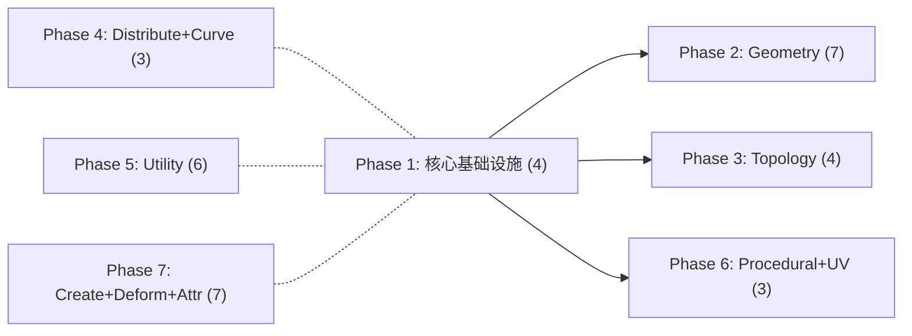

以下是按阶段划分的完整迭代任务，共 7 个 Phase，每个 Phase 可独立交给 AI Agent 执行。

---

## Phase 1 — 核心基础设施（3 项）

**前置依赖：无**
**交付物：`GeometryBridge.cs` + `ExpressionParser.cs` + 3 个节点**

| # | 类型 | 任务 | 文件路径 |
|---|------|------|---------|
| 1 | 新增基础设施 | `GeometryBridge`：`PCGGeometry ↔ DMesh3` 双向转换 | `Editor/Core/GeometryBridge.cs` |
| 2 | 修复 | `BooleanNode` Subtract/Intersect 真实实现（依赖 GeometryBridge） | `Editor/Nodes/Geometry/BooleanNode.cs` |
| 3 | 新增基础设施 + 节点 | `ExpressionParser` + `AttribWrangleNode` | `Editor/Core/ExpressionParser.cs` + `Editor/Nodes/Attribute/AttribWrangleNode.cs` |
| 4 | 新增节点 | `ForEachNode`（对每个 Group/Piece 执行子图） | `Editor/Nodes/Utility/ForEachNode.cs` | [5-cite-0](#5-cite-0) [5-cite-1](#5-cite-1) [5-cite-2](#5-cite-2) 

**关键说明：**
- `geometry3Sharp` 已在 `ThirdParty/geometry3Sharp/`，Boolean 修复直接使用

- `ForEachNode` 参考 `SubGraphNode.cs` 的子图加载/执行模式，循环调用 `PCGGraphExecutor`，每次迭代通过 `ctx.GlobalVariables` 注入 `iteration`/`groupname`
- 节点注册是自动反射扫描，新增 `PCGNodeBase` 子类即自动注册 [5-cite-3](#5-cite-3)

---

## Phase 2 — Geometry 系列补全（7 项）

**前置依赖：Phase 1（GeometryBridge）**
**交付物：6 个新节点 + 1 个修复**

| # | 类型 | 任务 | 文件路径 |
|---|------|------|---------|
| 5 | 新增 | `MirrorNode` — 沿平面镜像 + 翻转面绕序 | `Editor/Nodes/Geometry/MirrorNode.cs` |
| 6 | 新增 | `InsetNode` — 面内缩，生成环形侧面带 | `Editor/Nodes/Geometry/InsetNode.cs` |
| 7 | 新增 | `TriangulateNode` — N 边形转三角形 | `Editor/Nodes/Geometry/TriangulateNode.cs` |
| 8 | 新增 | `PeakNode` — 沿法线均匀偏移点 | `Editor/Nodes/Geometry/PeakNode.cs` |
| 9 | 新增 | `FacetNode` — Unique/Consolidate/ComputeNormals 三模式 | `Editor/Nodes/Geometry/FacetNode.cs` |
| 10 | 新增 | `PolyExpand2DNode` — 2D 多边形偏移/内缩 | `Editor/Nodes/Geometry/PolyExpand2DNode.cs` |
| 11 | 修复 | `SubdivideNode` Catmull-Clark 真实实现 | `Editor/Nodes/Geometry/SubdivideNode.cs` | [5-cite-4](#5-cite-4) 

**关键说明：**
- `PolyExpand2DNode` 使用已有的 `ThirdParty/Clipper2/` 库
- 所有新节点遵循 `ExtrudeNode` 的代码模式：继承 `PCGNodeBase`，实现 `Inputs`/`Outputs`/`Execute` [5-cite-5](#5-cite-5)

---

## Phase 3 — Topology 系列修复 + 补全（4 项）

**前置依赖：Phase 1（GeometryBridge）**
**交付物：2 个修复 + 2 个新节点**

| # | 类型 | 任务 | 文件路径 |
|---|------|------|---------|
| 12 | 修复 | `PolyBevelNode` — 支持按 Group 选择内部边倒角 | `Editor/Nodes/Topology/PolyBevelNode.cs` |
| 13 | 修复 | `ConvexDecompositionNode` — 集成 MIConvexHull 真实凸分解 | `Editor/Nodes/Topology/ConvexDecompositionNode.cs` |
| 14 | 新增 | `PolySplitNode` — 用平面切割面 | `Editor/Nodes/Topology/PolySplitNode.cs` |
| 15 | 新增 | `EdgeDivideNode` — 在边上等距插入新点 | `Editor/Nodes/Topology/EdgeDivideNode.cs` | [5-cite-6](#5-cite-6) [5-cite-7](#5-cite-7) 

**关键说明：**
- `MIConvexHull` 已在 `ThirdParty/MIConvexHull/`
- `PolyBevelNode` 修复重点：第 75-83 行的边选择逻辑，从 `Count == 1`（仅边界边）改为支持 group 参数指定的内部边

---

## Phase 4 — Distribute + Curve 补全（3 项）

**前置依赖：无（可与 Phase 2/3 并行）**
**交付物：3 个新节点**

| # | 类型 | 任务 | 文件路径 |
|---|------|------|---------|
| 16 | 新增 | `ArrayNode` — 线性阵列 + 径向阵列复制 | `Editor/Nodes/Distribute/ArrayNode.cs` |
| 17 | 新增 | `PointsFromVolumeNode` — 包围盒内体素网格生成点 | `Editor/Nodes/Distribute/PointsFromVolumeNode.cs` |
| 18 | 新增 | `PolyWireNode` — 曲线转管状网格（固定圆形截面） | `Editor/Nodes/Curve/PolyWireNode.cs` |

**关键说明：**
- `ArrayNode` 两种模式：linear（累加 offset）、radial（绕轴旋转 + 半径偏移）
- `PolyWireNode` 比已有的 `SweepNode` 更轻量，固定圆形截面，沿线段生成管状网格

---

## Phase 5 — Utility 系列补全（6 项）

**前置依赖：无（可与 Phase 2/3/4 并行）**
**交付物：6 个新节点**

| # | 类型 | 任务 | 文件路径 |
|---|------|------|---------|
| 19 | 新增 | `CompareNode` — 比较两值输出 Bool（驱动 Switch） | `Editor/Nodes/Utility/CompareNode.cs` |
| 20 | 新增 | `RandomNode` — 随机 Float/Int/Vector3，支持 seed | `Editor/Nodes/Utility/RandomNode.cs` |
| 21 | 新增 | `FitRangeNode` — 值域重映射 | `Editor/Nodes/Utility/FitRangeNode.cs` |
| 22 | 新增 | `RampNode` — 曲线 Ramp 映射 | `Editor/Nodes/Utility/RampNode.cs` |
| 23 | 新增 | `GroupCombineNode` — Group 集合运算 | `Editor/Nodes/Utility/GroupCombineNode.cs` |
| 24 | 新增 | `SplitNode` — 按 Group 拆分为 matched/unmatched 两路 | `Editor/Nodes/Utility/SplitNode.cs` | [5-cite-8](#5-cite-8) 

**关键说明：**
- 当前 `Execute` 返回 `Dictionary<string, PCGGeometry>`，非 Geometry 类型的输出（Bool/Float）通过 `PCGGeometry.DetailAttribs` 存储 [5-cite-9](#5-cite-9)
- `SplitNode` 是唯一需要双 Geometry 输出的节点（`matched` + `unmatched`）

---

## Phase 6 — Procedural + UV 修复（3 项）

**前置依赖：Phase 1（GeometryBridge 用于 UV）**
**交付物：3 个修复**

| # | 类型 | 任务 | 文件路径 |
|---|------|------|---------|
| 25 | 修复 | `WFCNode` — 支持自定义邻接规则 JSON 输入 | `Editor/Nodes/Procedural/WFCNode.cs` |
| 26 | 修复 | `UVUnwrapNode` — 集成 xatlas 真实展开 | `Editor/Nodes/UV/UVUnwrapNode.cs` |
| 27 | 修复 | `UVLayoutNode` — 实现真正的 UV 岛排布 | `Editor/Nodes/UV/UVLayoutNode.cs` | [5-cite-10](#5-cite-10) 

**关键说明：**
- `xatlas` 已在 `ThirdParty/xatlas/`
- WFC 修复重点：第 214-223 行的硬编码邻接规则替换为从 `adjacencyRules` 参数查表

---

## Phase 7 — Create + Deform + Attribute 补全（7 项）

**前置依赖：无（可与 Phase 4/5/6 并行）**
**交付物：7 个新节点**

| # | 类型 | 任务 | 文件路径 |
|---|------|------|---------|
| 28 | 新增 | `PlatonicSolidsNode` — 正四/八/十二/二十面体 | `Editor/Nodes/Create/PlatonicSolidsNode.cs` |
| 29 | 新增 | `HeightfieldNode` — 带 height 属性的噪声网格 | `Editor/Nodes/Create/HeightfieldNode.cs` |
| 30 | 新增 | `FontNode` — 文本转 2D/3D 几何体 | `Editor/Nodes/Create/FontNode.cs` |
| 31 | 新增 | `NoiseNode` — 通用噪声变形（Perlin/Simplex/Worley/Curl） | `Editor/Nodes/Deform/NoiseNode.cs` |
| 32 | 新增 | `CreepNode` — 沿目标表面爬行变形 | `Editor/Nodes/Deform/CreepNode.cs` |
| 33 | 新增 | `AttributeTransferNode` — 基于空间距离传递属性 | `Editor/Nodes/Attribute/AttributeTransferNode.cs` |
| 34 | 新增 | `AttributeRandomizeNode` — 为属性赋随机值 | `Editor/Nodes/Attribute/AttributeRandomizeNode.cs` |

---

## 阶段依赖关系

- **实线箭头** = 硬依赖（必须先完成）
- **虚线** = 无依赖（可并行）

**Phase 2/3/6** 依赖 Phase 1 的 `GeometryBridge.cs`。
**Phase 4/5/7** 无硬依赖，可与 Phase 1 并行启动。

---

## 汇总

| Phase | 内容 | 修复 | 新增 | 合计 |
|-------|------|------|------|------|
| 1 | 核心基础设施 | 1 | 3 | **4** |
| 2 | Geometry | 1 | 6 | **7** |
| 3 | Topology | 2 | 2 | **4** |
| 4 | Distribute + Curve | 0 | 3 | **3** |
| 5 | Utility | 0 | 6 | **6** |
| 6 | Procedural + UV | 3 | 0 | **3** |
| 7 | Create + Deform + Attribute | 0 | 7 | **7** |
| **总计** | | **7** | **27** | **34** |

所有文件路径前缀为 `Assets/PCGToolkit/`。所有新节点继承 `PCGNodeBase`，遵循 `ExtrudeNode.cs` 的代码模式。 [5-cite-11](#5-cite-11) [5-cite-12](#5-cite-12)