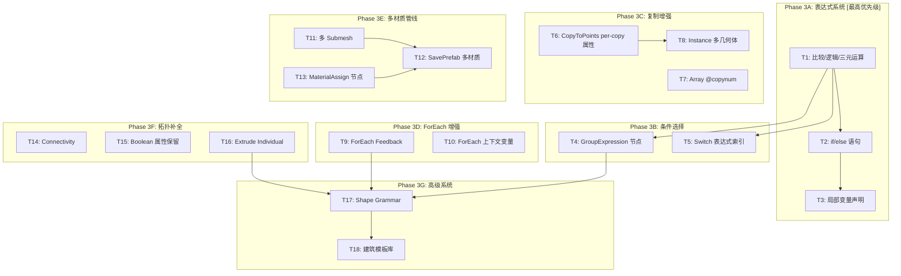

# PCG for Unity 第3轮迭代指导方针（进阶版）

基于对代码库的深度审查，以下是按优先级严格排序的迭代任务大纲。每个任务标注了**影响面**、**依赖关系**和**具体实现要点**。

---

## 架构级发现（影响任务排序）

在深入代码后，我修正了上一轮的几个判断：

1. `BooleanNode` **已经使用 geometry3Sharp 的 `MeshBoolean` 做真 3D CSG**，不是 2D Clipper。但它不保留属性/UV。 [1-cite-0](#1-cite-0)

2. `FacetNode` 的 `unique` 模式已经实现了"面独立化"（每个面使用独立顶点），部分解决了 Face Separate 需求。 [1-cite-1](#1-cite-1)

3. `PCGGeometryToMesh.Convert()` 只输出**单个 submesh**，无法按 PrimGroup 分配不同材质。 [1-cite-2](#1-cite-2)

4. `CopyToPointsNode` 读取 `orient`/`pscale`，但**不传递目标点的自定义属性**到副本，也不注入 `@copynum`。 [1-cite-3](#1-cite-3)

5. `ArrayNode` 同样**不注入 `@copynum`**，无法在子图中区分第几个副本。 [1-cite-4](#1-cite-4)

---

## Phase 3A — 表达式系统补全（解锁条件逻辑）

### T1: ExpressionParser 增加比较与逻辑运算（P0 最高优先级）

**文件**: `Assets/PCGToolkit/Editor/Core/ExpressionParser.cs`

当前 `ParseExpression()` 直接调用 `ParseAddSub()`，解析链中完全没有比较和逻辑层。 [1-cite-5](#1-cite-5)

需要在递归下降解析器中插入新的优先级层：

```
ParseExpression → ParseTernary → ParseLogicOr → ParseLogicAnd → ParseComparison → ParseAddSub → ...
```

具体增加：
- **比较运算符**: `<`, `>`, `<=`, `>=`, `==`, `!=` → 返回 `0f` 或 `1f`
- **逻辑运算符**: `&&`, `||`, `!` → 短路求值
- **三元表达式**: `condition ? trueExpr : falseExpr`

### T2: ExpressionParser 增加 if/else 语句（P0）

**文件**: `Assets/PCGToolkit/Editor/Core/ExpressionParser.cs`

当前 `ExecuteStatement()` 只处理赋值语句（`@X = expr`），用简单的 `IndexOf('=')` 分割。 [1-cite-6](#1-cite-6)

需要改造 `Execute()` 方法：
- 不能再用 `Split(';')` 做简单分割（因为 `{}` 块内也有分号）
- 实现 token-level 的语句解析
- 支持 `if (expr) { stmts } else { stmts }`
- 支持 `for (int i = 0; i < N; i++) { stmts }`（可选，优先级低于 if/else）

### T3: ExpressionParser 增加局部变量声明（P1）

当前只支持 `@` 前缀的属性变量。建筑生成中经常需要临时变量：

```c
float h = @P.y;
int floor = floor(h / 3.0);
@type = floor > 5 ? 1 : 0;
```

需要在 `EvalContext.Variables` 中支持无 `@` 前缀的局部变量，并在 `ParsePrimary()` 中识别 `float`/`int` 类型声明。

---

## Phase 3B — Group 表达式与条件选择

### T4: GroupExpression 节点（P1）

**新文件**: `Assets/PCGToolkit/Editor/Nodes/Create/GroupExpressionNode.cs`

允许用表达式创建分组：
```
@P.y > 5 && @P.y < 8   →  "middle_floors" 组
@primnum % 2 == 0       →  "even_faces" 组
```

实现要点：
- 输入: geometry + expression(string) + groupName(string) + class(point/primitive)
- 对每个点/面执行表达式，结果 > 0 则加入组
- 依赖 T1（比较运算符）

### T5: Switch 节点支持表达式索引（P1）

**文件**: `Assets/PCGToolkit/Editor/Nodes/Utility/SwitchNode.cs`

当前 `index` 参数是静态 int，只能手动设置 0-3。 [1-cite-7](#1-cite-7)

增强：
- 新增 `expression` 参数（string），当非空时用 ExpressionParser 求值作为 index
- 可以从 `ctx.GlobalVariables` 读取 `iteration`、`groupname` 等 ForEach 注入的变量
- 这样 ForEach + Switch 组合就能实现"不同楼层用不同子图"

---

## Phase 3C — 复制与实例化增强

### T6: CopyToPoints 注入 per-copy 属性（P2）

**文件**: `Assets/PCGToolkit/Editor/Nodes/Distribute/CopyToPointsNode.cs`

当前只读取 `orient` 和 `pscale`，不传递目标点的其他属性。 [1-cite-8](#1-cite-8)

增强：
- 为每个副本的所有点写入 `@copynum`（int，第几个副本）
- 将目标点上的**所有自定义属性**（如 `@variant`, `@height`, `@type`）复制到副本的 DetailAttribs 中
- 新增 `transferAttributes` 参数（string，逗号分隔），指定要传递的属性名

### T7: Array 注入 @copynum（P2）

**文件**: `Assets/PCGToolkit/Editor/Nodes/Distribute/ArrayNode.cs`

在 `AppendTransformed()` 中为每个副本的点写入 `@copynum` 属性： [1-cite-9](#1-cite-9)

### T8: Instance 节点实际解析多几何体（P3）

**文件**: `Assets/PCGToolkit/Editor/Nodes/Distribute/InstanceNode.cs`

当前 `InstanceNode` 只是标记点为实例，不实际解析不同几何体。 [1-cite-10](#1-cite-10)

增强为真正的多几何体实例化：
- 增加多个几何体输入端口（`instance0`, `instance1`, ...）
- 读取每个点的 `@instance` 属性值作为索引
- 将对应几何体复制到该点位置

---

## Phase 3D — ForEach 增强

### T9: ForEach Feedback 模式（P2）

**文件**: `Assets/PCGToolkit/Editor/Nodes/Utility/ForEachNode.cs`

当前 `IterateByCount` 把所有中间结果都 add 到 results 再 merge： [1-cite-11](#1-cite-11)

增加 `feedback` 参数（bool）：
- `feedback = false`（默认）：当前行为，merge 所有中间结果
- `feedback = true`：只输出最终迭代结果

```csharp
if (feedback)
    return new List<PCGGeometry> { current }; // 只返回最终结果
else
    return results; // 返回所有中间结果的 merge
```

### T10: ForEach 注入更多上下文变量（P2）

当前只注入 `iteration` 和 `groupname`： [1-cite-12](#1-cite-12)

增加：
- `numiterations`（总迭代次数）
- `value`（当前 piece 的某个属性值，可配置）

---

## Phase 3E — 多材质与输出管线

### T11: PCGGeometryToMesh 多 Submesh 支持（P2）

**文件**: `Assets/PCGToolkit/Editor/Core/PCGGeometryToMesh.cs`

当前所有面输出到单个 submesh： [1-cite-2](#1-cite-2)

增强：
- 检查 `PrimAttribs` 中是否有 `@material` 或 `@materialId` 属性
- 如果有，按属性值分组，每组生成一个 submesh
- 如果没有，按 `PrimGroups` 分组（每个 group 一个 submesh）
- 返回 `Mesh` + `Material[]` 映射信息

### T12: SavePrefab 多材质支持（P2）

**文件**: `Assets/PCGToolkit/Editor/Nodes/Output/SavePrefabNode.cs`

当前只分配单个 Default-Diffuse 材质： [1-cite-13](#1-cite-13)

增强：
- 从 `PrimAttribs` 的 `@material` 属性读取材质路径
- 按 submesh 分配不同材质到 `MeshRenderer.sharedMaterials`

### T13: MaterialAssign 节点（P3）

**新文件**: `Assets/PCGToolkit/Editor/Nodes/Geometry/MaterialAssignNode.cs`

- 输入: geometry + group(string) + materialPath(string)
- 为指定 PrimGroup 的所有面设置 `@material` 属性
- 配合 T11/T12 实现完整的多材质管线

---

## Phase 3F — 拓扑工具补全

### T14: Connectivity 节点（P3）

**新文件**: `Assets/PCGToolkit/Editor/Nodes/Geometry/ConnectivityNode.cs`

- 使用 Union-Find（ForEachNode 中已有实现可复用）为每个连通分量写入 `@class` 属性 [1-cite-14](#1-cite-14)
- 配合 ForEach byPiece 使用

### T15: Boolean 属性保留（P3）

**文件**: `Assets/PCGToolkit/Editor/Nodes/Geometry/BooleanNode.cs`

当前 Boolean 结果丢失所有属性（UV、法线、自定义属性）： [1-cite-15](#1-cite-15)

应改用 `GeometryBridge.ToDMesh3()` / `FromDMesh3()` 做转换（它们保留法线和 UV）： [1-cite-16](#1-cite-16)

### T16: Extrude Individual 模式（P3）

**文件**: `Assets/PCGToolkit/Editor/Nodes/Geometry/ExtrudeNode.cs`

当前 Extrude 对共享顶点的面会产生拉扯。增加 `individual` 参数： [1-cite-17](#1-cite-17)

- `individual = true` 时，先对选中面做 Facet Unique（面独立化），再逐面挤出
- 这是建筑立面生成的核心操作（选中一面墙 → Inset → Extrude Individual → 生成窗框凹槽）

---

## Phase 3G — 高级程序化系统（中期目标）

### T17: Shape Grammar 节点（P4）

**新文件**: `Assets/PCGToolkit/Editor/Nodes/Procedural/ShapeGrammarNode.cs`

这是建筑生成的终极武器。设计思路：

```
输入: 一个初始面（如建筑立面）+ 规则集（JSON/DSL）
规则示例:
  Facade → split(y, 3) { Floor* | Roof }
  Floor  → split(x, 2) { Wall | Window | Wall }
  Window → inset(0.1) { Frame | Glass }
```

实现分阶段：
1. **Phase 1**: 支持 `split`（沿轴等分/按比例分割面）和 `repeat`（重复分割）
2. **Phase 2**: 支持 `inset`、`extrude` 作为终端操作
3. **Phase 3**: 支持条件规则（`if @floor > 3 then ...`）

### T18: 建筑 SubGraph 模板库（P4）

**新目录**: `Assets/PCGToolkit/Templates/Building/`

在节点能力补全后，创建预制 SubGraph：
- `WindowFrame.asset` — Inset + Extrude + Bevel
- `BuildingFloor.asset` — Grid 分割 + ForEach + 随机窗户变体
- `SimpleBuilding.asset` — Box → Array(楼层) → ForEach(立面处理)

---

## 优先级总览与依赖图



## 建议迭代批次

| 批次 | 任务 | 完成后解锁的能力 |
|------|------|-----------------|
| **Batch 1** | T1, T7, T9 | Wrangle 条件逻辑 + 副本编号 + ForEach 累积 |
| **Batch 2** | T2, T4, T5, T6 | if/else + 表达式分组 + 动态 Switch + per-copy 变体 |
| **Batch 3** | T11, T12, T13, T16 | 多材质输出 + Extrude Individual |
| **Batch 4** | T3, T8, T10, T14, T15 | 局部变量 + 多几何体实例 + 拓扑工具 |
| **Batch 5** | T17, T18 | Shape Grammar + 建筑模板 |

完成 Batch 1-2 后，系统就能做出**中等复杂度的程序化建筑**（多层、窗户变体、条件逻辑）。完成 Batch 3-4 后可以输出**生产级质量的多材质建筑 Prefab**。Batch 5 是对标 CityEngine/Houdini Labs Building Generator 的终极目标。