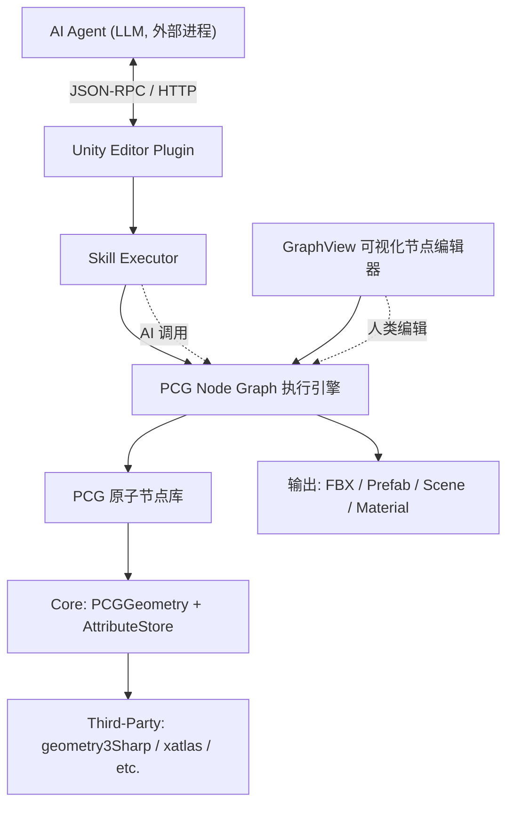
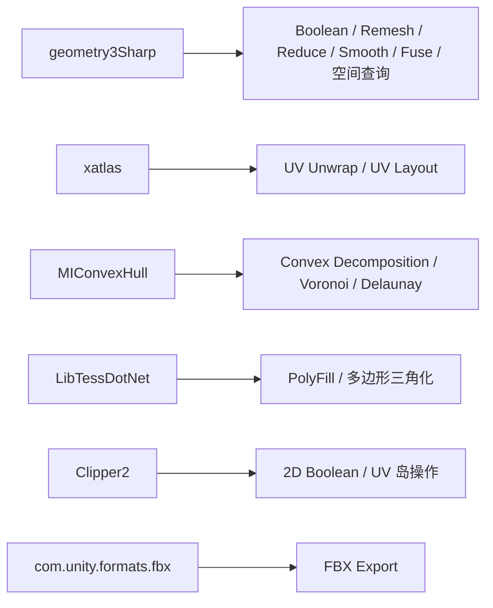

# PCG 工具库 + AI Agent 驱动的 3D 资产生产管线 — 实施方案

---

## 一、项目目标

在 Unity Editor 环境内（纯 Editor-only，无 Runtime 代码），构建一套综合性 3D 资产生产工作流：

- **底层**：PCG 元件级工具库（对标 Houdini SOP 节点体系）
- **中层**：可视化节点编辑器（基于 Unity GraphView）+ SubGraph 封装机制
- **上层**：AI Agent 通过 Skill 嵌套 Skill 的方式调用 PCG 管线，自动化生产 3D 资产

最终产出物：FBX 文件、Unity Prefab、Unity Scene、Material 等资产。

---

## 二、整体架构



**两种使用方式共享同一套底层**：
- 人类通过 GraphView 节点编辑器拖拽连线
- AI Agent 通过 Skill 参数化调用

---

## 三、核心数据模型

所有 PCG 节点之间传递的核心数据类型，对标 Houdini 的 Geometry + Attribute 体系：

```csharp
public class PCGGeometry
{
    // 拓扑
    public List<Vector3> Points;
    public List<int[]> Primitives;       // 面（支持三角形/四边形/多边形）
    public List<int[]> Edges;            // 边（按需构建）

    // 属性系统（Point / Vertex / Primitive / Detail 四个层级）
    public AttributeStore PointAttribs;
    public AttributeStore VertexAttribs;
    public AttributeStore PrimAttribs;
    public AttributeStore DetailAttribs;

    // 分组系统
    public Dictionary<string, HashSet<int>> PointGroups;
    public Dictionary<string, HashSet<int>> PrimGroups;
}
```

Unity 的 `Mesh` 只在最终输出阶段才由 `PCGGeometry` 转换生成。

---

## 四、PCG 原子节点清单（按优先级分层）

### Tier 0 — 基础设施（Phase 1 实现）

| 节点 | 对标 Houdini | 说明 |
|------|-------------|------|
| Box / Sphere / Tube / Grid / Circle / Line / Torus | 基础几何体 SOP | 参数化基础几何体生成 |
| Attribute Create / Set | AttribCreate / AttribWrangle | 创建/修改任意属性 |
| Transform | Transform SOP | 平移/旋转/缩放 |
| Merge | Merge SOP | 合并多个 PCGGeometry |
| Delete | Delete SOP | 按条件删除点/面 |
| Group Create | Group Create SOP | 按条件创建点/面分组 |
| Import Mesh | File SOP | Unity Asset → PCGGeometry |
| Export Mesh | ROP Output | PCGGeometry → Mesh → FBX / Prefab |

### Tier 1 — 核心几何操作（Phase 2 实现）

| 节点 | 对标 Houdini | 说明 |
|------|-------------|------|
| Subdivide | Subdivide SOP | Catmull-Clark / Loop 细分 |
| Extrude | PolyExtrude SOP | 面挤出 |
| Boolean | Boolean SOP | Union / Subtract / Intersect |
| Normal | Normal SOP | 重算法线 |
| Fuse | Fuse SOP | 合并重复点 |
| Reverse | Reverse SOP | 翻转面朝向 |
| Clip | Clip SOP | 平面裁切 |
| Blast | Blast SOP | 按 Group 删除 |
| Measure | Measure SOP | 计算面积/周长/曲率写入属性 |
| Sort | Sort SOP | 重排点/面顺序 |

### Tier 2 — UV 与纹理（Phase 3 实现）

| 节点 | 对标 Houdini | 说明 |
|------|-------------|------|
| UV Project | UVProject SOP | 平面/柱面/球面/盒式投影 |
| UV Unwrap | UVUnwrap SOP | 自动 UV 展开（依赖 xatlas） |
| UV Layout / Pack | UVLayout SOP | UV 岛排布打包（依赖 xatlas） |
| UV Transform | UVTransform SOP | UV 空间内平移/旋转/缩放 |

### Tier 3 — 分布与实例化（Phase 2 实现）

| 节点 | 对标 Houdini | 说明 |
|------|-------------|------|
| Scatter | Scatter SOP | 表面随机/泊松盘分布 |
| Copy to Points | CopyToPoints SOP | 在点位置实例化几何体 |
| Instance | Instance SOP | 按属性选择不同几何体实例化 |
| Ray | Ray SOP | 将点投射到表面 |

### Tier 4 — 曲线与路径（Phase 3 实现）

| 节点 | 对标 Houdini | 说明 |
|------|-------------|------|
| Curve Create | Curve SOP | Bezier / Polyline 曲线 |
| Resample | Resample SOP | 重采样曲线 |
| Sweep | Sweep SOP | 沿曲线扫掠截面 |
| Carve | Carve SOP | 裁切曲线 |
| Fillet | Fillet SOP | 曲线/边倒角 |

### Tier 5 — 噪声与变形（Phase 4 实现）

| 节点 | 对标 Houdini | 说明 |
|------|-------------|------|
| Mountain | Mountain SOP | Perlin/Simplex/Worley 噪声位移 |
| Bend | Bend SOP | 弯曲变形 |
| Twist | Twist SOP | 扭曲变形 |
| Taper | Taper SOP | 锥化变形 |
| Lattice | Lattice SOP | FFD 自由变形 |
| Smooth | Smooth SOP | 拉普拉斯平滑 |

### Tier 6 — 高级拓扑（Phase 4 实现）

| 节点 | 对标 Houdini | 说明 |
|------|-------------|------|
| PolyBevel | PolyBevel SOP | 边/点倒角 |
| PolyBridge | PolyBridge SOP | 桥接面 |
| PolyFill | PolyFill SOP | 填充孔洞 |
| Remesh | Remesh SOP | 重新网格化 |
| Decimate | PolyReduce SOP | 减面 |
| Convex Decomposition | — | 凸分解（碰撞体用） |

### Tier 7 — 程序化规则（Phase 5 实现）

| 节点 | 对标 Houdini | 说明 |
|------|-------------|------|
| WFC | — | Wave Function Collapse 模式生成 |
| L-System | L-System SOP | 分形/植物生成 |
| Voronoi Fracture | VoronoiFracture SOP | 泰森多边形碎裂 |

### Tier 8 — 资产输出（Phase 1 起逐步完善）

| 节点 | 说明 |
|------|------|
| Save Prefab | PCGGeometry → GameObject → Prefab |
| Export FBX | 通过 `com.unity.formats.fbx` 导出 |
| Save Material | 创建/配置 Unity Material |
| Save Scene | 组装并保存 Unity Scene |
| LOD Generate | 自动生成 LOD 链（Phase 5） |

---

## 五、可视化节点编辑器

基于 Unity `GraphView`（`UnityEditor.Experimental.GraphView`）框架实现。

### 核心功能

| 功能 | 说明 |
|------|------|
| 节点拖拽、连线 | GraphView 内置 |
| 端口类型匹配 | 只有兼容类型的端口才能连线 |
| 缩放/平移 | GraphView 内置 |
| Tab 搜索菜单 | 按名称搜索节点类型（`SearchWindow`） |
| MiniMap | 小地图导航 |
| SubGraph 节点 | 封装子图为单个节点，对外暴露输入输出端口 |
| 节点数上限 | 单个 Graph ≤ N 个节点（建议 20~30），超出需封装为 SubGraph |
| 序列化 | 节点图保存为 ScriptableObject 或 JSON |
| 执行引擎 | DAG 拓扑排序 → 按序执行节点 → 传递 PCGGeometry |
| Undo/Redo | 集成 Unity `Undo` 系统 |

### 统一节点接口

```csharp
public interface IPCGNode
{
    string Name { get; }
    string Description { get; }
    PCGParamSchema[] InputSchema { get; }
    PCGGeometry Execute(PCGContext ctx, Dictionary<string, object> parameters);
}
```

同一个 `IPCGNode` 实现同时服务于 GraphView 可视化编辑和 AI Agent Skill 调用。

---

## 六、AI Agent 集成层

### 通信方式

AI Agent（外部 LLM 进程）与 Unity Editor 之间通过 **HTTP / WebSocket / stdin-stdout** 双向通信。Unity 侧运行一个 Skill Executor 服务。

### Skill 定义

每个 PCG 节点自动导出 JSON Schema，供 AI Agent 发现和调用：

```json
{
  "name": "generate_box",
  "description": "生成一个长方体 Mesh",
  "parameters": {
    "width":  { "type": "float", "default": 1.0 },
    "height": { "type": "float", "default": 1.0 },
    "depth":  { "type": "float", "default": 1.0 }
  },
  "returns": { "type": "PCGGeometry" }
}
```

### Skill 嵌套

高层 Skill 内部调用多个低层 Skill，形成层级化工具链。封装好的 SubGraph 天然就是一个高层 Skill。

---

## 七、需要的第三方库和插件

### Unity 官方包（通过 Package Manager 安装）

| 包名 | 用途 | 安装方式 |
|------|------|----------|
| **`com.unity.formats.fbx`** | FBX 导入/导出 | Package Manager → Unity Registry |
| **`com.unity.formats.usd`**（可选） | USD 格式支持（未来扩展用） | Package Manager → Unity Registry |

`Packages/manifest.json` 中添加：
```json
{
  "dependencies": {
    "com.unity.formats.fbx": "5.1.1"
  }
}
```

### 第三方 C# 库（作为源码或 DLL 导入）

| 库名 | 用途 | 许可证 | GitHub |
|------|------|--------|--------|
| **geometry3Sharp** | 核心几何内核：半边数据结构（DMesh3）、Boolean、Remesh、Reduce、空间查询、法线计算等 | MIT | `gradientspace/geometry3Sharp` |
| **xatlas** (C# binding) | UV 自动展开和 UV 岛打包 | MIT | `jpcy/xatlas`（C++ 原库）+ C# wrapper |
| **MIConvexHull** | 凸包计算、Delaunay 三角化、Voronoi 图 | MIT | `DesignEngrLab/MIConvexHull` |
| **LibTessDotNet** | 多边形三角化（复杂多边形 → 三角形） | SGI Free License | `speps/LibTessDotNet` |
| **Clipper2** | 2D 多边形布尔运算、偏移（用于 UV 操作和 2D 布局） | Boost | `AngusJohnson/Clipper2` |

### 各库对应的 PCG 节点覆盖



### 优先级

| 优先级 | 库 | 原因 |
|--------|---|------|
| **必须** | `geometry3Sharp` | 覆盖面最广，是整个 PCG 工具库的几何内核 |
| **必须** | `com.unity.formats.fbx` | FBX 导出是核心输出能力 |
| **必须** | `LibTessDotNet` | 多边形三角化是基础操作 |
| **高** | `xatlas` | UV 展开是 3D 资产生产的刚需 |
| **中** | `MIConvexHull` | Voronoi/Delaunay/凸包在多个高级节点中需要 |
| **中** | `Clipper2` | 2D 布尔运算在 UV 和布局操作中需要 |

---

## 八、项目目录结构

```
Assets/
└── PCGToolkit/
    └── Editor/
        ├── Core/
        │   ├── PCGGeometry.cs              // 核心几何数据结构
        │   ├── AttributeStore.cs           // 属性系统（Point/Vertex/Prim/Detail）
        │   ├── PCGContext.cs               // 执行上下文（中间结果传递）
        │   ├── IPCGNode.cs                 // 节点统一接口
        │   └── PCGGeometryToMesh.cs        // PCGGeometry ↔ Unity Mesh 转换
        │
        ├── Nodes/
        │   ├── Create/                     // Tier 0: Box, Sphere, Grid, Line...
        │   ├── Attribute/                  // Tier 0: AttribCreate, AttribSet...
        │   ├── Geometry/                   // Tier 1: Subdivide, Extrude, Boolean, Fuse...
        │   ├── UV/                         // Tier 2: UVProject, UVUnwrap, UVLayout...
        │   ├── Distribute/                 // Tier 3: Scatter, CopyToPoints, Ray...
        │   ├── Curve/                      // Tier 4: Curve, Sweep, Resample...
        │   ├── Deform/                     // Tier 5: Mountain, Bend, Twist, Smooth...
        │   ├── Topology/                   // Tier 6: Bevel, Bridge, PolyFill, Remesh...
        │   └── Procedural/                 // Tier 7: WFC, L-System, Voronoi...
        │
        ├── Output/                         // Tier 8: SavePrefab, ExportFBX, SaveMaterial...
        │
        ├── Graph/
        │   ├── PCGGraphView.cs             // GraphView 画布
        │   ├── PCGGraphEditorWindow.cs     // EditorWindow 入口
        │   ├── PCGNodeVisual.cs            // 节点 UI 基类（继承 GraphView.Node）
        │   ├── PCGNodeSearchWindow.cs      // Tab 搜索菜单
        │   ├── PCGGraphSerializer.cs       // 节点图序列化/反序列化
        │   ├── PCGGraphExecutor.cs         // DAG 拓扑排序 + 执行引擎
        │   └── SubGraph/
        │       ├── SubGraphNode.cs         // SubGraph 节点
        │       └── SubGraphAsset.cs        // SubGraph 序列化资产
        │
        ├── Skill/
        │   ├── ISkill.cs                   // Skill 接口
        │   ├── SkillRegistry.cs            // Skill 注册表（自动收集所有 IPCGNode）
        │   ├── SkillSchemaExporter.cs      // 导出 JSON Schema 供 AI Agent 使用
        │   └── SkillExecutor.cs            // 接收外部调用，执行 Skill
        │
        ├── Communication/
        │   ├── AgentServer.cs              // Unity 侧 HTTP/WebSocket 服务
        │   └── AgentProtocol.cs            // 通信协议定义
        │
        └── ThirdParty/
            ├── geometry3Sharp/             // 几何内核
            ├── LibTessDotNet/              // 多边形三角化
            ├── MIConvexHull/               // 凸包/Voronoi
            ├── Clipper2/                   // 2D 布尔
            └── xatlas/                     // UV 展开（Native Plugin .dll/.so/.dylib + C# wrapper）
```

全部位于 `Editor` 文件夹下，不会编译进 Runtime build。

---

## 九、实施阶段

### Phase 1 — 基础设施 + 最小可用管线

**目标**：跑通"生成基础几何体 → 变换组合 → 导出 FBX/Prefab"的完整流程。

| 任务 | 内容 |
|------|------|
| 核心数据模型 | `PCGGeometry`、`AttributeStore`、`PCGContext` |
| Tier 0 节点 | 基础几何体生成、Transform、Merge、Delete、Group、Import/Export |
| Tier 8 输出 | Save Prefab、Export FBX |
| 集成 geometry3Sharp | 导入库，实现 `PCGGeometry ↔ DMesh3` 转换 |
| 集成 com.unity.formats.fbx | FBX 导出功能 |
| 集成 LibTessDotNet | 多边形三角化 |
| 节点统一接口 | `IPCGNode` 定义 |

### Phase 2 — 核心几何 + 分布实例化 + GraphView

**目标**：能够进行有意义的几何操作，并通过可视化节点编辑器编辑。

| 任务 | 内容 |
|------|------|
| Tier 1 节点 | Subdivide、Extrude、Boolean、Normal、Fuse、Reverse、Clip、Blast、Measure、Sort |
| Tier 3 节点 | Scatter、CopyToPoints、Instance、Ray |
| GraphView 编辑器 | PCGGraphView、节点 UI、连线、搜索菜单、序列化、执行引擎 |
| SubGraph 机制 | SubGraph 封装、节点数上限控制 |

### Phase 3 — UV + 曲线 + AI 接口

**目标**：UV 操作能力，曲线操作能力，AI Agent 可以开始调用。

| 任务 | 内容 |
|------|------|
| Tier 2 节点 | UV Project、UV Unwrap、UV Layout、UV Transform |
| Tier 4 节点 | Curve Create、Resample、Sweep、Carve、Fillet |
| 集成 xatlas | UV 展开和打包 |
| AI Skill 层 | SkillRegistry、SkillSchemaExporter、SkillExecutor |
| 通信层 | AgentServer、AgentProtocol |

### Phase 4 — 变形 + 高级拓扑

**目标**：丰富几何操作能力。

| 任务 | 内容 |
|------|------|
| Tier 5 节点 | Mountain、Bend、Twist、Taper、Lattice、Smooth |
| Tier 6 节点 | PolyBevel、PolyBridge、PolyFill、Remesh、Decimate、Convex Decomposition |
| 集成 MIConvexHull | 凸包、Delaunay、Voronoi |
| 集成 Clipper2 | 2D 布尔运算 |

### Phase 5 — 程序化规则 + 完善

**目标**：高级程序化生成能力，LOD，整体打磨。

| 任务 | 内容 |
|------|------|
| Tier 7 节点 | WFC、L-System、Voronoi Fracture |
| LOD Generate | 基于 Reduce 自动生成 LOD 链 |
| 整体打磨 | 错误处理、日志、文档、Undo/Redo 完善 |

---

## 十、第三方依赖汇总清单

| 名称 | 类型 | 许可证 | 获取方式 | 引入阶段 |
|------|------|--------|----------|----------|
| `com.unity.formats.fbx` | Unity 官方包 | Unity License | Package Manager | Phase 1 |
| `geometry3Sharp` | C# 源码库 | MIT | GitHub: `gradientspace/geometry3Sharp` | Phase 1 |
| `LibTessDotNet` | C# 源码库 | SGI Free | GitHub: `speps/LibTessDotNet` / NuGet | Phase 1 |
| `xatlas` | C++ Native Plugin + C# wrapper | MIT | GitHub: `jpcy/xatlas` | Phase 3 |
| `MIConvexHull` | C# 源码库 | MIT | GitHub: `DesignEngrLab/MIConvexHull` / NuGet | Phase 4 |
| `Clipper2` | C# 源码库 | Boost | GitHub: `AngusJohnson/Clipper2` | Phase 4 |
| `com.unity.formats.usd`（可选） | Unity 官方包 | Unity License | Package Manager | 未来扩展 |

**注意**：`xatlas` 是 C++ 库，需要编译为 Native Plugin（`.dll` / `.so` / `.dylib`），然后通过 C# `DllImport` 调用。可以寻找社区已有的 C# binding 或自行编写 P/Invoke wrapper。其余库均为纯 C# 源码，直接放入 `Editor/ThirdParty/` 即可。

---

## 十一、关键设计约束

| 约束 | 说明 |
|------|------|
| **Editor-only** | 所有代码位于 `Editor` 程序集，不编译进 Runtime |
| **FBX 为主要输出格式** | 通过 `com.unity.formats.fbx` 导出 |
| **单 Graph 节点数上限** | ≤ N 个节点（建议 20~30），超出需封装为 SubGraph |
| **不引入第三方软件** | 只引入库/包/插件，不依赖外部独立软件 |
| **IPCGNode 统一接口** | 每个节点同时服务于 GraphView 可视化和 AI Agent Skill 调用 |